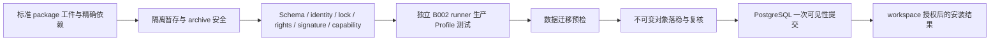

# 项目摘要

## M1-B003 实现启动治理候选

已接收冻结基线为 `7c6240e28c1ff4066debedffb43284b979dee260` / tree `c3a0f11cf2c99d1bfb6ec6d57c95d5016d7c3e8c`，M1/v29、B003 FROZEN；本机规划接收回执 `/home/zyc14588/engineering/codex-loop-state/owner-receptions/M1-B003-plan-freeze-4bd29bbb-a1/ACCEPTANCE_RECEIPT.json` 的 SHA256 为 `f303229da35630a25629fd935b7964ddba115fcefcec6c77902320ba3f925212`。原首轮 FAIL 与 `ACC-M1-B003-001 = CLOSED_FOR_VERIFIED_SUCCESSOR` 的后继处置均保留。

本 tree 仅作已授权 PLAN 生命周期转换：M1/v29→v30、B003 FROZEN→IMPLEMENTING。原生 `validateMilestonePlanChange` 要求 revision 加一；14 类冻结合同字段及摘要 `59e0456c8ed261f08b1d1211fbdd1436cc50f4e875f36482732fe84e39d5167e` 不变，下方 19 行平台/证据矩阵逐字保留。B001/B002 依赖已完成；其他 batch、依赖/并行字段、墓碑与 next_batch_sequence=12 不变，B004 PLANNED、B012 未分配；候选 active batch 仅 B003，WIP 上限 1。

本候选的精确 SHA/tree 由签名 Git object、fresh PLAN route 和独立治理报告固定。owner 本轮授权只允许独立验证通过的最小激活 delta 本地 ff-only 接收；沿用 `trpg-owner-local-batch-acceptance/1` 的 owner-local 惯例，stage 为 `IMPLEMENTATION_START`、scope 为 `B003_GOVERNANCE_IMPLEMENT_ACTIVATION_ONLY`，不是新增原生 schema。实际接收结果、intent、命令退出和生效读回见 `/home/zyc14588/engineering/codex-loop-state/owner-receptions/M1-B003-implementation-start-7c6240e-a1/`；本摘要不预告接收 PASS，也不替代实际 main/ref 与回执。

仅在激活接收与读回完成后，从实际生效 SHA/tree 创建独立 Builder worktree 和全新 IMPLEMENT/builder 上下文，生成 fresh route/check 与 `B003_IMPLEMENTATION_START_BINDING.json`。Builder 仍受原 allowed/forbidden scope 约束，不得修改 `.codex/**`。当前无 B003 业务候选，业务验收 `NOT_RUN_NO_BUSINESS_CANDIDATE`；业务合入、后续生命周期接收、B004、B002 重开、B012、旧 c1 及远端写入均不在本轮授权内。

## 历史 v29 规划冻结投影（原文保留）

以下“本轮”“当前”“未接收”“下一 gate”均指原规划冻结阶段；冻结合同、接口与 19 行测试映射继续适用，当前启动身份以上方实际基线及外置接收读回为准。

## M1-B003 原生 PLAN / planner 冻结候选（本轮）

### Authority 与合法改动

`CURRENT_MAIN_AUTHORITY = 4bd29bbb04aa951d91fc743fa075d1c794a780e5` / tree `ff2b7a9d404379d4c03f35fc941081831fa5ecd7` / `M1 ACTIVE v28`。已重新核验本地 `refs/heads/main`，不是锚点分支 HEAD。当前 B003 为 `PLANNED / UNFROZEN`，无 frozen_contract_sha256；未冻结合同规范化摘要 `bc75a0f7d2424e87efa933cfb816bf6dab00aa4ab4cc118e3fcf5c5182ccd176` 仅为比较指纹，不冒充已冻结值。

`PLANNING_CANDIDATE_AUTHORITY = 本 tree 的 M1/v29, B003 FROZEN`，拟冻结摘要 `59e0456c8ed261f08b1d1211fbdd1436cc50f4e875f36482732fe84e39d5167e`。具体 candidate SHA/tree 由本提交 Git object、fresh route 与外置独立报告绑定，避免自引用。`POST_RECEPTION_EFFECTIVE_AUTHORITY` 只有 owner 批准并完成精确 ff-only 接收及回执回读后才等于该候选。`FUTURE_IMPLEMENTATION_IDENTITY = UNALLOCATED`；后续须从实际接收的 SHA/tree 生成 fresh route，按原生 PLAN 合法完成 FROZEN→IMPLEMENTING 生命周期步骤，并另获 Builder 启动授权。不能在本轮伪造最终实现 source、epoch、lease、cycle 或 attempt。

机器合同唯一来源是 `.codex/state/MILESTONE_PLAN.yaml` 的 `M1-B003` 条目；本摘要按现有 BATCH_CONTRACT/HANDOFF 模板补充实施步骤、风险、测试映射和交接导航，不是第二份可覆盖机器合同的冻约。PLAN 层本轮 exact changed-file allowlist 为 `.codex/state/MILESTONE_PLAN.yaml`、`.codex/state/MILESTONE_STATUS.md`、`.codex/state/PROJECT_SNAPSHOT.md`；独立生成的 `.codex/runtime/READING_MAP.yaml` 不入 Git。B003 的未来业务 allowed/forbidden_scope 原文保留；其中禁止 `.codex/**` 是 IMPLEMENT 边界，不禁止本次获授权 PLAN 修改原生治理状态。

`EXISTING_AUTHORITY`：保留 B003 objective、requirements、acceptance、tests、stop_conditions、全部 allowed/forbidden scope、depends_on、并行字段。仅增加上述已存在规范章节 `SPEC-PACKAGE-TRUST-001, SPEC-MIGRATION-001, SPEC-RELEASE-GATE-MATRIX, SPEC-CREATOR-POSITIONING, SPEC-CREATOR-ROUNDTRIP` 的阅读绑定，补齐签名/迁移前检/平台/Creator 引用，不新增产品语义。按 `validateMilestonePlanChange` 与 `validBatchStateTransition` 从 v28 递增一版并作 PLANNED→FROZEN；未硬编码下一业务 revision。其余十个 batch、墓碑和 next_batch_sequence=12 均原样。B003 独占 REQ-PACKAGE-005；WIP 上限 1、active IMPLEMENTING/VERIFYING 为 0。FROZEN 不是开工。

`EXISTING_AUTHORITY`：B002 已完成。接收回执 `/home/zyc14588/engineering/codex-loop-state/owner-receptions/M1-B002-473c941-business-acceptance-a1/ACCEPTANCE_RECEIPT.json` SHA256 `c727815a4bf3b2af2abbf7108fce3819321a2fec6b98ca665f7230dc31eda572`，POST_ACCEPTANCE_NATIVE_READBACK SHA256 `1f9d3a47ec3e7e64ebdded98c6a8e927c7bbf14e3ff8123b4bd9674d99b677ed`；原业务测试 identity `473c94190b4eb9e203ab4ea823eaf72829960ad9 / ea87972af11c8c5956c116b58ff946291a0b3bdf`，治理完成 identity `4bd29bbb04aa951d91fc743fa075d1c794a780e5 / ff2b7a9d404379d4c03f35fc941081831fa5ecd7`，独立治理报告 SHA256 `ccdc83bba69c175d55129acc238c97642c1354657a0bc8d20653eba7db728fe6`。证据是原业务验收加无业务变化的独立治理验证；原 CI 未直接测试治理 tree。B002 frozen digest `5dbcccd9ddda20bbcbdcbff473fb9197b83bb087a10f1ee802ed8ad547d74677` 保留。010 事件 SHA256 `2505adafa61d1ed9bb402d17d0d6da068731956adc0f2f8f1b8101aa9fb7a969` 已消费，复用回读、不重发；008/009 历史 HIGH/OPEN 保留，原精确业务候选 disposition PASS 不变。

### 范围、接口与实施闭环

以下表中 `EXISTING_AUTHORITY` 是已存在规范义务，`VERIFIED_EXISTING_INTERFACE` 是本轮源级核实，`PLANNING_DERIVATION_WITHIN_SCOPE` 是可调整的内部实现规划，后者不新增公共 API、包格式或冻约义务。每个新路径均位于原 B003 allowlist。`PLANNED_NEW` 只描述入口尚未实现。

| 环节 | 来源类型与依据 | 实际路径 / 符号或 PLANNED_NEW | 输入、输出、权限和失败边界 |
| --- | --- | --- | --- |
| 输入 | VERIFIED_EXISTING_INTERFACE；B001/B011 | `internal/package/archive/model.go`: Import/ImportBytes/FromFiles, Package.Manifest/ExactLock/ContentHash/ArtifactIdentity/Entries/Entry；`snapshot.go`: Snapshot.Bytes/Hash；`project.go`: ImportProject | Creator/CLI 先产出标准 immutable ZIP + META-INF envelope；B003 消费有界快照和本地精确依赖工件集合，不把用户目录路径当安装目标。Bundle 是分发容器，须由上层分解为 package 工件，不伪造运行时 bundle。 |
| 隔离暂存与安全 | EXISTING_AUTHORITY；B003 acceptance[0]、SPEC-PACKAGE-INSTALL/STORAGE；PLANNING_DERIVATION_WITHIN_SCOPE | PLANNED_NEW `internal/package/install/staging.go`, `validation.go`；复用 `archive.Import`→reader.readSnapshot→preflightZIP32（后两者内部，不从安装器直接调用） | 服务端自选临时根；只读取不可变限长副本，不向受管 active 工作区解包。沿用现有 ZIP/path/schema 上限，额外安装策略拒绝 bytecode/未声明二进制等原合同 corpus；通过 archive parser 不等于已完成全部安装校验。 |
| 身份和依赖 | VERIFIED_EXISTING_INTERFACE；B001/B011 | `manifest/artifact.go`: BuildArtifactIdentity/ArtifactIdentity.Digest；`dependency/lock.go`: ParseExactLock/BuildExactLock/Packages/CanonicalJSON/Digest | package_id、version、content hash、build provenance、rights、features/transitive exact lock 相互核对。缺依赖/重复版本/循环/换字节均拒绝；不联网求解最新版本。归档 hash、content hash、artifact digest 分列，不能以 ZIP hash 替换包 content identity。 |
| 权利、签名和能力 | EXISTING_AUTHORITY：R2-A11/A12/A14/A15、SPEC-PACKAGE-TRUST-*；VERIFIED_EXISTING_INTERFACE | `manifest.Package.Rights/Capabilities`、`capability.Resolve`；PLANNED_NEW `internal/package/install/policy.go` | 验证调用方 workspace 授权和可信策略来源，再验证实际签名证据与精确包/锁/Profile/Host API/套件绑定；包自报 trust 或 PASS 不可信。发布者签名不替代认证签名；撤销状态阻止安装。只允许规范允许的明确开发/CI 未签名上下文；本批次不构造私人房间确认 UI。清单权利字段有效不等于许可批准；未满足策略 fail closed。签名算法/证据容器是内部策略接缝的实现细化，不能新增公共包签名格式或签名服务。 |
| 生产 Profile 测试 | EXISTING_AUTHORITY：SPEC-PACKAGE-INSTALL 明确列出生产 Profile 测试；VERIFIED_EXISTING_INTERFACE | `vm/vm.go`: Options/New/Session.Execute/Destroy；`vm/package.go`: FallbackProof；`ipc/client.go`: Start/Call/Kill；`profile/profile.go`: ID/RuntimeVersion/ValidateSource/Limits/Failure/Code；PLANNED_NEW `internal/package/install/runtime_validation.go` | 必须在独立 runner 执行适用的生产 Profile 测试；静态 source 检查不能充当执行 PASS。可启动的 game-system 使用现有 vm.New 临时验证实例，非 Session-startable 包由安装测试适配层用同一 B002 IPC/production profile 隔离检查模块和显式测试输入；无脚本资产包记录该分支不适用及结构测试，不跳过整个 gate。库不能借测试开启正式 Session。没有 B004 回调时必需能力 fail closed；可选 fallback 证据必须实际执行并绑定 hash，不伪造 FallbackProof。 |
| B002 生命周期与错误 | VERIFIED_EXISTING_INTERFACE；SPEC-LUA-RUNTIME-VM/GLOBALS/BUDGET | `vm.New/Execute/Destroy`；`ipc.Start/Call/Kill`；`profile.Failure` 与 `Code`；`ipc/frame.go`: ErrRunner/ErrProtocol | 使用原 source-only、空主机能力、Linux 隔离边界、有限 CPU/指令/墙钟/内存。保留 SOURCE_REJECTED、SCRIPT_FAILED、BUDGET_EXCEEDED、VM_POISONED、VM_DESTROYED、CAPABILITY_DENIED、CONFIGURATION_REJECTED、cancel/deadline 的实际分类；IPC transport error 单列，不靠通用 Code 抹平原因。失败后销毁/reap，不重用污染实例。安装器保存阶段和安全错误码，不输出凭据或 VM token。B002 源码和语义均不修改。 |
| 数据迁移预检 | EXISTING_AUTHORITY：B003 acceptance[1]、SPEC-MIGRATION-*；PLANNING_DERIVATION_WITHIN_SCOPE | PLANNED_NEW `internal/package/install/preflight.go` 和 `internal/storage/postgres/` 的初装元数据 schema | 明确执行 fresh install 的兼容/数据目标预检：没有现存受影响状态时记录 no-op 理由，存在要求但无法证明安全的迁移则拒绝。本批次不执行包升级、Session migration 或任意包 DDL。若某真实包必须新增迁移语义/公共声明字段才能初装，触发原 stop/CHANGE gate，而不是默认成功或实现 B006。 |
| 不可变对象 | EXISTING_AUTHORITY：SPEC-DATA-OBJECT/TENANT；PLANNING_DERIVATION_WITHIN_SCOPE | PLANNED_NEW `internal/storage/object/`、`internal/package/store/` | 最小真实 backend 可用规范允许的本地目录；根由 operator 配置，服务进程独占写权限，不取包内路径。hash-keyed 不可变对象先落稳并复核，读取经过 workspace 元数据授权；对象 key 本身不授予权限。物理复用允许，ownership/rights/visibility/retention/grants 不复用。S3-compatible 是存储抽象后续可实现 backend，本轮不强加托管部署。 |
| 原子可见性 | EXISTING_AUTHORITY：B003 acceptance[1-3]；PLANNING_DERIVATION_WITHIN_SCOPE | PLANNED_NEW `internal/package/install/install.go`、`internal/package/store/`、`internal/storage/postgres/` | 一次 PostgreSQL 事务提交 install index、workspace ownership/rights/权限及完整对象引用作为唯一可见性线性化点；此前对象仅私有暂存/无可访问元数据。提交前确保所有对象存在且不可变。禁止声称 PostgreSQL 与对象存储天然跨系统原子；以先落稳对象、再原子发布引用实现合同观察语义。 |
| 失败、取消和重试 | EXISTING_AUTHORITY：B003 acceptance[2]；PLANNING_DERIVATION_WITHIN_SCOPE | 同上 + PLANNED_NEW `tests/integration/package_install/` | 提交前任何失败回滚元数据/grant，清理本次独占 staging；不得删除其他安装/并发赢家共享对象。crash 遗留不可见暂存可隔离回收，不是活跃 metadata。commit acknowledgement 丢失先按 workspace+精确 artifact/请求身份查询事务结果，已提交返回同一完整安装，未提交重试；不盲删或重复 grant。竞争不同内容不覆盖既有 immutable artifact。同 content 不同 provenance/版本的 identity 不混同。 |
| 可用结果与下游 | PLANNING_DERIVATION_WITHIN_SCOPE；B004 既有 depends_on | PLANNED_NEW `internal/package/store/` 的 workspace-scoped 查询结果与 `cmd/platformd/` 内部组合入口；现有 platformd/main.go 仍仅 baselinecli.Run | 内部结果含 workspace、artifact/content/lock identity 和已提交状态。仅 commit 后可读取，Player/Creator 以后经各自正式上层接口消费；本批次不新增 OpenAPI、UI、房间选择或自动启动 Session。B004 消费已经安装的不可变包和受管存储接口，不反向为 B003 提供 Host API。 |
| Creator 与通用扩展往返 | VERIFIED_EXISTING_INTERFACE；SPEC-PACKAGE-EXTENSIONS-M1-B010、SPEC-CREATOR-ROUNDTRIP | `apps/creator-studio/creator/service.go`: ImportArchive/Inspect/Edit/Export；`archive.Package.Export/ReplaceExtension`；`extension.Load` | Installer 复用 canonical package，不添加专用 manifest/内部私货。原 v1 无扩展、v2 required/optional、opaque optional raw bytes、第三方路径一致。Creator 编辑产生新 immutable hash，经正常输入再安装；不回写已安装对象。I07/R01/R02 验证原 model 到存储再 reload/export 的保留。 |

安装闭环（箭头是顺序，数据库提交前无外部可见安装）：

`PLANNING_DERIVATION_WITHIN_SCOPE`：未来实施步骤依次为安全 corpus/输入适配、可信安装策略与 production-runner 适配、真实对象与 PG store、初装 preflight、原子提交及不确定结果恢复、平台/租户/B011 回归证据。先完成 targeted/affected tests，再固定业务 candidate，完整 required suite 由独立 ACCEPT 执行；同一精确候选已有新鲜完整证据可复用，不能重复跑后混合计数，也不能删 gate。

`EXISTING_AUTHORITY`：依赖方向（前置→后继）B001→B002；B001/B002→B003；B001/B002/B003→B004；B001→B011。完整 graph 以机器 plan 为准，本轮不加边，无环；B011 已完成接口是共同 baseline 约束，不创建 B003↔B004 循环。B003 不是第二个 runtime/Host API 所有者。

`DEFERRED_OUT_OF_SCOPE`：远端下载/仓库、发布和认证签名服务、自动升级、卸载、迁移执行、热更新、完整 Creator/UI、Host API/B004、Room/Session、正式 revocation 运营、生产部署/备份。只做相关策略拒绝/预检和内部接缝。`OWNER_DECISION_REQUIRED = NONE`（本候选不触及新产品决策）；后续若发现必须新增公共格式/能力/签名规则/迁移语义/关键未批准依赖才能满足原合同，应带源级证据集中提交 CHANGE；不能靠本摘要静默授权。当前没有经独立复现的 B002 上游缺陷。

### 测试、平台与执行环境（冻结前映射）

`EXISTING_AUTHORITY`：REQ-PACKAGE-005→TEST-PACKAGE-005，来源 REQUIREMENTS/TEST_CATALOG/TRACEABILITY 的 M1 行和 R17-A06/A07；完整五条 acceptance、四条 tests、四条 stop_conditions 均在机器 plan 中冻结。`PLANNING_DERIVATION_WITHIN_SCOPE`：I01-I08 是上述合同案例分解，R/C 行是现存受影响兼容门禁，S 行仅补充或下游，均不分配新 TEST ID。所有业务执行状态为 `PLANNED_NOT_RUN`，不存在的目录不是本轮测试失败。

- E0：保留 command argv/cwd、开始结束时间、exit code、环境/平台实测 identity；可复现日志原文与 SHA256。复用必须绑定同一 exact candidate tree、未变依赖和完整 required case 集。
- E1：另含 exact candidate commit/tree、B003 frozen digest、test ID/case 名、run/pass/fail/skip/NOT_RUN 数；过滤/零执行/跳过不得假充 PASS。构建 driver 和被测 source identity 分列。
- E2：另含临时 PostgreSQL 与真实对象 backend/version/配置摘要（无秘密）、隔离 namespace、注入故障点、安装前后可见 metadata/permissions/object manifest、事务结果及重启/重试证据。真实目录 backend 不是 Mock；S3 若未来在本批次实现，该 backend 同样必须跑 I04-I08，不能只用本地 backend 证明其正确。
- E3：另含 Creator binary SHA256、嵌入 commit/tree、版本、build command 和真实 edit/validate/export/reimport/repeat 结果；不复用旧 binary identity 冒充新候选。

E-LINUX：本机是 Linux 环境；后续测试须记录实际 GOOS/GOARCH、locked Go/Node/pnpm/Just/Wails，确保 native Studio 库及 Compose 可用。当前不启动服务或安装依赖。
E-SERVICE：未来需要独立 PostgreSQL 实例与规范允许的真实对象 backend（最小本地目录）、临时 database/root、故障注入控制及清理。仓库目前没有 PostgreSQL 测试 service 或镜像 pin；实施时按允许的 tests/storage 路径提供固定版本/真实启动命令与证据，受影响依赖先过许可策略。不新增生产 deploy 或修改 toolchain/CI 路由以绕过门禁。服务未准备不会被本轮报告为已跑通。
E-WINDOWS：当前 workflow 的 windows-2025 native provider；E-MACOS：当前 macos-15 provider，arch 在实际 runner 回读（历史 arm64 不是本次保证）。本机不能替代这些 native runs。后续使用既有获授权 runner 或一次明确范围的 CI 执行授权；本轮无 push、dispatch、rerun、runner/billing 变更。Required gates 仍 required，环境依赖不构成豁免。

Windows Portable corpus 不继承 B002 的 special_socket/case-folded_parent 两项条件。Linux-only Core/runner cases 可按真实产品平台安排，portable archive 安全断言不能用平台标签整体排除；无法构造某 fixture 时显式记录未执行并取得针对实际候选的独立裁定，不能记 PASS。macOS 不承担 Core 或 Creator native shell。cross-build 仅编译。既有 frontend component gates 不等于全部 Chromium E2E；B003 没有新 UI 流程，产品 E2E 留在既有下游义务。

| ROW | REQUIREMENT_ID | AUTHORITY_SOURCE | COMPONENT | PLATFORM_ARCHITECTURE | NATIVE_OR_CROSS_BUILD | TEST_ID | ENTRYPOINT | EXISTING_OR_PLANNED_NEW | REQUIRED_OR_SUPPLEMENTAL | EXPECTED_ASSERTION | EVIDENCE_CONTRACT | EXECUTION_PROVIDER | ENVIRONMENT_OR_AUTHORIZATION_DEPENDENCY | STATUS |
| --- | --- | --- | --- | --- | --- | --- | --- | --- | --- | --- | --- | --- | --- | --- |
| I01 | REQ-PACKAGE-005 | B003 acceptance[0,1]; SPEC-PACKAGE-INSTALL/STORAGE | installer portable validation | linux/amd64 | NATIVE | TEST-PACKAGE-005 | go test -count=1 -json ./internal/package/install/... | PLANNED_NEW | REQUIRED | archive/path corpus; all validators precede visibility; exact lock/rights/signature/capability negative cases | E1 + E0 | local isolated Linux or approved Linux CI | E-LINUX | PLANNED_NOT_RUN |
| I02 | REQ-PACKAGE-005 | B003 acceptance[0]; PROJECTCTL-PLATFORM-CI windows portable-package test | installer portable validation | windows/amd64 | NATIVE | TEST-PACKAGE-005 | go test -count=1 -json ./internal/package/install/... | PLANNED_NEW | REQUIRED | same portable path/ZIP/schema/collision corpus; no inherited B002 skips | E1 + E0 | approved windows-2025 native job | E-WINDOWS | PLANNED_NOT_RUN |
| I03 | REQ-PACKAGE-005 | B003 acceptance[1]; SPEC-PACKAGE-INSTALL; SPEC-LUA-RUNTIME-PROFILE | Core production-profile adapter | linux/amd64 | NATIVE | TEST-PACKAGE-005 | go test -count=1 -json ./internal/package/install/... | PLANNED_NEW | REQUIRED | real isolated runner executes applicable production tests; bytecode/dangerous operations/cancel/budget/poisoned VM reject; destroy/reap | E1 + E0 | local isolated Linux or approved Linux CI | E-LINUX; exact runner SHA256/profile/runtime; no Host API | PLANNED_NOT_RUN |
| I04 | REQ-PACKAGE-005 | B003 acceptance[1,2]; SPEC-QUALITY-REAL-SERVICES | PostgreSQL + real object storage | linux/amd64 | NATIVE | TEST-PACKAGE-005 | go test -count=1 -json -tags=integration ./tests/integration/package_install/... | PLANNED_NEW | REQUIRED | initial install and idempotent retry; immutable verified objects exist before one DB visibility commit | E1 + E2 | temporary PostgreSQL + isolated filesystem object store on Linux | E-SERVICE | PLANNED_NOT_RUN |
| I05 | REQ-PACKAGE-005 | B003 acceptance[2]; SPEC-QUALITY-REAL-SERVICES | atomicity and recovery | linux/amd64 | NATIVE | TEST-PACKAGE-005 | go test -count=1 -json -tags=integration ./tests/integration/package_install/... | PLANNED_NEW | REQUIRED | fail/cancel/crash before object persist, before/during DB commit, after commit before acknowledgement; unknown commit resolves from DB; no partial visible install | E1 + E2 | same real-service run as I04, separate case evidence | E-SERVICE | PLANNED_NOT_RUN |
| I06 | REQ-PACKAGE-005 | B003 acceptance[3]; SPEC-DATA-OBJECT/TENANT | workspace store and dedup | linux/amd64 | NATIVE | TEST-PACKAGE-005 | go test -count=1 -json -tags=integration ./tests/integration/package_install/... | PLANNED_NEW | REQUIRED | two workspaces same physical hash retain independent rights/grants/retention; wrong tenant and object-key-only read denied; concurrent retry does not delete winner bytes | E1 + E2 | same real-service run as I04 | E-SERVICE | PLANNED_NOT_RUN |
| I07 | REQ-PACKAGE-005 | SPEC-PACKAGE-EXTENSIONS-M1-B010 9.4-9.6; B003 immutable identity | installed B011 canonical packages | linux/amd64 | NATIVE | TEST-PACKAGE-005 | go test -count=1 -json -tags=integration ./tests/integration/package_install/... | PLANNED_NEW | REQUIRED | v1/v2, required supported/unsupported, optional unknown, third-party parity; install-read-export/reload preserves identity and raw optional bytes; no installer format fork | E1 + E2 | same real-service run as I04 | E-SERVICE | PLANNED_NOT_RUN |
| I08 | REQ-PACKAGE-005 | SPEC-PACKAGE-INSTALL; B003 acceptance[1] | migration preflight | linux/amd64 | NATIVE | TEST-PACKAGE-005 | go test -count=1 -json -tags=integration ./tests/integration/package_install/... | PLANNED_NEW | REQUIRED | empty fresh-install preflight explicit; reject incompatible/unsupported migration requirements; active data and Session locks unchanged | E1 + E2 | same real-service run as I04 | E-SERVICE; no B006 migration implementation | PLANNED_NOT_RUN |
| R01 | REQ-PACKAGE-005 (consumer); REQ-PACKAGE-001/002/004 remain upstream-owned | SPEC-PACKAGE-EXTENSIONS-M1-B010; B003 immutable artifact boundary | Host/archive/Creator regression | linux/amd64 | NATIVE | TEST-PACKAGE-001/002/004 + TEST-PACKAGE-005 | go test -count=1 -json ./internal/package/... ./cmd/creator-cli/... ./apps/creator-studio/... ./tests/integration/package_extensions/... | EXISTING + PLANNED_NEW installer | REQUIRED | existing canonical preservation, deterministic second archive, extension negatives plus installer regression remain green | E1 + E0 | Linux full just test or targeted affected run | E-LINUX | PLANNED_NOT_RUN |
| R02 | REQ-PACKAGE-005 (consumer) | SPEC-PACKAGE-EXTENSIONS-M1-B010 9.5; SPEC-CREATOR-ROUNDTRIP | Creator binary | linux/amd64 | NATIVE | TEST-PACKAGE-005 (regression mapping) | go test -count=1 -json ./tests/integration/package_extensions/... | EXISTING | REQUIRED | real embedded-identity binary import/edit/validate/export/reimport and deterministic repeat; install produced package in I07 | E1 + E3 | Linux full just test or focused existing integration target | E-LINUX; source commit/tree and binary SHA256 | PLANNED_NOT_RUN |
| C01 | REQ-PACKAGE-005 | B003 tests[3]; SPEC-RELEASE-GATE-MATRIX | Core/toolchain aggregate | linux/amd64 | NATIVE | TEST-PACKAGE-005 + native governance gates | just check; just test; go vet ./...; just license-check; just ci | EXISTING | REQUIRED | all original aggregate commands; ci adds Go/frontend/native Studio/Compose build; actual required cases execute, no zero-test PASS | E1 + E0 | current m0-baseline.yml linux job or local exact-equivalent evidence | E-LINUX; locked tools; native Studio libs/Compose | PLANNED_NOT_RUN |
| C02 | REQ-PACKAGE-005 (compatibility) | PROJECTCTL-PLATFORM-CI; SPEC-RELEASE-GATE-MATRIX | portable packages / Creator CLI and Studio | windows/amd64 | NATIVE | TEST-PACKAGE-005 + existing compatibility checks | just ci | EXISTING (includes I02 when implemented) | REQUIRED | portable package/Creator/projectctl build/test/vet and native Studio; no Windows Core support assertion | E1 + E0 | current m0-baseline.yml windows job | E-WINDOWS | PLANNED_NOT_RUN |
| C03 | REQ-GOV-002/003 (compatibility) | PROJECTCTL-PLATFORM-CI; SPEC-RELEASE-GATE-MATRIX | projectctl toolchain | darwin/arm64 (runner identity verify at execution) | NATIVE | TEST-GOV-002/003 + existing compatibility checks | just ci | EXISTING | REQUIRED | projectctl build/test/vet; no macOS Core or native Creator shell claim | E1 + E0 | current m0-baseline.yml macos job | E-MACOS | PLANNED_NOT_RUN |
| C04 | REQ-PACKAGE-005 (affected compatibility) | SPEC-RELEASE-GATE-MATRIX; PROJECTCTL-PLATFORM-CI | Web Player and Creator frontend | linux/amd64 | NATIVE toolchain / frontend tests | existing frontend compatibility gates | just ci -> pnpm -r typecheck/build/test | EXISTING | REQUIRED | existing TypeScript/Vite/component gates; no B003 UI added; component tests are not Chromium E2E | E1 + E0 | linux job | E-LINUX | PLANNED_NOT_RUN |
| C05 | REQ-PACKAGE-005 (affected compatibility) | SPEC-RELEASE-GATE-MATRIX; PROJECTCTL-PLATFORM-CI | Web Player and Creator frontend | windows/amd64 | NATIVE toolchain / frontend tests | existing frontend compatibility gates | just ci -> pnpm -r typecheck/build/test | EXISTING | REQUIRED | existing TypeScript/Vite/component gates; no B003 UI added; component tests are not Chromium E2E | E1 + E0 | windows job | E-WINDOWS | PLANNED_NOT_RUN |
| C06 | REQ-PACKAGE-005 (affected compatibility) | SPEC-RELEASE-GATE-MATRIX; PROJECTCTL-PLATFORM-CI | Web Player and Creator frontend | darwin/arm64 (verify actual) | NATIVE toolchain / frontend tests | existing frontend compatibility gates | just ci -> pnpm -r typecheck/build/test | EXISTING | REQUIRED | existing TypeScript/Vite/component gates; no B003 UI added; component tests are not Chromium E2E | E1 + E0 | macos job | E-MACOS | PLANNED_NOT_RUN |
| S01 | REQ-PACKAGE-005 (supplement) | SPEC-RELEASE-GATE-MATRIX | Web Player browser experience | Windows/Linux/macOS Chromium; host arch recorded | NATIVE_BROWSER | TEST-PACKAGE-005 (optional consumer smoke) | PLANNED_NEW consumer smoke if an affected public flow exists | PLANNED_NEW | SUPPLEMENTAL | no B003 public UI path currently exists; full product E2E belongs downstream; does not replace CI component gates | E1 + E0 | future authorized Chromium environment | DEFERRED_OUT_OF_SCOPE for this PLAN/B003 public UI | PLANNED_NOT_RUN |
| S02 | REQ-GOV-002/003 (supplement) | SPEC-RELEASE-GATE-MATRIX | projectctl cross-build | linux/amd64 -> windows/amd64 | CROSS_BUILD | TEST-GOV-002/003 (supplement) | env GOOS=windows GOARCH=amd64 go build -o <evidence>/projectctl-windows.exe ./cmd/projectctl | EXISTING | SUPPLEMENTAL | compile only; never Windows native execution proof | E1 + E0 | local Linux | locked Go; write output outside tracked tree | PLANNED_NOT_RUN |
| S03 | REQ-GOV-002/003 (supplement) | SPEC-RELEASE-GATE-MATRIX | projectctl cross-build | linux/amd64 -> darwin/arm64 | CROSS_BUILD | TEST-GOV-002/003 (supplement) | env GOOS=darwin GOARCH=arm64 go build -o <evidence>/projectctl-darwin ./cmd/projectctl | EXISTING | SUPPLEMENTAL | compile only; never macOS native execution proof | E1 + E0 | local Linux | locked Go; write output outside tracked tree | PLANNED_NOT_RUN |

### 独立治理、接收目标和恢复规范

本轮仅运行受影响治理测试和静态检查：原生 plan/route/check、schema/contract digest、native legal transition、阅读绑定、平台计划静态测试、差异/签名/依赖图/历史保持。只读独立 Codex ACCEPT 上下文按合同→规范/机器→commit/diff→证据→最后 Handoff 检查；其 PASS/FAIL/BLOCKED 是治理候选结果，不是 TEST-PACKAGE-005 功能验收。Git 签名与 fresh route 的候选可读性也不是 main 已生效授权。

接收精确对象由外置 `reception/RECEPTION_HANDOFF.md`、candidate manifest 和独立报告最终固定；三方绑定为：机器 MILESTONE_PLAN 的合同/摘要/revision + always-read MILESTONE_STATUS/PROJECT_SNAPSHOT 的规划投影 + exact candidate Git/route/独立证据及外置 owner receipt。外置交接降权，不覆盖机器字段。

拟议 target：原仓库 `/home/zyc14588/TRPG_PLATFORM/.git` 的 `refs/heads/main`，预期 before SHA/tree `4bd29bbb04aa951d91fc743fa075d1c794a780e5 / ff2b7a9d404379d4c03f35fc941081831fa5ecd7`；实际 main 工作区 `/home/zyc14588/worktrees/TRPG_PLATFORM_MAIN_B002_RECEPTION_A2`。复用上一轮已成功 owner-local 流程：批准后检查 main/clean/signatures/ancestry/证据新鲜，先 no-replace 写入授权、PRE_ACCEPTANCE_GATE 和 REF_UPDATE_INTENT，再在 main 工作区执行 `git merge --ff-only <独立验证的精确候选SHA>`，记录 stdout/stderr/exit/before/after，fresh PLAN 与 B003 ACCEPT route/check 回读并保存，最后形成接收回执。不存在 M1 accept 写入 CLI；ACCEPT 路由是只读检查。

回执沿用 `schema_version = trpg-owner-local-batch-acceptance/1` 的已存在 owner-local 记录惯例，**不宣称是 projectctl native schema**。最小差异：record_kind 使用原 GOVERNANCE_CLOSEOUT_RECEPTION，阶段名 PLAN_FREEZE，明确 governance-only；business_tested_sha/tree 不填本候选，B003 business acceptance 为 NOT_RUN，B002 evidence 仅 baseline 引用；增加 before/after plan revision、B003 before/proposed state 和 digest。保存路径拟为 `/home/zyc14588/engineering/codex-loop-state/owner-receptions/M1-B003-plan-freeze-4bd29bbb-a1/ACCEPTANCE_RECEIPT.json`，此处仅预留交接地址，不创建伪回执。授权对象必须包含该最小差异和 exact candidate SHA/tree。

接收 mutation allowlist：main ref/reflog、该 main 工作区/index 的上述三个 tracked 文件、接收工作区 `.codex/runtime/` 可重建路由、上述新 owner-receptions 目录的授权/intent/result/readback/receipt/hash index。所有业务源、CI、锁文件、其他 refs、旧 ledger/owner closeouts/历史证据不在范围内。接收只使 `B003=FROZEN, M1/v29` 生效；B002=COMPLETED，B004=PLANNED，B012 未分配；不把 B003 改成 IMPLEMENTING，不创建 Builder task。

No-replace：新记录用 exclusive create；已存在完全相同身份记录则只读核验，不覆盖或另造编号逃避冲突。中断后先读实际 ref、reflog 和 durable intent：若仍是 baseline，重新核验后继续；若已是 exact candidate 但 receipt 缺失，标为 REF_UPDATED_RECEIPT_PENDING，补足命令与回读证据而不重复 merge；若第三个 SHA，停止集中报告，不能 reset/rebase。Git ref 与外置回执不声称跨系统原子。前轮业务/治理两阶段在这里收窄为一个规划冻结阶段，不重放 B002 接收。

最终 stop：独立治理 PASS 后提交一个集中 owner 接收包；本 PLAN 授权不包括执行接收。`MAIN_UPDATED=NO; BUSINESS_CODE_CHANGED=NO; B003_BUILDER_STARTED=NO; B004_STARTED=NO; B002_REOPENED=NO; OLD_C1_RESUMED=NO; B012_ALLOCATED=NO; BUSINESS_TESTS=NOT_RUN_NO_BUSINESS_CANDIDATE; REMOTE_WRITES=NONE`。

## 历史 v28 及更早摘要（原文保留）

以下所有“当前”“本 tree”“下一 gate”是对应历史阶段；本节保留原始失败、阻塞和接收前表述，上方新规划投影及外置已接收回执提供当前来源关系。

## M1-B002 固定业务候选的治理完成登记

本 tree 是 `PLAN / planner` 的 plan v28 治理完成登记，B002 从 `VERIFYING` 进入 `COMPLETED`。前一步 v27 `IMPLEMENTING -> VERIFYING` 为 `04f47cbf2b2098e99970facf1a7e4c41bd2775e1` / tree `5da2fdc0172afc206cb84cf5f56cf35f1f6df244`；两步均须独立验证并经本次 owner 授权的本地 ff-only 接收。两次 revision 各加一，依据 `internal/projectctl/codex.go:1244` 的 `validateMilestonePlanChange` 与 `:1345` 的 `validBatchStateTransition`。未分配新 task/cycle，未修改冻结目标、scope、tests 或门禁；M1 本身仍 ACTIVE。

业务验收固定为 commit `473c94190b4eb9e203ab4ea823eaf72829960ad9` / tree `ea87972af11c8c5956c116b58ff946291a0b3bdf`；合同 `5dbcccd9ddda20bbcbdcbff473fb9197b83bb087a10f1ee802ed8ad547d74677`。候选已有实际 Lua runtime/profile/VM/checkpoint/IPC 和 runner evidence 代码，checkpoint 修复已保持合法值形状并验证销毁后 replacement restore。原 `d0055c712aa2d9048e35c014f015582adb272496` FAIL 与固定候选原环境 BLOCKED 均保留。本次治理提交不改变业务文件内容、类型或模式，也不重新实现 checkpoint。

### 接收证据及机器消费

- [独立业务 ACCEPT continuation](/home/zyc14588/engineering/m1-b002-010-repair-20260910/native-accept-execution-473c941-20260910/INDEPENDENT_ACCEPTANCE_CONTINUATION.md)，SHA256 `d53c1055d980fd7b3ac2df88552d549d61051acae3593ee7f60707dba2b18419`；[封存执行结论](/home/zyc14588/engineering/m1-b002-010-repair-20260910/native-accept-execution-473c941-20260910/FINAL_RESULT.json)，SHA256 `78ed66662fddf31214b5db5b3a5eec09dea9f1c22e1fd372dd9f7a5593b6e064`：`INDEPENDENT_ACCEPTANCE_RESULT=PASS`、`REMAINING_REQUIRED_GATES=NONE`。
- [required 平台矩阵](/home/zyc14588/engineering/m1-b002-010-repair-20260910/native-accept-execution-473c941-20260910/REQUIRED_NATIVE_GATE_MATRIX.json)，SHA256 `85dcda9a22e523f974309072bed5db666f39b2df3a2bd4a3bf3405a4ab0c99a2`：Linux amd64 承担完整 Core/Lua；Windows amd64 承担 portable package/Creator/projectctl 与前端；macOS arm64 承担 projectctl 与前端。GitHub Actions run `34435123523` / attempt `1`，driver `c8e11cea76b322bd0624c2451e5baa6278ac9b33`；实际 tested source 固定为上述业务 SHA/tree，driver 不是 tested candidate。
- [Windows 独立裁定](/home/zyc14588/engineering/m1-b002-010-repair-20260910/native-accept-execution-473c941-20260910/review/WINDOWS_REQUIRED_NATIVE_ACCEPTANCE.json)，SHA256 `61e0c50d5f2f569aa769791c9f6586d37ab2c1448db10f9eb4440e1eadc9a5af`：`TestImportProjectRejectsSymlinksSpecialFilesAndPortableCollisions/special_socket` 因 Windows runner 无法 bind Unix socket（invalid argument），`/case-folded_parent` 因文件系统大小写不敏感；两者始终 `SKIPPED_NOT_PASSED`，未计入 631 PASS、0 FAIL；required command/stage 均执行。对应 gate `m0-baseline/windows:ci`、`continuation/windows:test-observability`。本次 owner 仅接受此精确候选的两个已披露条件，不构成未来豁免或已执行断言。macOS 106/106 PASS；各平台 Web Player 1、Creator 前端 8 PASS，来源计数不合并。
- [ACC-M1-B002-010 原 owner 关闭事件](/home/zyc14588/engineering/codex-loop-state/owner-closeouts/M1-B002/ACC-M1-B002-010-473c941/FINDING_CLOSEOUT.json)，SHA256 `2505adafa61d1ed9bb402d17d0d6da068731956adc0f2f8f1b8101aa9fb7a969`；[原 owner decision](/home/zyc14588/engineering/codex-loop-state/owner-closeouts/M1-B002/ACC-M1-B002-010-473c941/OWNER_DECISION.md)，SHA256 `9928b218fa397c033fc290fb41445461c36933ad5e79d0123534a79180909fa3`。原事件绑定精确 candidate/contract，状态 `CLOSED_BY_OWNER_FOR_VERIFIED_CANDIDATE`；不以它单独证明 B002 完成。
- [010 机器消费记录](/home/zyc14588/engineering/codex-loop-state/owner-receptions/M1-B002-473c941-business-acceptance-a1/MACHINE_CLOSEOUT_CONSUMPTION.json)，SHA256 `0921c875c2449f6a45afcf38ba7c82da06006ee4596cff454fcaf6de1f7b539b`：读取完整文件并核验摘要、candidate/tree/contract 及接收判定 predicates 后，本原生 always-read 状态摘要登记其稳定引用，并实际采用该已验证关闭事件作为本候选接收前置。本准备记录自身的 `PREPARED_PENDING_NATIVE_REGISTRATION_AND_READBACK` 是发布时事实；独立治理验收及最终 main 回读须验证本登记关系并在外置回执报告结果。没有重发 owner 010 事件，没有修改旧 Controller ledger，没有新原生枚举或 validator 例外。
- [本次 owner 本地接收授权](/home/zyc14588/engineering/codex-loop-state/owner-receptions/M1-B002-473c941-business-acceptance-a1/OWNER_RECEPTION_AUTHORIZATION.json)，SHA256 `6cdce73fe07be2f290473d790feb61767b43eb19986862be119e003e57fb4934`：只接收固定业务候选和满足条件的独立治理增量。最终治理 SHA/tree、实际 main SHA/tree、每阶段退出结果及消费回读由外置本地回执绑定。本治理候选未被独立验收/接收之前不冒充已生效 main；接收后原业务验收与无业务变化的独立治理验证共同构成证据，不将原 CI 测试身份替换为治理 tree。

### 008/009 历史与当前候选义务

[008/009 原始 native finding payload](/home/zyc14588/engineering/codex-loop-state/native-acceptance/trpg-platform/M1-B002/native-acceptance-d1dcdb91ab2ba70fd7d3093d1dc9d8d20f9b548dc02468b65b1d5cdb65ac1d75.json)，SHA256 `ebe8b6a5a05b402dbff9f5f37197baedaac18edd81d1d0d4dd055d81fbe065e9`：原候选 `3a1e45b464ac66f4d3592e0574a27810205a6073` / tree `bce928aa7d3f8ff9e4c67947659f68a335e1684d`，blocking commit `27bc3b7ecf870a27348516ff950526c4fea5f0ed`；acceptance identity `native-acceptance:sha256:d1dcdb91ab2ba70fd7d3093d1dc9d8d20f9b548dc02468b65b1d5cdb65ac1d75`，finding-set digest `cf4a102beb92e6b63c4b78bc8d39c53cc329289a2e123d1be07764a2d2fbd9cd`。两个 HIGH 历史记录仍 OPEN_HISTORICAL，不删除、不改成“从未失败”、不批量 CLOSED。

[当前候选 008/009 与 B011 独立回归裁定](/home/zyc14588/engineering/m1-b002-010-repair-20260910/native-accept-execution-473c941-20260910/review/REUSED_FINDING_AND_B011_DISPOSITION.json)，SHA256 `d0c848f66443373ebe2252e1de830c6898dbc659d5389d069cccd058e6c4cd8c`：

| Finding | 对固定候选的适用性与实际满足情况 | 历史处理 |
| --- | --- | --- |
| ACC-M1-B002-008 | APPLICABLE；真实 IPC 在部分修改后值转换失败，后续操作被 VM_POISONED 拒绝，destroy/reap 后从权威值重建；PASS / VERIFIED_CORRECT_FOR_THIS_EXACT_CANDIDATE | OPEN_HISTORICAL_HIGH 保留，无全局关闭 |
| ACC-M1-B002-009 | APPLICABLE；正常 evidence 证明 TEST-LUA-001/002 实际执行；继承及持久 GOFLAGS=-run=^$ 均退出 1、suites NOT_RUN；PASS / VERIFIED_CORRECT_FOR_THIS_EXACT_CANDIDATE | OPEN_HISTORICAL_HIGH 保留，无全局关闭 |

当前判定依据 `docs/60-quality/ACCEPTANCE_POLICY.md` 的 `SPEC-ACCEPTANCE-RESULT`、`SPEC-ACCEPTANCE-FINDINGS` 与 `SPEC-ACCEPTANCE-EVIDENCE`：当前义务、精确候选和有效证据须满足，原失败记录不删除；这些规则未要求将历史 008/009 全局 owner CLOSED 才能接收新的已验证候选。v26 已要求未来实际候选独立给出 disposition，本次以上关联履行该要求，未隐藏历史 HIGH。

B011 当前候选回归 PASS：真实 `TestB011PackageInputsAndRejections` 与 Creator binary edit/validate/export/reimport/repeat，重复输出 hash `35de290d80f307b19548595c6e26b160b34cda012e1dd0343aa88c522a0810cc`；generic extension 和 Creator 往返保持。[完整封存索引](/home/zyc14588/engineering/m1-b002-010-repair-20260910/native-accept-execution-473c941-20260910/UPDATED_EXPORT_INDEX.json)，SHA256 `c83d91ce6f936a0a2ce355d0638e1e6861c5a9a63405462bf925ad5d503b7115` 保留原 25 项 frozen exports、前轮 140 项、本轮原生补验 391 项，以及原 FAIL/BLOCKED。业务证据复用，不重跑业务全套或 CI。

### 下游边界

依赖保持 B002←B001、B003←B001/B002、B004←B001/B002/B003；所有其他 dependencies、tombstones、IDs、parallel fields 不变，`next_batch_sequence=12`，B012 未分配。B003/B004 均仍 PLANNED、未启动；B002 完成接收后活跃批次为 0，WIP 上限仍为 1。按完成依赖及最小 sequence，下一 eligible batch 是 B003；它尚无 frozen_contract_sha256，须先通过 PLAN/planner 准备与接收合法冻结状态，才有 IMPLEMENT/builder 施工前置。`projectctl codex route` 只校验原生 target 和当前来源，不能把可生成 IMPLEMENT 阅读图当成冻结或启动证明。

仅在本地接收后的实际 SHA/tree 上生成 fresh route/check 与 B003 接续交接；不复用旧 epoch/envelope 或 c1，不开始包安装或 Host API。远端 CI 分支、历史失败候选和封存证据保留；本轮不执行远端接收。

## 历史 plan v26 与更早摘要（以下原文保留）

以下原文中“当前”“下一 gate”“源码未建立”“未集成”等仅指各自历史阶段；上方精确候选与本次治理登记给出新的来源关联，历史内容不改写。

## M1-B002 在已验收 B011 上的生命周期接续候选

本节为 plan v26 的治理候选投影；精确候选 Commit/tree 由外部验收绑定，避免自引用。未接收前，主线 authority 仍是 `b67298de2861643e61794ace51b71891d6417320`、plan v25、`M1-B002 = BLOCKED`。本候选不证明 runtime 已实现，不代替独立 ACCEPT、owner 接收或 human merge，不授权本会话启动业务角色。

- 实际 native batch/task target：`M1-B002`；本次治理入口是 `PLAN M1/MILESTONE`，role `planner`。没有新分配的治理 task 或 M1-B012。
- plan revision：`25 -> 26`；唯一 batch 状态变化：`M1-B002: BLOCKED -> IMPLEMENTING`。这是原生 `validBatchStateTransition` 允许的接续状态；不修改 frozen contract，不是重新定义目标/需求/scope 的 replan。
- 原冻结合同仍在 `.codex/state/MILESTONE_PLAN.yaml` 的 M1-B002 条目，SHA-256 `5dbcccd9ddda20bbcbdcbff473fb9197b83bb087a10f1ee802ed8ad547d74677`。没有独立 contract revision 字段，没有新冻约或摘要替换。本文是 always-read 状态/基线投影，不是平行执行合同。
- 唯一 Lua runtime 主责任仍为 B002，拥有 `REQ-LUA-001/002` 和 `TEST-LUA-001/002`。`M1-B012` 未分配；`next_batch_sequence=12` 不变；所有其他 batch、dependencies、tombstones 和 parallel fields 均不变；WIP=1。
- 已验收 B011 产品/主线 baseline：commit `b67298de2861643e61794ace51b71891d6417320`，tree `4c4d3e613c48dcd829192da7e2eddcc9fd1b1d11`。验收记录 `M1-B011-PLATFORM-REMOTE-INTEGRATION-INDEPENDENT-ACCEPT` / `PASS_M1_B011_PLATFORM_REMOTE_INTEGRATION_ACCEPTED` 固定该 identity；B011 全部已验收能力继承。下方旧 preintegration snapshot 保留原文，只代表当时阶段，不撤销该后续已接收事实。
- 实现性质：`FIRST_IMPLEMENTATION_ON_ACCEPTED_B011_LINEAGE`。当前树只有 M0 lua-runner shell，没有 internal/luaruntime；未来不是对当前已有实现做两项小修。没有选择整合历史候选，也没有声明其 backend 合格。
- 生效实现 baseline：本候选正式接收/集成后的精确 authority SHA，由接收回执和新的 native reading map 固定；当前为 `NOT_EFFECTIVE_PENDING_ACCEPTANCE`。不得把未接收候选 SHA 当成已生效主线，不允许回到历史 B002 checkout 施工。
- 接收后按本 plan 状态映射得到的业务 mode/role 为 `IMPLEMENT / builder`，对象为 B002 完整原冻结合同；本轮只进行该路由的只读解析验证，不启动 Builder。旧 c1 的 `REPAIR / repair` envelope 不适用于 B011。

### B002 冻结义务和 finding lineage

原 objective、non_goals、requirements、allowed/forbidden scope、machine_contracts、reading_map_sections、acceptance、tests、stop_conditions、depends_on 与 parallel fields 逐项保留，原摘要不变。Machine contracts 为 `REQ-LUA-001/002`、`TEST-LUA-001/002`、`R14-A15/A22`、`R15-A09/A11/A13`。Frozen reading sections 为 `SPEC-V1-ROADMAP-M1`、`SPEC-M1-ALLOWED/FORBIDDEN/EXIT`、`SPEC-LUA-RUNTIME-001`、`SPEC-PACKAGE-001`、`SPEC-SECURITY-001`、`SPEC-QUALITY-001`；它们仍由原生 route materialization 强制覆盖。

| 必须继承的原义务 | 实现边界与未来验收 |
| --- | --- |
| pinned、许可兼容的 Lua 5.5 Platform Profile，真实语义一致性；没有合格 candidate 则停止 | profile/backend；TEST-LUA-001。没有冻结指定第三方库或 CGo/纯 Go 方案，历史 `golua/v2@v2.0.5` 不是新选型结论。 |
| 仅 UTF-8 source；拒绝 bytecode、io/os/debug、native loader、C module、动态库、文件/网络/进程/环境/原始凭据；无 production REPL | loader/production profile/runner；TEST-LUA-001 的每项拒绝负例，不能只执行 trivial script。 |
| 同主机独立 Lua process、本地双向有界 IPC、无公网接口/DB credentials/Go pointers、无权威写入 | cmd/lua-runner 与 ipc；进程与消息边界/错误传播测试，正式 Host Callback 属于 B004。 |
| 每 Session 独立长期 VM；globals/modules/coroutines/random/capability handles 不共享；结束销毁不影响其他 Session | vm；TEST-LUA-002 生命周期/销毁/交叉污染与 multi-Session race。 |
| checkpoint 仅 nil、bool、受限数值、UTF-8 string、规范数组/字符串键表；拒绝函数、闭包、coroutine、userdata、句柄、环、metatable 行为和能力 token | checkpoint；TEST-LUA-002 允许值 roundtrip、全部禁止值及不兼容绑定负例。 |
| checkpoint 绑定状态版本、包 hash、exact lock、Lua Profile、runtime version；从 authoritative state+checkpoint 重建；内存压力提前重建须先取得当前一致 checkpoint | checkpoint/vm；TEST-LUA-002 恢复等价、故障和内存压力；不得序列化 opaque VM memory 或只在 globals 保存权威事实。 |
| 执行失败污染 VM，下一命令前重建；包括执行后返回值转换错误 | vm/ipc；继承 ACC-M1-B002-008：部分写 globals 后返回 function 等不允许值，后续执行必须拒绝直到重建。 |
| CPU/指令、wall-clock、memory、递归、输出等 runtime 硬预算与取消/超时隔离 | profile/vm/ipc；TEST-LUA-001/002 的资源耗尽/取消/恢复测试；不能靠只在执行前后检查 context 允许无限脚本继续。 |
| declared ∩ trust ∩ execution-context capability；required 缺失拒绝、optional 有 tested fallback、无动态提权；权威 random/time 来自 Host API；稳定序列化/恢复 | 复用现有 package capability/lock model；runtime 必须拒绝未提供能力，跨 VM/过期/伪造句柄负例；完整事务与事件 replay 由现有下游批次承接。 |
| TEST-LUA-001/002 各有真实重复命令、exit code、machine evidence、exact candidate SHA | runner evidence；继承 ACC-M1-B002-009，拒绝/消除 test-selection overrides，证明必需测试实际执行；零执行绝不是 PASS。 |

Host Callback 次数、patch/DB rows/bytes/events/tasks、MutationWorkspace commit/rollback、AUDIT-0 及更高级审计的完整验收仍由 B004 的 `REQ-LUA-003/004/006` 和 `TEST-LUA-003/004/006` 主拥有；B002 的 runtime 安全、预算、污染与拒绝边界不能因其尚未实现而减免。正式 Session/replay/组合安全仍归 B005/B006/B008。该分工沿用现有合同，不创建 B002→B004 的反向依赖。

历史 FAIL candidate `3a1e45b464ac66f4d3592e0574a27810205a6073`，tree `bce928aa7d3f8ff9e4c67947659f68a335e1684d`；blocking commit `27bc3b7ecf870a27348516ff950526c4fea5f0ed`。原生 finding authority `native-acceptance:sha256:d1dcdb91ab2ba70fd7d3093d1dc9d8d20f9b548dc02468b65b1d5cdb65ac1d75`，finding-set digest `cf4a102beb92e6b63c4b78bc8d39c53cc329289a2e123d1be07764a2d2fbd9cd`。008/009 均继续 `OPEN_HISTORICAL`、owner B002，必须在未来实际 candidate 独立验收中明确 disposition；本状态接续不声称已修复或在 B011 已复现。

旧 controller task `M1-B002/c1` 保留其 immutable baseline `a6ce0e1f1f7cddcd191899946093626a81e00111` 和 `REPAIR / repair` envelope。它属于历史谱系，在当前产品计划原本已注明 inactive/not resumed；其 lease=0、RUNNING role=0 的观测不授权修改 ledger，也不把它重新定义为当前 source。此候选既不重绑旧 task，也不要求主机/controller 恢复。若未来另行使用旧 controller，必须先具备其适用的来源/登记 authority，不得把当前 projectctl reading-route PASS 当成旧 controller task 可运行的证明。

### B011 现存接口、路径和未来测试

所有 `PLANNED_NEW` runtime 子目录已包含在原 B002 frozen allowed_scope；目前仍未建立，不能对不存在入口跑测试再记作 runtime FAIL。

| 路径 | 状态 | 真实符号/未来边界 |
| --- | --- | --- |
| `cmd/lua-runner/main.go` | EXISTING | 当前仅 `baselinecli.Run` M0 shell；未来 runner lifecycle/process 入口。 |
| `cmd/lua-runner/evidence.go` | PLANNED_NEW | 未来候选绑定证据，不假称当前已有 evidence subcommand。 |
| `internal/luaruntime/profile/`、`vm/`、`checkpoint/`、`ipc/`、`testdata/` | PLANNED_NEW | 原 frozen scope 内完整 Profile、VM、恢复、IPC 与 fixtures。未授权在这些子目录外任意新增 runtime 文件。 |
| `go.mod`、`go.sum` | EXISTING | 原合同未来允许必要依赖选型；本治理轮不新增或升级依赖。 |
| `internal/package/manifest/manifest.go` | EXISTING | `Parse`/`Document`/`Package`：TOML→normalized model/error，含 Entrypoint/LuaProfile/HostAPIRange/Capabilities/Dependencies/Extensions；`validateRuntime` 要求 runtime 三字段成组、规范相对 .lua 路径，声明不等于执行。 |
| `internal/package/archive/model.go` | EXISTING | `FromFiles`/`Import`/`ImportBytes`→validated immutable Package；`Manifest()`、`ExactLock()`、`ContentHash()`、`ArtifactIdentity()`、`Entry(path)` 和 `Entry.Bytes()` 提供隔离副本及规范 source bytes。 |
| `internal/package/archive/project.go`、`writer.go`、`snapshot.go` | EXISTING | `ImportProject` 使用受限目录读取和相同 canonical model；`Package.Export()`→deterministic Snapshot/error，`Snapshot.Bytes/Hash` 为最终 ZIP identity。 |
| `internal/package/extension/extension.go`、`internal/package/archive/model.go` | EXISTING | `Descriptor/Support/Load`、`Document.ValidateReplacement`、`Package.ReplaceExtension` 保持 generic namespaced JSON、required unsupported 拒绝、optional unknown raw bytes 无损；extension 不能覆盖 core runtime 字段。 |
| `apps/creator-studio/creator/service.go`、`apps/creator-studio/main.go` | EXISTING | `Service.ImportArchive/Inspect/Edit/Export` 与 `runExtensionInspect/runExtensionEdit` 共享 archive+schema 校验；Edit 输入 conflictToken/namespace/JSON→EditResult/error，Export→ExportResult/error；已有 headless edit/validate/export/reimport，不增加 Creator 特权旁路。 |
| `internal/package/capability/capability.go` | EXISTING | `Resolve(declaration,level,policy,execution)`→Resolution/error，复用既有 capability 交集。 |
| `internal/package/install/`、`internal/hostapi/` | PLANNED_NEW | 仅下游 B003/B004 的未来路径，非本轮或 B002 写范围。 |

拟议 package-to-runtime adapter 放在原允许的 vm/profile/ipc 边界，只消费 `Package.Manifest/ExactLock/ContentHash/Entry`，按 `Entrypoint` 取得校验 source，绑定包 identity/profile/lock，进入独立 runner。以真实 v1/v2 B011 包 fixtures 验证加载/执行、缺入口/错 profile 拒绝、core override 禁止和原 extension 无损。包、Creator 的 EXISTING 文件只读；若必须修改其产品契约或 scope，触发原停止条件。

错误类别须区分装载/输入拒绝、profile/capability 拒绝、脚本失败、取消/预算、IPC/runner 故障、checkpoint 值/绑定失败、VM 污染/已销毁；具体新类型/码值尚未实现，不能把历史符号冒充当前 API。通过实际 typed error/有限响应验证传播、不泄露秘密和不继续执行污染 VM。

原测试命令完整保留：`go test ./internal/luaruntime/profile/... ./cmd/lua-runner/...`（TEST-LUA-001）；`go test ./internal/luaruntime/vm/... ./internal/luaruntime/checkpoint/...`（TEST-LUA-002）；`go test -race ./internal/luaruntime/...`；clean tracked tree 下 `just check`、`just test`、`go vet ./...`、`just license-check`。未来 IPC/包到 runtime/取消/008/009 regressions 在这些原 test targets 内落实。新增业务测试均 `PLANNED_NOT_RUN`。

B011 不回归的真实现存入口：`go test ./internal/package/... ./cmd/creator-cli/... ./apps/creator-studio/...`、Creator `TestHeadlessInspectEditValidateExportReimport`、以及当前三平台 `just ci` 分流。本轮均 `NOT_RUN_NO_BUSINESS_CANDIDATE`，不重用 B011 PASS 充当 Lua 验收。

平台责任保持 `SPEC-RELEASE-GATE-MATRIX`：Core/platformd/workerd/lua-runner 仅 Linux amd64 原生；Compose 为 Linux amd64，Windows 走 WSL2/Docker Desktop；Player 为 Windows/Linux/macOS Chromium；Creator Studio/CLI 为 Windows/Linux。`platformCIPlanForGOOS` 的 Linux 执行全部 Go build/test/vet+native Studio/Compose，Windows 执行 portable package/Creator 的 native build/test/vet，macOS 执行 projectctl 和 frontend gates。三平台 workflow 都调用 Just，不等于三个 OS 都原生执行 Lua；cross-build 不能当 native execution。原全 Go tests/vet 义务在正式 Linux Core 平台执行，不通过禁用必需能力令构建变绿。

### 下游与停止边界

依赖不变：B002←B001；B003←B001/B002；B004←B001/B002/B003；B005←B003/B004；B006←B002/B005；B007←B003/B006；B008←B003/B004/B005/B006/B007；B009←B007/B008；B010/B011←B001。无环，无第二个 Lua 主责任。B003 安装需要已验收 Lua profile/runner；B004 正式 Host API 需要 runtime lifecycle/IPC/errors/isolation 及 B003 安装/存储前置。此顺序来自现行 graph，不强制增加反向交叉依赖。

原四项 stop conditions 不变：不得削弱 Lua 5.5/source-only/process/checkpoint/production-debug 标准；不得接受未定/不兼容许可或未 pin 关键依赖；不得用 opaque VM memory/functions/coroutines/userdata 或缺失权威事实恢复；不得扩大到 Host API/Session/AI/Room/official game/Creator。原非目标及全部禁止目录保持原文。未来实施交付必须满足完整原冻约和 finding 回归，而非最小壳。

本轮 `BUSINESS_CODE_CHANGED=NO`、`LUA_BUILDER_STARTED=NO`、`LUA_IMPLEMENTATION_TESTS=NOT_RUN`、`BUSINESS_FULL_SUITE=NOT_RUN_NO_BUSINESS_CANDIDATE`、`REMOTE_WRITES=NONE`。候选接收前 `IMPLEMENTATION_AUTHORIZED=NO`；唯一下一 gate 为此治理候选的独立 ACCEPT 与原生要求的 owner/human 接收，不释放实现启动提示词。

## 历史 B011 preintegration 摘要（原文保留）

以下文字保留 b67298d 所承载的历史阶段及 evidence identity；其中“当前”“下一 gate”“未集成”均为该历史快照语境，不覆盖上文已经读取的实际 B011 remote-integration acceptance 或本候选状态。

产品：AI 原生在线桌面游戏平台。

V1：官方隐藏信息桌游 + 规则异常 TRPG + Creator Studio + 托管/自托管。

技术：单节点 Go、Lua 5.5 游戏包、React Web、Wails Studio、PostgreSQL。

M0 已独立验收 `PASS`、合并并关闭。当前边界为 `M1`，计划版本为 `25`，`next_batch_sequence = 12`。

`M1-B001` 已完成；`M1-B002` 为 `BLOCKED / GOVERNANCE_STATE_REPROJECTION_ONLY`；`M1-B003`—`M1-B009` 为 `PLANNED`；`M1-B010` 为 `COMPLETED / HISTORICAL_COMPLETION_PROJECTION`；`M1-B011` 为 `COMPLETED / LINEAGE_CLEAN_CONTENT_RECONSTRUCTION`。当前 preintegration governance rebind candidate 的 active verification target 为 `M1-B011-PLATFORM-PREINTEGRATION-GOVERNANCE-REBIND-INDEPENDENT-ACCEPT`。

`M1-B002` 的 blocked historical authority 是 `27bc3b7ecf870a27348516ff950526c4fea5f0ed`，冻结契约仍为 `5dbcccd9ddda20bbcbdcbff473fb9197b83bb087a10f1ee802ed8ad547d74677`。B002 product code is NOT integrated into this lineage；其 `BLOCKED` 状态是 independently established historical evidence 的治理投影；product code imported: `false`。

`M1-B010` 的冻结契约 `452846abd429474fb57aaab1a4247308df5b78ea819601e113bd2a33d2368583` 保持精确历史等价。历史 lifecycle authority 为 `cde53640e143b7adb9e36d7d8bc4fedb6f0ed401`；accepted code/tree 为 `1339c490bd8cae1e2a6e6607fc0f1db019faab64` / `25d5645caf883a73f165db0179accbca48ddf526`；platform ACCEPT 为 `PASS`；`R2-INT-010` 为 `RESOLVED_ADAPTER`。这些都是历史完成事实投影：B010 product code integrated into clean lineage 为 `false`，当前 tree 不具有 B010 capability，旧 main integration 已由 `M1-B011` clean reconstruction 取代。

旧 plan authority `ea211cfaa0f9e6008da68688b076db281c8a45df` 与旧 B011 contract `b2a2ca0d410b2dec4977f4dd09529e4213eceb4d613d0a87a7b1b5044b3616fd` 保持 immutable historical evidence，分别分类为 `REJECTED_NON_INTEGRABLE_PLAN_AUTHORITY` 与 `REJECTED_HISTORICAL_PLAN_CONTRACT`，modified: `false`。新的 clean B011 contract 为 `fa7d260c4f77f164b6ae7f1582eb87b20a1f2b4cf59b37a799027e17bfe876a3 = ACTIVE_FROZEN_CONTRACT`，仅依赖 `M1-B001`，没有额外 pre-implementation governance prerequisite。Lineage-clean product identity 继续固定为 `b82d52571287d9d0ebcfa589fd575125ac578476`，tree 为 `b9be959f22a8b15080a1035fba0fb46c256edf62`；product accepted 为 `true`，本 transition 的 product changes 为 `NONE`。

Platform independent acceptance 为 `PASS`。历史 verdict `PASS_M1_B011_PLATFORM_ACCEPTED` 的 evidence root `112dfdd0d93ba936fba31108006c166ae21ea86a2e090b9dbac611fcca93e9a9` 仅为 `HISTORICAL_ONLY`：original payload unavailable、not reverified，不能作为 current authority。当前 durable authority 是 `M1-B011-PLATFORM-ACCEPTANCE-EVIDENCE-REISSUE-001` / `PASS_M1_B011_PLATFORM_ACCEPTANCE_EVIDENCE_REISSUED`，verified root `865a244e234dadb0f919fd42645b44ee74129c1e01b81d4736615bbe0659ea40`，archive SHA-256 `21ecfa011cee94197670e12f13c94201276585362e66fbed1c96a7c485f5d5dd`，Platform ACCEPT binding `aee21ae041faad20ba96379d7d2c9ecfae0cef372d40e3265cd08f03e7a1f081`。

Fresh/current Creator binary identity 为 `5b54b2d5c9db302baf965da0e5061b427652e2a7c58a2f647bf5d8a98e36bb55`；historical identity 为 `6158fe53646fc3d53f87f48ef675d0dc727806e24a0ee195d0992dd28681af87`；binary reproducibility 为 `DIFFERENT`，但 deterministic product output 继续为未变化的 `35de290d80f307b19548595c6e26b160b34cda012e1dd0343aa88c522a0810cc`。

历史 cross-repository closure 为 `PASS / SUPERSEDED_FOR_CURRENT_INTEGRATION`。历史 authority 是 `M1-B011-CROSS-REPOSITORY-EXACT-PAIR-ACCEPT-001` / `PASS_M1_B011_CROSS_REPOSITORY_EXACT_PAIR_ACCEPTED`，root `b154784d312babb7dc83b76f03f88c7ed879c5895d0dee8ea15b58f5573ea88d`，archive SHA-256 `3365c6adc84ebb490beb1a5fe9a56ecf1487436bc7f8ac6d2acad82f44dc0743`，Rules cross-ACCEPT binding `09ced89ea54e068d62aee2e2da288d1c5a8d22fb49d7330dd36f97080e522edf`。其 exact tuple 绑定 Rules adapter `455cd5d66c683565a4aad7ef8d6523421d37db71` / `d74aae0baf791566a770ef1aaed2da7562f681d5`、Rules rebind `00e015270b99d819ffefcb0e36442f0b4e7874ef` / `c63a63b051f6cecc6eec24b786d2b2a0f2b216d6`、Platform product `b82d52571287d9d0ebcfa589fd575125ac578476` / `b9be959f22a8b15080a1035fba0fb46c256edf62` 与 Platform VERIFYING predecessor `412111c05c087ed066a297304bed728870f03fc8` / `a77015feee62564ec8ec9744391a3b5de83e4217`。该历史 PASS 不接受新的 Rules / Platform governance tuple。

当前 preintegration Rules binding 为 `6caf57cdc1127e84546459766949e0da664bb2f9` / tree `ec6cb5e7fdc0c93f09862fcf032dbb61393293a1`，candidate acceptance task 为 `M1-B011-RULES-REBIND-INDEPENDENT-ACCEPT`，root `27d8cf103dd0ce6740330df74c813c9872133a484243d06c264ac5903f1348d5`，archive SHA-256 `b4c55e9886651945a693239799f64f1474cf13a15b8a745c7acb6baddb4b45df`。Preintegration prerequisite `M1-B011-RULES-REMOTE-INTEGRATION-INDEPENDENT-ACCEPT` 的外部证据 root 为 `5ca14d526359972dec8b345e3c537e5d9d5b751695277302cc4d7bd935e0d9d3`，archive SHA-256 为 `a0ed5564e60ea072ed0210c87da0a1fc0545ab158292d157ea2e2e06b83568da`；远端写入结果只记录于该外部审计包。

Recovery PLAN-003（root `2fc1d3ba75e457a329f46a4ebf9292801424598b6480dd81048fa460bdf8f995`；独立验收 root `008abc6ae98d9d0820c4bd5eb94f21fbcf3f4056994d85f294f762d7e297f47f`）要求先验收本次治理绑定，再执行 `M1-B011-NEW-CROSS-PAIR-ACCEPT` 和 `M1-B011-COMPLETION-REACCEPT`。新的 cross-pair 和 completion reaccept 均为 `REQUIRED_NOT_RUN`；不复用历史配对 PASS。

M1-B011 lifecycle state: `COMPLETED`。

Identity 分层保持明确：

- Product identity: `b82d52571287d9d0ebcfa589fd575125ac578476` / `b9be959f22a8b15080a1035fba0fb46c256edf62`。
- VERIFYING governance identity: `412111c05c087ed066a297304bed728870f03fc8` / `a77015feee62564ec8ec9744391a3b5de83e4217`。
- Completion transition identity: commit `e99f31ad842ebfda4c51808f50c46be3f2a97cfc` / tree `a15ded87265b2ae30da20baa9810cca056e30798`；parent `412111c05c087ed066a297304bed728870f03fc8`。
- Accepted post-transition identity projection repair: `967aa4f628a521265e82eeb746bad629f23d5358` / `cac9af0744e0acf8a08cc937990a242ceb12b96c`。
- Current preintegration governance rebind candidate: product and lifecycle identities remain unchanged；this new candidate's exact commit/tree are bound externally by its signed Git object and the next independent acceptance, avoiding a self-reference。

历史 completion transition independent acceptance `M1-B011-COMPLETION-INDEPENDENT-ACCEPT-001` 的结果为 `FAIL_M1_B011_COMPLETION_TRANSITION`，failure 为 `FAIL_COMPLETION_TARGET_BINDING`，当时 disposition 为 `REPAIR_REQUIRED`。随后 `M1-B011-COMPLETION-INDEPENDENT-ACCEPT-RETRY-001` 在 governance head `967aa4f628a521265e82eeb746bad629f23d5358` 通过，结果为 `PASS_M1_B011_COMPLETION_TRANSITION_ACCEPTED_AFTER_PROJECTION_REPAIR`，root 为 `9091af0acf5a48177ca7fea8708aa87a7c07a77ac0f861ee46d25f30ad865b46`。这是旧配对的已接受历史事实；新的 Rules binding 仍要求 completion reaccept。

读取图缺失的规范章节以 exact accepted semantic authority `cde53640e143b7adb9e36d7d8bc4fedb6f0ed401` 补齐：`PACKAGE_MODEL.md` 为 mode/blob `100644 3322861b08979c328d068b1c6040494238cd8186`，`M1_SCOPE_AND_EXIT_GATE.md` 为 `100644 dee317bded7541582f4b168a52bd85213a462e3b`。Creator boundary governance repair authority `54f5dea3438d32a04a14f8888347aa3dfc222ee9` 保持 accepted，manifest-v2 Creator boundary 保持 `GENERIC JSON`。Clean lineage base 为 `main@36e0009e779564ad44799f54f9ccc1c74ac412a8`；B002 ancestry 为 `ABSENT`；old rejected PLAN ancestry 为 `ABSENT`；old B010 product ancestry 为 `ABSENT`。

Rules 状态仍为 `M2-B001 = ACCEPTED`、effective `R2-INT-010 = RESOLVED_ADAPTER`、`M2-B002 = NOT_STARTED`、`M2-B002_READY = NO`；不宣称 Rules aggregate M2 PASS、formal M2-B002 PASS 或 formal M2-B009 PASS。

原 completion transition `e99f31ad842ebfda4c51808f50c46be3f2a97cfc` 继续保持 `M1-B011 = COMPLETED`；本 preintegration governance rebind 只更新当前绑定和验收依赖，不产生第二次 lifecycle transition。治理修复范围由 `GOV-M1-B011-PREINTEGRATION-BINDING` 限定。新的治理候选尚待独立验收；Platform `integration_authorized = false`、`push_authorized = false`、`merge_authorized = false`。下一 gate 是 `M1-B011-PLATFORM-PREINTEGRATION-GOVERNANCE-REBIND-INDEPENDENT-ACCEPT`，之后依次为新 cross-pair、completion reaccept、transport PLAN 及其独立验收、staging flow。

状态摘要不覆盖权威规范。
