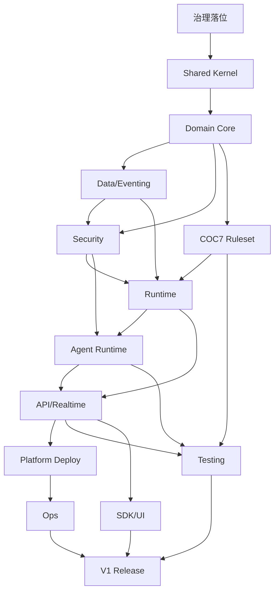

# 01 — 整体施工计划总览

## 1. Codex-only 施工模型

施工采用 **阶段门禁 + batch 内小步提交 + Codex 自测自修复** 模型。

```text
阶段 START_PROMPT
  ↓
Codex 读取 AGENTS / persistent context / module prompt / batch / per-file prompts
  ↓
Codex 输出最小执行计划与改动文件清单
  ↓
Codex 实现 primary prompt，归并 supplemental requirement，维护 traceability docs
  ↓
Codex 运行阶段测试命令
  ↓
Codex 使用 REPAIR_PROMPT 修复失败
  ↓
Codex 使用 ACCEPTANCE_PROMPT 生成验收报告
  ↓
人工只确认阶段门禁与合并
```

## 2. V1 关键路径

V1 首发闭环不是聊天机器人，而是由结构化游戏状态、规则引擎、Agent、多人实时房间、事件日志、可见性系统与部署能力构成的在线 COC 7 跑团平台。施工优先级必须围绕以下闭环：

```text
部署 → 初始化管理员 → 配置模型 → 创建 Campaign → 锁定 Authority Contract
→ 车卡/角色审核 → Tutorial Scenario → 调查/检定/线索/SAN/NPC/战斗/追逐
→ 多人分组同步 → 导出/复盘 → Golden Scenario → 备份恢复 → 发布验收
```

## 3. 总体阶段划分

| 阶段 | 名称 | 主要输入分类 / Batch | 主要输出 | 阶段验收焦点 |
|---|---|---|---|---|
| S00 | 治理落位与 Codex 施工入口 | `00-index`, `90-traceability`, `99-appendix`<br>BATCH-001-00-index, BATCH-002-00-index, BATCH-046-90-traceability, BATCH-047-90-traceability, BATCH-048-90-traceability, BATCH-049-90-traceability, BATCH-050-90-traceability, BATCH-051-99-appendix, BATCH-052-99-appendix | `trpg-docs-governance` | 仓库根 AGENTS.md 存在并声明不可突破原则；docs/codex/00-index/codex-persistent-context.md 与 prompt-boundary 可被 Codex 定位 |
| S01 | Rust Workspace 与 shared kernel 基座 | `01-foundation`<br>BATCH-003-01-foundation, BATCH-004-01-foundation, BATCH-005-01-foundation, BATCH-006-01-foundation | `trpg-shared-kernel` | 所有公开类型使用领域专名，不出现 ModuleService/ModuleCommand 模板残留；CommandEnvelope 携带 idempotency_key、expected_version、actor、correlation_id、causation_id |
| S02 | Domain Core：Authority、Campaign、Decision 与事件模型 | `02-domain-core`<br>BATCH-007-02-domain-core, BATCH-008-02-domain-core, BATCH-009-02-domain-core, BATCH-010-02-domain-core, BATCH-011-02-domain-core | `trpg-domain-core` | Campaign 生命周期内 authority_mode 和 authority_owner 不可更改；正式状态只能由 Decision/Event 路径生成 |
| S03 | Data/Eventing：PostgreSQL、Event Store、Outbox、Projection、RAG Snapshot | `06-data-eventing`<br>BATCH-024-06-data-eventing, BATCH-025-06-data-eventing, BATCH-026-06-data-eventing, BATCH-027-06-data-eventing, BATCH-028-06-data-eventing | `trpg-data-eventing` | Event Store 是唯一正史；Projection/Cache/RAG 均可重建；所有正式写入在 transaction 内完成 event append 与 outbox |
| S04 | Security Governance：OpenFGA/OPA、权限、隐私、版权与审计 | `09-security-governance`<br>BATCH-035-09-security-governance, BATCH-036-09-security-governance, BATCH-037-09-security-governance | `trpg-security-governance` | Policy Gate 不能被 Agent、插件、handler、provider 绕过；安全暂停不直接改变游戏结果 |
| S05 | COC7 Ruleset：角色、骰子、检定、SAN、战斗、追逐、场景结构 | `05-ruleset-coc7`<br>BATCH-021-05-ruleset-coc7, BATCH-022-05-ruleset-coc7, BATCH-023-05-ruleset-coc7 | `trpg-ruleset-coc7` | 所有正式骰子由服务端生成；核心线索不因一次失败永久丢失 |
| S06 | Runtime Orchestration：Session、Workflow、Pending Decision、Decision Commit Pipeline | `03-runtime-orchestration`<br>BATCH-012-03-runtime-orchestration, BATCH-013-03-runtime-orchestration, BATCH-014-03-runtime-orchestration, BATCH-015-03-runtime-orchestration, BATCH-016-03-runtime-orchestration | `trpg-runtime` | 任何正式状态变更必须经过 Decision Commit Pipeline；HUMAN_KP 模式 AI 输出 requires_human_confirmation=true |
| S07 | Agent Runtime：Gateway、Tool Permission Gate、Provider、本地模型认证、Memory/RAG | `04-ai-agent-system`<br>BATCH-017-04-ai-agent-system, BATCH-018-04-ai-agent-system, BATCH-019-04-ai-agent-system, BATCH-020-04-ai-agent-system | `trpg-agent-runtime` | 所有 AI 能力经 Agent Gateway -> Orchestrator/Runtime -> Provider Adapter；表达 Agent 不能新增事实或调用状态变更工具 |
| S08 | API / Realtime：REST、OpenAPI、WebSocket、NATS Contract、服务二进制 | `07-api-realtime-contracts`<br>BATCH-029-07-api-realtime-contracts, BATCH-030-07-api-realtime-contracts | `trpg-api` | 前端不能直接调用模型服务；handler 必须传递 actor、visibility、provenance、correlation_id |
| S09 | Platform Infrastructure：Docker Compose、Object Storage、Observability、Admin Health | `08-platform-infrastructure`<br>BATCH-031-08-platform-infrastructure, BATCH-032-08-platform-infrastructure, BATCH-033-08-platform-infrastructure, BATCH-034-08-platform-infrastructure | `trpg-platform` | docker compose up -d 能启动 Web/API/Realtime/Agent/Postgres/pgvector/Redis/Object Storage/Reverse Proxy/Admin；生产环境拒绝占位 key 或暴露未鉴权本地模型 |
| S10 | Ops / Migration：备份、恢复、升级、回滚、Projection Rebuild | `11-ops-migration`<br>BATCH-042-11-ops-migration, BATCH-043-11-ops-migration | `trpg-ops` | 恢复后 Event Store hash 与备份前一致；Projection rebuild 不产生新正史事件 |
| S11 | Testing Quality：Tutorial/Golden Scenario、Contract、Leakage、Model Certification CI | `10-testing-quality`<br>BATCH-038-10-testing-quality, BATCH-039-10-testing-quality, BATCH-040-10-testing-quality, BATCH-041-10-testing-quality | `trpg-testing` | Golden Scenario Tests 全部通过；失败不能通过删除测试、弱化 policy gate 或关闭 visibility 检查解决 |
| S12 | Extension SDK 与分层 UI 边界 | `12-extension-sdk`<br>BATCH-044-12-extension-sdk, BATCH-045-12-extension-sdk | `trpg-extension-sdk` | 插件/扩展不能绕过 Tool Grant、Policy Gate、Event Store；V1 UI 覆盖 Player/KP/Admin/Developer 最小界面 |
| S13 | V1 Release Hardening 与总验收 | `ALL`<br>ALL | `workspace` | 17 条 V1 完成标准逐项有证据；P0/P1 defects=0 |


## 4. 阶段依赖图



## 5. 分支与合并策略

- 每个阶段使用独立分支：`codex/sXX-<slug>`。
- 每个阶段内部按原 execution batch 小步提交；单次提交不得混合多个无关 crate。
- 每个 primary prompt 至少一个实现提交，一个测试提交；supplemental requirement 以 traceability markdown 形式归并并在 commit message 中引用 primary Prompt ID。
- 每阶段合并前必须生成 `docs/reports/SXX_ACCEPTANCE_REPORT.md`，包含变更文件、测试命令、测试结果、风险、TODO、关联 Prompt ID。

## 6. 禁止事项

- 禁止业务层、KP 服务、规则引擎、前端直接调用模型服务。
- 禁止 AI、插件或 provider 直接写数据库或 Event Store。
- 禁止为了通过测试删除测试、弱化权限、关闭 policy gate、绕过 migration 或关闭 visibility redaction。
- 禁止 `serde_json::Value` 成为最终领域模型；仅允许 provider adapter、unknown external payload、审计附加信息等 schema boundary。
- 禁止 source-path-like、hash-fragment、旧中间文档名进入 Rust module、文件名、migration、event schema、NATS subject、metric label。

## 7. 完成定义

V1 只在 `S13` 满足全部条件后视为可发布：Docker Compose 成功、一键初始化成功、云端/本地模型配置与认证成功、AI_KP/HUMAN_KP Campaign 可创建、Authority Contract 不可修改、COC 车卡与完整原创教学模组跑通、多人分组同步、私密信息不泄露、AI 正式裁定均通过工具和事件日志、真人 KP 模式 AI 只能草稿、可 fork、可导出玩家/KP/审计版、Golden Scenario 通过、无静默云端 fallback、关键 AI 裁定可解释可审计。
