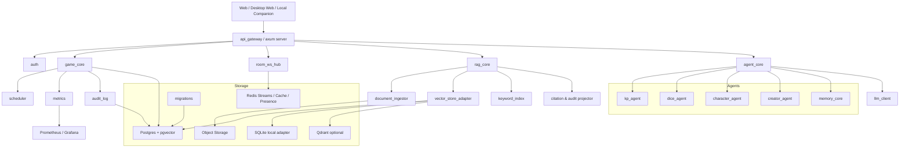
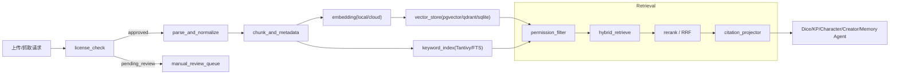
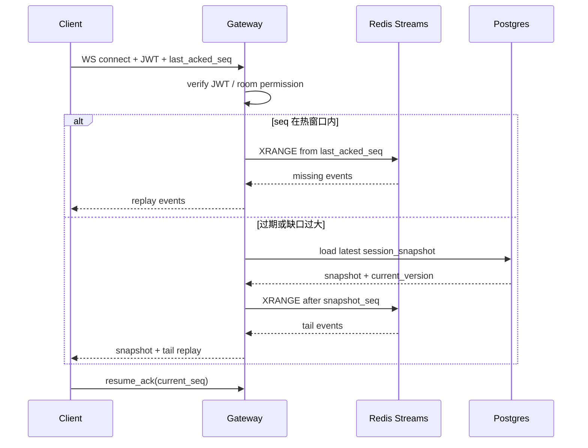
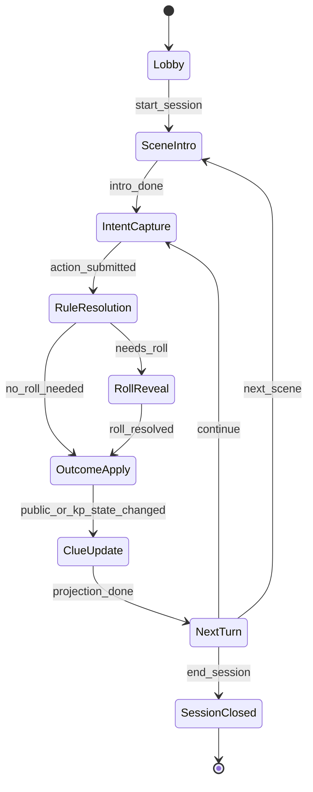

# TRPG 平台服务端架构与实施规格（最终决策版）

> **状态：最终决策基线（2026-06-25）**  
> 本文档中的产品与技术决策已经完成确认。Codex 不得重新询问这些已决定事项，也不得退回旧的“待确认/未指定”方案。任何实现偏离都必须先写 ADR 并说明迁移与兼容影响。

**执行摘要**

基于两份既有研究文档与 UI 规格，本平台的后端应当落在一个清晰的边界上：**多知识域 RAG、多 Agent 协作、严格权限隔离、KP-only 模组保护、线上为主且兼顾线下无实物模式**。既有研究已经把平台产品边界明确为规则书、模组书、公开线索、会话日志、长期记忆分域管理，并要求 Dice Agent、Character Agent、KP Agent、Creator Agent、Memory Agent 协同工作；UI 规格进一步确认了桌面 Web 优先、线上/线下双模式、阶段状态机、独立线索窗口和权限投影式界面展示。这些前提直接决定了服务端必须采用**事件驱动房间核心 + 权限先行检索 + 可审计模型网关 + 可回放会话日志**的架构，而不是一个简单的“HTTP API + 向量库”系统。

在技术取舍上，推荐采用 **Rust workspace + Axum + Tokio + SQLx + PostgreSQL/pgvector + Redis + 对象存储** 作为默认生产方案；本地单机/离线模式则提供 **SQLite + 本地文件对象存储 + 可选本地向量索引** 的轻量适配层。Axum 原生支持 `WebSocketUpgrade` 与读写并发拆分，适合房间实时链路；Tokio 提供任务调度、I/O 驱动与高性能定时器，适合游戏循环、调度器与后台 ingest 任务；SQLx 的静态检查查询宏与内嵌 migration 适合保证长期可维护性；pgvector 可在 PostgreSQL 内同时保存业务表与向量数据，而 PostgreSQL 的 RLS 与 `jsonb`+GIN 可以把权限隔离、审计、扩展字段与检索元数据统一起来。

在模型层，不建议把业务直接绑死到某一云厂商。更稳健的方案是做一层**统一 LLM 抽象**，对上只暴露 `chat_json / chat_text / embed / rerank / generate_image` 等能力；图像能力单独通过可选 `ImageProvider` trait 暴露，对下兼容 OpenAI API、OpenAI-compatible 本地端点、Ollama 与 llama.cpp server。OpenAI Structured Outputs 明确优于单纯 JSON mode，因为它保证 schema adherence；Ollama 支持本地结构化输出与 embeddings，并默认提供本地 API；llama.cpp server 则提供 OpenAI-compatible `/v1/models` 与 `/v1/chat/completions`。这使得“本地/在线大模型无缝替换”可以真正落到接口层，而不是写成配置说明。

在可靠性与成本控制上，关键不是“少调模型”，而是**分层调用**：能靠 deterministic 规则引擎解决的，不进 LLM；能靠 retrieval-only 或 rerank 解决的，不进 generate；必须进 generate 时，尽量让静态 instructions、few-shot 与工具 schema 放在前缀，利用 Prompt Caching 的精确前缀缓存。OpenAI 文档明确指出，Prompt Caching 对 1024 token 以上请求自动生效，缓存命中依赖**exact prefix matches**，并通过 `cached_tokens` 回传命中情况；缓存降低延迟与输入成本，但不减少 rate limit 计数。对本项目这意味着：系统提示、规则模板、few-shot、JSON schema 必须版本化且前置；实时会话上下文则应走滚动摘要和证据包，而不是整段日志直塞。

最终可执行的目标架构是：**单仓库、多 crate、可插拔存储、可插拔模型、事件溯源、严格审计、Compose 一键起本地开发、Helm 一键上生产**。Docker Compose 官方文档强调它通过单个 YAML 配置定义并启动整套多容器应用；Helm 则把一组 Kubernetes 资源打包为 chart。再配合 Prometheus 与 Grafana 做指标与可视化，就能同时满足一键部署、可观测性和后续横向扩展。

## 最终服务端决策基线

| 决策点 | 最终值 | 实施要求 |
|---|---|---|
| 部署 | 云服务 + Docker Compose 自托管；单区域 | 生产保留 `region_id`，Helm 为升级路径 |
| 容量 | 20 活跃房、单房最多 8 人、200 WS；压测 1000 WS | 容量参数配置化 |
| Provider | 隐私感知路由 | `standard/private_hybrid/local_only`，禁止跨隐私边界回退 |
| 规则系统 | Generic Percentile + D&D SRD 5.2.1 + 商业系统适配器 | COC/商业正文必须来自官方授权包或用户合法上传，不随项目捆绑 |
| 断线恢复 | Redis Streams 72h + Postgres 长期快照 | `server_seq/last_acked_seq/resume_token` |
| 长期记忆 | 人工批准、战役结束或 180 天复审 | 不自动微调模型权重 |
| 并发 | 乐观锁 + 死锁检测/重试 | 战斗、回合、角色卡；CRDT 仅笔记和线索布局 |
| 审计 | 操作 180d；模型原始载荷 30d；费用聚合 365d | 载荷加密，支持删除/匿名化 |
| 检索 | RRF + 规则权重，后续轻量 reranker | pgvector + Tantivy；Qdrant 保留适配器 |
| 本地模式 | SQLite + FTS5 + Flat Cosine | 建议不超过 50k chunks |
| 文件解析 | md/html/txt + PDF 文本提取 + 可选 OCR Worker | OCR 结果必须人工结构审查 |
| 边缘入口 | Caddy/Traefik + Axum | TLS 1.3；MVP 不自研独立 API Gateway |
| 媒体 | 外部语音链接；Beta 托管 LiveKit；TTS 插件化 | 不阻塞核心跑团 |
| Creator 图片 | ImageProvider 插件，默认关闭 | 人工审批、费用与许可审计、PL/KP 投影隔离 |

## 总体架构与模块设计

总体架构建议采用**单仓库、领域分 crate、边界清晰的分层服务**。外层是网关、认证与实时房间；中层是游戏循环、RAG、Agent 与导出；底层是 PostgreSQL/pgvector、Redis、对象存储与指标审计。Axum 的 WebSocket 模块支持 `WebSocketUpgrade` 与 `on_upgrade`，并可对 `WebSocket` 做 `split` 以实现读写并发；Tokio 提供运行时、任务调度、异步 I/O 与 timer，适合把 HTTP、WS、worker、scheduler 和 ingest 作业统一在一个运行时内管理。



从模块实现上，建议直接采用你要求的命名，并且各模块职责保持单一。下面这张表可直接作为 `ARCHITECTURE.md` 的主表。

| 模块 | 职责 | Rust 推荐 crate/模式 | 关键输出 |
|---|---|---|---|
| `auth` | 用户认证、房间角色、权限判定、可见性过滤 | `jsonwebtoken`/`pasetors`、`axum::extract::State`、`tower` 中间件 | `AuthContext`、`AuthzDecision` |
| `api_gateway` | HTTP 路由、限流、JWT 校验、错误映射、OpenAPI | `axum`, `tower-http`, `serde`, `utoipa` 可选 | REST/WS 对外入口 |
| `axum server` | 统一运行 HTTP、WS、health、metrics、多路中间件 | `axum`, `tokio`, `tracing` | App state、server bootstrap |
| `rag_core` | 混合检索、过滤器、citation model、检索策略 | trait + adapter 模式、`async-trait` | `Evidence[]` |
| `document_ingestor` | 许可检查、解析、切块、embedding 生成、索引写入 | `reqwest`, `scraper`, `pulldown-cmark`, PDF 适配器 | `documents`, `chunks`, `manifests` |
| `llm_client` | 统一模型接口，兼容 OpenAI/Ollama/llama.cpp/本地 HTTP | `reqwest`, `serde`, `thiserror`, `backoff` | `chat_json`, `chat_text`, `embed` |
| `agent_core` | Agent 通用 envelope、schema 验证、日志与审计抽象 | `schemars`, `serde_json`, `validator` 可选 | `AgentResult<T>` |
| `kp_agent` | 剧情裁定、公共/私有双通道输出、状态更新建议 | retrieval + generate 双阶段 | `KpTurnDecision` |
| `dice_agent` | 动作解析、规则命中、检定方案、确定性掷骰联动 | LLM + deterministic dice engine | `DiceResolution` |
| `character_agent` | 车卡辅助、合法性报告、KP 审核建议 | retrieval + schema check | `ValidationReport` |
| `creator_agent` | 战报、故事导出、PL 安全版/KP 完整版 | summarization + export | `StoryDraft` |
| `memory_core` | 长期记忆提取、偏好审核、记忆检索 | structured extraction + approval queue | `MemoryEntry` |
| `game_core` | 房间状态机、会话快照、事件应用、冲突控制 | event-sourcing + versioning | `SessionState` |
| `storage adapters` | `Postgres+pgvector`、`SQLite`、`Qdrant` 统一接口 | adapter + repository 模式 | `VectorStore`, `Repo` |
| `redis` | presence、房间广播、短期事件流、重连回放游标 | Redis Streams 优先 | `RoomEventLog` |
| `object storage` | 原始文档、快照、导出物、附件 | MinIO/S3 兼容 API | `ObjectRef` |
| `metrics` | 应用指标、业务指标、RAG/LLM 费用指标 | `metrics`, `prometheus`, `tracing` | `/metrics` |
| `audit log` | 管理审计、模型调用审计、文档许可证审计 | append-only | `AuditRecord` |
| `scheduler` | ingest 重试、摘要压缩、记忆审批提醒、备份钩子 | `tokio::time`, job queue | 定时任务 |
| `migrations` | schema 生命周期管理 | `sqlx::migrate!` | 数据库迁移 |

SQLx 的 `query!` 宏提供静态检查 SQL；`migrate!` 宏可以把 migration 内嵌到二进制中，这对一键部署尤其重要。Tokio 文档也明确区分了 `multi_thread` 与 `current_thread` 运行时：前者适合高并发服务端，后者更适合单线程或同步桥接场景。对本项目而言，服务端统一采用 `multi_thread`，而线下本地伴随端若需要嵌入单进程同步界面，则可局部使用 `current_thread` 包装异步能力。

下面的代码骨架可直接作为 workspace 的起点：

```rust
// crates/llm_client/src/lib.rs
use async_trait::async_trait;
use serde::{Deserialize, Serialize};
use serde_json::Value;
use std::time::Duration;

#[derive(Debug, Clone, Serialize, Deserialize)]
pub struct ModelRef {
    pub provider: String,   // openai | ollama | llama_cpp | local_http
    pub model: String,
    pub base_url: String,
    pub api_key_ref: Option<String>,
    pub supports_json_schema: bool,
    pub supports_streaming: bool,
    pub supports_embeddings: bool,
}

#[derive(Debug, Clone, Serialize, Deserialize)]
pub struct LlmUsage {
    pub prompt_tokens: u32,
    pub completion_tokens: u32,
    pub cached_tokens: u32,
    pub request_id: Option<String>,
}

#[derive(Debug, Clone, Serialize, Deserialize)]
pub struct ChatJsonRequest {
    pub model: ModelRef,
    pub system: String,
    pub prompt: String,
    pub schema: Value,
    pub temperature: f32,
    pub timeout: Duration,
    pub prompt_cache_key: Option<String>,
}

#[derive(Debug, Clone, Serialize, Deserialize)]
pub struct ChatJsonResponse {
    pub content: Value,
    pub usage: LlmUsage,
    pub raw_provider_response: Value,
}

#[derive(thiserror::Error, Debug)]
pub enum LlmError {
    #[error("transport error: {0}")]
    Transport(String),
    #[error("rate limited")]
    RateLimited,
    #[error("schema validation failed: {0}")]
    Schema(String),
    #[error("provider unsupported: {0}")]
    Unsupported(String),
}

#[async_trait]
pub trait LlmProvider: Send + Sync {
    async fn chat_json(&self, req: ChatJsonRequest) -> Result<ChatJsonResponse, LlmError>;
    async fn chat_text(&self, model: ModelRef, system: &str, prompt: &str) -> Result<(String, LlmUsage), LlmError>;
    async fn embed(&self, model: ModelRef, texts: &[String]) -> Result<Vec<Vec<f32>>, LlmError>;
}
```

```rust
// crates/rag_core/src/lib.rs
use async_trait::async_trait;
use serde::{Deserialize, Serialize};

#[derive(Debug, Clone, Serialize, Deserialize)]
pub struct RetrievalFilter {
    pub room_id: Option<String>,
    pub session_id: Option<String>,
    pub user_id: String,
    pub role: String,
    pub system_name: Option<String>,
    pub visibility_scopes: Vec<String>,
    pub document_types: Vec<String>,
    pub top_k: usize,
}

#[derive(Debug, Clone, Serialize, Deserialize)]
pub struct Evidence {
    pub chunk_id: String,
    pub document_id: String,
    pub title: String,
    pub section_path: Vec<String>,
    pub score: f32,
    pub preview: String,
    pub visibility_scope: String,
    pub citation: Citation,
}

#[derive(Debug, Clone, Serialize, Deserialize)]
pub struct Citation {
    pub source_url: Option<String>,
    pub page_start: Option<i32>,
    pub page_end: Option<i32>,
    pub license_name: Option<String>,
}

#[async_trait]
pub trait VectorStore: Send + Sync {
    async fn upsert(&self, items: Vec<(String, Vec<f32>)>) -> anyhow::Result<()>;
    async fn search(&self, query: &[f32], filter: &RetrievalFilter) -> anyhow::Result<Vec<(String, f32)>>;
}

#[async_trait]
pub trait KeywordIndex: Send + Sync {
    async fn search(&self, query: &str, filter: &RetrievalFilter) -> anyhow::Result<Vec<(String, f32)>>;
}
```

### 规则、地图与 Creator 插件边界

#### 规则适配器与内容包解耦

```rust
#[async_trait]
pub trait RuleSystem: Send + Sync {
    fn id(&self) -> &'static str;
    fn character_schema(&self) -> serde_json::Value;
    fn supported_rolls(&self) -> &'static [RollKind];
    async fn validate_character(&self, sheet: &serde_json::Value) -> Result<ValidationReport, RuleError>;
    async fn adjudicate(&self, input: RuleInput, evidence: &[Evidence]) -> Result<RuleDecision, RuleError>;
}
```

内置代码适配器包括 `generic_percentile`、`dnd5e_srd_5_2_1`、`coc7e_compatible` 和 `licensed_commercial`。只有 D&D SRD 等明确允许分发的规则正文可以随合法规则包安装；COC 或其他商业正文必须使用官方授权包或用户声明有权使用的私有上传。

#### 地图几何

```rust
pub enum GridGeometry {
    SceneBoard,
    Square { cell_size: f32 },
    HexFlatTop { hex_size: f32 },
    HexPointyTop { hex_size: f32 },
}
```

位置在数据库中以世界坐标保存；吸附、邻接、距离、范围模板和路径计算由几何适配器完成，避免把战斗规则写死为方格。

#### Creator 图片 Provider

```rust
#[async_trait]
pub trait ImageProvider: Send + Sync {
    fn capabilities(&self) -> ImageCapabilities;
    async fn generate(&self, request: ImageGenerationRequest) -> Result<ImageDraft, ImageProviderError>;
}
```

图片任务必须经过预算检查、隐私投影和人工审批。生成结果先写对象存储的隔离草稿区，状态为 `draft`；只有 `approved` 才能进入 PL 导出或共享屏幕。

## 数据模型与持久化

数据层建议采用**PostgreSQL 为事实源、Redis 为短时事件总线、对象存储为大对象落点**。之所以不建议把 Redis 当作唯一房间状态源，是因为 TRPG 平台存在长会话、断线恢复、权限回放、日志导出与审计要求，天然更适合用 PostgreSQL 保存**房间、角色、会话快照、线索、审计、文档元数据与记忆**，而 Redis 只保存**presence、重连缓冲、流式事件与热点缓存**。PostgreSQL 的 `jsonb` 适合容纳规则系统差异化字段，且官方文档明确支持 GIN 索引高效搜索 key 或 key/value；RLS 则可为高敏感表提供默认拒绝的第二道保险。

数据库表不宜一上来就全都事件溯源到底，而应采用**“关系主表 + 事件日志 + 周期快照”**的折中方案：可变对象维持当前真值，关键业务动作记录 append-only event，房间会话定期生成 snapshot，以便重连和导出。

### 核心业务表

| 表名 | 主要字段 | 索引 | 权限字段 | 审计字段 |
|---|---|---|---|---|
| `users` | `id`, `email`, `display_name`, `status` | `email unique` | `tenant_id` 可选 | `created_at`, `updated_at` |
| `rooms` | `id`, `owner_id`, `title`, `system_name`, `mode` | `owner_id`, `system_name`, `mode` | `default_visibility_policy` | `created_at`, `updated_at` |
| `room_members` | `room_id`, `user_id`, `role`, `seat_index` | `(room_id,user_id) unique`, `(room_id, role)` | `role` | `created_at`, `updated_at`, `invited_by` |
| `campaigns` | `id`, `room_id`, `title`, `status` | `room_id`, `status` | `room_id` | `created_at`, `updated_at` |
| `sessions` | `id`, `room_id`, `campaign_id`, `phase`, `version`, `status` | `(room_id,status)`, `(campaign_id)` | `room_id` | `created_at`, `updated_at`, `closed_at` |
| `session_snapshots` | `session_id`, `version`, `state_json` | `(session_id, version desc)` | `room_id` | `created_at`, `created_by` |
| `session_events` | `id`, `session_id`, `seq_no`, `event_type`, `event_json` | `(session_id, seq_no unique)` | `visibility_scope`, `room_id` | `created_at`, `actor_id`, `request_id` |
| `messages` | `id`, `session_id`, `author_id`, `kind`, `content` | `(session_id, created_at)` | `visibility_scope` | `created_at`, `edited_at`, `deleted_at` |
| `characters` | `id`, `room_id`, `owner_id`, `system_name`, `status` | `(room_id, owner_id)` | `visibility_scope` | `created_at`, `updated_at` |
| `character_sheets` | `character_id`, `version`, `sheet_json`, `validation_json` | `(character_id, version desc)`, `GIN(sheet_json)` | `owner_id`, `room_id` | `created_at`, `validated_by` |
| `combat_states` | `session_id`, `version`, `state_json` | `(session_id)` | `room_id`, `visibility_scope` | `updated_at`, `updated_by` |
| `clues` | `id`, `session_id`, `title`, `summary`, `state` | `(session_id, state)` | `visibility_scope` | `created_at`, `revealed_at`, `revealed_by` |
| `clue_edges` | `from_id`, `to_id`, `edge_type`, `weight` | `(from_id,to_id)` | `visibility_scope` | `created_at`, `updated_at` |

### 文档、RAG 与 Agent 表

| 表名 | 主要字段 | 索引 | 权限字段 | 审计字段 |
|---|---|---|---|---|
| `documents` | `id`, `room_id`, `document_type`, `title`, `status` | `(room_id, document_type, status)` | `visibility_scope`, `room_id` | `uploaded_by`, `created_at`, `ingested_at` |
| `document_sources` | `document_id`, `source_url`, `source_type`, `license_name`, `license_url`, `content_hash` | `(document_id)`, `content_hash unique` | `license_status` | `checked_at`, `checked_by` |
| `document_chunks` | `id`, `document_id`, `section_path`, `page_start`, `page_end`, `content` | `(document_id)`, `(visibility_scope)`, `GIN(section_path)` | `visibility_scope`, `room_id`, `session_id` | `created_at`, `parser_version` |
| `chunk_embeddings` | `chunk_id`, `provider`, `model`, `vector`, `dim` | 向量索引 + `(provider, model)` | 继承 chunk | `created_at` |
| `rag_queries` | `id`, `requester_id`, `query`, `filter_json`, `result_ids` | `(requester_id, created_at)` | `room_id`, `role_snapshot` | `created_at` |
| `agent_runs` | `id`, `agent_name`, `session_id`, `status`, `provider`, `model` | `(session_id, created_at)` | `visibility_scope`, `room_id` | `created_at`, `finished_at`, `request_id` |
| `agent_run_payloads` | `run_id`, `input_json`, `output_json`, `usage_json` | `(run_id)` | `payload_scope` | `created_at` |
| `agent_memories` | `id`, `scope`, `room_id`, `campaign_id`, `player_id`, `memory_json`, `approved` | `(scope, approved)`, `GIN(memory_json)` | `visibility_scope` | `created_at`, `approved_by`, `approved_at` |
| `session_exports` | `id`, `session_id`, `scope`, `format`, `object_key` | `(session_id, scope)` | `export_scope` | `requested_by`, `created_at` |
| `generated_media` | `id`, `session_id`, `provider`, `model`, `status`, `object_key`, `license_json` | `(session_id, status)` | `visibility_scope` | `requested_by`, `approved_by`, `created_at` |
| `concurrency_incidents` | `id`, `resource_type`, `resource_id`, `sqlstate`, `attempts`, `request_id` | `(created_at)`, `(resource_type, resource_id)` | `room_id` | `created_at` |
| `audit_logs` | `id`, `actor_id`, `action`, `target_type`, `target_id`, `payload_json` | `(created_at)`, `(actor_id, created_at)` | `room_id`, `scope` | `created_at`, `request_id`, `ip_hash` |

推荐对以下表启用 PostgreSQL RLS：`documents`、`document_chunks`、`messages`、`session_events`、`clues`、`agent_run_payloads`、`agent_memories`。因为 PostgreSQL 在 RLS 启用后，如果没有匹配策略，会走**default deny**；这非常适合 KP-only 模组与私密线索一类“宁可查不到，也不能查错”的数据。

至于向量存储，建议把适配层设计成三种：

| 适配器 | 默认用途 | 优点 | 风险与限制 |
|---|---|---|---|
| `PgVectorStore` | 生产默认 | 同库事务、一体化备份、业务过滤简单 | 大规模 ANN 与复杂 payload 过滤不如专用库灵活 |
| `SqliteLocalStore` | 离线/开发 | 本地零依赖、便于 demo | 向量能力弱、仅适合小规模 |
| `QdrantStore` | 高检索量与复杂过滤升级 | 过滤能力强、payload index 明确 | 运维成本更高 |

pgvector 官方 README 明确支持 exact 与 approximate nearest neighbor search，支持 L2、inner product、cosine、L1 等距离，同时给出 HNSW 与 IVFFlat 两种 ANN 策略。HNSW 查询性能通常优于 IVFFlat，但建索引更慢、更耗内存；若启用 ANN + 过滤，pgvector 文档还提醒过滤是在索引扫描后应用，命中过严时可能需要 iterative scans。对于 TRPG 这种**高过滤、文档量中等、权限复杂**的场景，这正是为什么默认推荐先用 pgvector，并把高强度过滤作为升级到 Qdrant 的阈值之一。

## RAG、LLM 抽象与 Agent 审计

RAG 层的首要原则不是“把所有内容都塞进去”，而是**许可先行、切块结构化、权限先于召回、证据先于生成**。研究文档已经把平台定义为规则书、模组书、线索、日志、记忆等多知识域并存的系统，因此后端不能只有一个 `chunks` 表和一个 `search()` 方法。至少要分为五类知识域：`rulebook`, `module`, `clue`, `session_log`, `memory`。

### RAG pipeline



文档接入流程建议分成六步：

| 步骤 | 必做动作 | 默认实现 |
|---|---|---|
| license check | 判断来源、许可、是否允许全文入库 | 规则书仅收明确开放许可或用户声明有权上传；不明即 `pending_review` |
| parse | 转成统一中间结构 | `md/html/txt` 直接解析；PDF 文本抽取优先 |
| chunk | 按标题层级、页码、显隐边界切块 | 500–1200 token，60–120 token overlap |
| metadata | 附加文档级与块级元数据 | 系统、类型、可见性、页码、URI、许可证、房间、会话 |
| embedding | 本地或云端嵌入，同模型索引与查询 | 同一 collection 强制同一维度与模型 |
| store | 写向量库与关键词索引 | 向量+关键词双通道 |

块级元数据 schema 建议如下：

| 字段 | 说明 |
|---|---|
| `chunk_id` | 块唯一 ID |
| `document_id` | 所属文档 |
| `document_type` | `rulebook/module/clue/session_log/memory` |
| `visibility_scope` | `public_rule/room_rule/kp_only_module/pl_visible_clue/kp_secret/character_private/session_log` |
| `system_name` | 规则系统适配器，例如 `generic_percentile`, `dnd5e_srd_5_2_1`, `coc7e_compatible`, `licensed_commercial` |
| `section_path` | 标题路径数组 |
| `heading` | 当前块标题 |
| `page_start/page_end` | PDF 页码映射 |
| `source_url` | 原始来源 |
| `license_name/license_url` | 许可证 |
| `room_id/session_id` | 房间/会话范围 |
| `content_hash` | 去重 |
| `embedding_model` | 嵌入模型 |
| `parser_version` | 解析器版本 |
| `created_by/ingested_at` | 责任链 |

对向量层，OpenAI embeddings 适合默认云端方案；OpenAI 文档明确把 embeddings 定位为把文本映射成数字，以支撑搜索、聚类、推荐等场景。Ollama 文档则明确说明本地 embeddings 适合 semantic search、retrieval 和 RAG，并建议大多数语义搜索使用 cosine similarity。

### 混合检索与权限过滤

推荐检索流程不是“召回后在应用层删掉不可见块”，而是：

1. `AuthContext` 生成 `RetrievalFilter`
2. 先按 `visibility_scope + room_id + role + document_type + system_name` 过滤
3. 向量召回与关键词召回并行
4. 用 RRF 或轻量 score fusion 合并
5. 对 top-k 做 rerank
6. 只返回 `Evidence[]` 与 citation，不直接生成回答

Qdrant 的 filtering 文档展示了 `must` 结构，且其 indexing 文档特别强调：若希望 HNSW 对过滤友好，应在 collection 创建后、数据导入前创建 payload index。Tantivy 则是 Rust 原生全文搜索库，适合作为本项目的关键词检索后端。由此可以得到一个明确结论：**向量召回是语义广召回，BM25/Tantivy 是精确术语补偿，过滤必须是第一层约束，而不是后处理补丁。**

### Agent 调用分层与审计

Agent 调用建议强制分三层：

| 层级 | 适用场景 | 是否调 LLM | 目标 |
|---|---|---|---|
| retrieval-only | 规则条文定位、文档搜索、纯检索 API | 否 | 省 token、保留证据 |
| rerank / classify | 证据重排、意图分类、风险判断 | 可用轻量本地模型 | 降低大模型调用 |
| generate | 叙事裁定、故事导出、意见归纳 | 是 | 需要自然语言与结构化生成 |

具体到 Agent：

| Agent | 默认链路 | 省 token 策略 |
|---|---|---|
| Dice Agent | 意图分类 → 规则检索 → deterministic roll → 可选简短叙事 | 掷骰与数学完全不走 LLM |
| Character Agent | 规则检索 → schema 校验 → 局部建议生成 | 先做静态规则校验，再用 LLM 解释 |
| KP Agent | 公共证据 + 私有证据 + 状态摘要 → 结构化生成 | 状态增量摘要，禁止塞全量日志 |
| Creator Agent | 会话摘要 + 公开/私有线索 → 批量生成 | 先按章节摘要，再写故事 |
| Memory Agent | 复盘摘要 + 玩家反馈 → 待审批记忆 | 仅写摘要，不存整段对话 |

OpenAI Structured Outputs 与 Ollama Structured Outputs 都支持 JSON schema 约束；OpenAI 还明确建议在能用时优先用 Structured Outputs，而不是简单 JSON mode。对本平台而言，这意味着 **Dice Agent、Character Agent、KP Agent、Memory Agent 的主输出全部必须是 schema-valid JSON**，只有前端最后一层或 Creator Agent 的文章体导出才允许是富文本。

建议的调用审计 schema：

| 字段 | 用途 |
|---|---|
| `run_id` | 关联业务请求 |
| `agent_name` | 哪个 Agent |
| `provider/model` | 模型来源 |
| `request_scope` | `pl_visible`, `kp_only`, `system_internal` |
| `prompt_template_version` | 模板版本 |
| `fewshot_bundle_hash` | few-shot 版本 |
| `retrieval_query_hash` | 检索请求摘要 |
| `evidence_ids` | 使用了哪些证据块 |
| `input_tokens` | 输入 token |
| `cached_tokens` | 命中缓存 token |
| `output_tokens` | 输出 token |
| `latency_ms` | 延迟 |
| `request_id` | 上游 provider request ID |
| `cost_estimate_usd` | 费用估算 |
| `result_status` | 正常/重试/失败/拒答 |
| `redaction_applied` | 是否做过可见性投影 |

OpenAI API 参考明确要求把 API key 放在服务端环境变量或密钥管理服务中，不能暴露给浏览器；同时建议在生产中记录 `x-request-id`，并暴露了 `x-ratelimit-limit-requests`、`x-ratelimit-limit-tokens` 等 header。这个事实直接支持本报告中的审计字段设计：**request_id、rate-limit feedback、provider usage 与 cached_tokens 都应被落审计表**。

### Prompt caching、few-shot 与 token 预算

OpenAI Prompt Caching 文档指出：缓存只对**exact prefix matches** 生效，1024 token 以上自动启用，`cached_tokens` 可用于观测命中率，而且缓存并不影响 rate limit。对本平台，最优实践不是“到处加缓存键”，而是**把会重复的内容放到 prompt 前缀**：

- 系统规范
- Agent persona
- few-shot
- JSON schema
- 工具说明
- 稳定的房间规则与 house rules 摘要

玩家本轮动作、当前投影状态、最新线索变更则放在后部。这样可最大化命中缓存，同时把动态部分保持最小。

建议的 token 预算默认值：

| 调用类型 | 输入预算 | 输出预算 | 备注 |
|---|---:|---:|---|
| Dice Agent | 2k–4k | 300–600 | 以结构化结果为主 |
| Character Agent | 4k–8k | 800–1500 | 规则解释与建议 |
| KP Agent 回合裁定 | 6k–16k | 600–1800 | 只送状态摘要与证据包 |
| Creator Agent 章节生成 | 12k–32k | 2k–6k | 建议分章节批处理 |
| Memory Agent | 4k–10k | 500–1200 | 只提炼 high-signal 记忆 |

如果要再省 token，优先顺序应是：**减少会话原文、增加结构化状态摘要、压缩 evidence preview、把数学和判定外包给确定性引擎、做 retrieval-only API**，而不是一味换更小模型。

## 实时房间、断线重连与安全

实时房间建议采用 **WebSocket + JWT + Redis Streams + PostgreSQL snapshot** 的组合。Axum 已原生支持 WebSocket 升级与并发读写；Redis Streams 则是 append-only log，并支持 consumer groups，非常适合拿来做**房间事件流、重连回放和多实例广播**。

### 房间状态同步与断线重连

建议把房间状态分成三层：

| 层级 | 内容 | 存储 | 生命周期 |
|---|---|---|---|
| `authoritative_state` | 会话真值、战斗状态、角色状态、私密标记 | PostgreSQL snapshot + event log | 长期 |
| `durable_stream` | 最近事件、seq、重连窗口、实例间广播 | Redis Streams | 72 小时 |
| `ephemeral_presence` | 在线状态、光标、typing、弱提示 | Redis key / in-memory cache | 秒到分钟 |

重连流程建议如下：



推荐协议字段：

```json
{
  "room_id": "room_123",
  "session_id": "sess_456",
  "client_session_id": "uuid",
  "last_acked_seq": 1824,
  "projection": "pl|kp|public_screen|offline_companion",
  "resume_token": "optional-short-lived"
}
```

同步冲突策略必须区分权威状态与协作内容：

- **战斗状态、回合推进、角色卡**：使用乐观锁。客户端命令携带 `expected_version` 与 `idempotency_key`；数据库使用 `UPDATE ... WHERE version = expected_version` 或等价 compare-and-swap，成功后 `version + 1`。
- **数据库死锁检测**：多实体事务按 `(aggregate_type, aggregate_id)` 固定顺序访问；配置 `lock_timeout`、`statement_timeout` 和 PostgreSQL `deadlock_timeout`。捕获 SQLSTATE `40P01`、`40001`、`55P03`。
- **自动重试**：只有具备幂等键且尚未产生外部副作用的命令可重试，最多 3 次，指数退避加随机抖动。外部模型调用、音频播放和导出任务必须在事务提交后通过 Outbox 触发。
- **冲突响应**：版本不匹配或重试耗尽返回 `409 concurrent_update`，附 `current_version`、`snapshot_version` 与 `retryable`；客户端拉取快照和尾部事件后重新提交。
- **监控**：记录 `optimistic_conflicts_total`、`db_deadlocks_total`、`deadlock_retries_total`、`lock_wait_seconds`，并在同一房间短时间冲突异常时告警。
- **CRDT**：只用于协作笔记正文与线索图布局；不得用于 HP、先攻、回合阶段、角色合法性、线索可见性或任何权限字段。

推荐 SQL：

```sql
UPDATE combat_states
SET state_json = $1,
    version = version + 1,
    updated_at = now(),
    updated_by = $2
WHERE session_id = $3
  AND version = $4
RETURNING version;
```

推荐错误结构：

```json
{
  "error": "concurrent_update",
  "resource": "combat_state",
  "expected_version": 18,
  "current_version": 20,
  "retryable": true,
  "snapshot_uri": "/api/sessions/sess_456/snapshot"
}
```

因此，本项目不采用“大一统 CRDT”。TRPG 权威状态是带权限、可审计的事务状态机；CRDT 只服务不会决定规则结果的协作体验。

### 回合状态机与回放

UI 研究已经把平台定义为阶段状态机驱动的玩法，因此服务端也应持有相同状态机，而不是把 phase 仅当作前端动画字段。



每次状态流转都必须产生一个可审计 `session_event`，并显式写出：

- `from_phase`
- `to_phase`
- `actor`
- `visibility_scope`
- `state_delta`
- `projection_delta`
- `source_agent_run_id`（如适用）

这样，玩家断线重连不是“重新问一遍大模型现在什么情况”，而是**基于 snapshot + stream replay** 重建状态。这也是避免浪费 token 的关键。

### 安全连接、权限模型与数据隔离

传输层建议所有公网入口强制 TLS；数据库连接视部署环境决定是否启用内网 mTLS，但至少应启用 PostgreSQL SSL。PostgreSQL 官方文档明确说明其原生支持使用 SSL/TLS 加密 client/server 通信，并支持 server cert、client cert 与 `hostssl` 策略。

权限模型建议采用四层：

| 层级 | 例子 |
|---|---|
| 平台角色 | admin / owner / user |
| 房间角色 | kp / assistant_kp / pl / observer / public_screen |
| 数据可见性 | `public_rule`, `pl_visible_clue`, `kp_secret`, `character_private` |
| 调用作用域 | `pl_projection`, `kp_internal`, `system_internal` |

其中最重要的不是 UI 隐藏，而是**服务端投影**。KP Agent 可以读取 KP-only 模组，但当请求者是 PL 时，输出必须过一次 projection pipeline，裁掉任何 `kp_secret` 字段与私密理由说明。这个投影过程应固定在服务端，不允许由前端自行决定显示哪些字段。既有研究中关于 KP-only 模组保护与线索隔离的要求，应当在这里变成后端强约束。

### 版权合规与隐私

平台的版权策略不应指望“合理使用”兜底。更稳妥的工程实践是：

- 规则文本只自动接入明确开放许可、官方 SRD、CC/ORC 等可重用材料
- 模组内容默认仅允许用户上传并声明权利
- 许可证不明进入 `pending_review`
- RAG 返回短证据与 citation，而非长段原文
- 导出时默认不拼接大段原文块

GDPR 方向上，欧盟委员会面向组织的说明明确强调组织必须遵守数据保护规则，并帮助权利主体行使访问、删除、转移等权利；因此本平台至少需要提供：数据导出、数据删除/匿名化、保留期策略、谁导出了什么的审计，以及“按设计和默认的数据保护”思路。

## 部署运维、测试验收与成本

部署建议分成两个层次：**本地开发/单机演示** 和 **生产集群**。本地模式直接使用 Docker Compose；生产模式使用 Helm chart。Docker Compose 官方文档指出，它通过单个 YAML 文件定义并启动多容器应用；Helm 则把整套 Kubernetes 资源打包成 chart。对 Codex 来说，这意味着可以先生成 `docker-compose.yml` 快速起服务，再把同一组 values 抽成 Helm chart。

### 一键部署形态

| 形态 | 目标 | 组件 |
|---|---|---|
| Compose MVP | 本地开发 / 演示 / 单机自托管 | `gateway`, `worker`, `postgres`, `redis`, `minio`, `prometheus`, `grafana` |
| Helm Small | 正式小规模生产 | `api deployment`, `worker deployment`, `postgres operator/managed`, `redis`, `object storage`, `ingress`, `prometheus`, `grafana` |
| Helm HA | 多副本生产 | 多 API 副本、独立 worker、读写分离或托管 Postgres、Redis Sentinel/Managed、对象存储、告警 |

Prometheus 是开源监控与告警工具包，Grafana 文档则强调它可以对数据源进行 dashboards、panels and visualizations、alerting 和 administration。对平台而言，至少需要以下指标：

| 指标域 | 关键指标 |
|---|---|
| HTTP / WS | 请求量、P95/P99、WS 活跃连接、重连次数、消息积压 |
| RAG | query latency、召回数、命中率、权限过滤后返回数 |
| LLM | 每 Agent 输入/输出/cached tokens、失败率、provider 延迟、重试次数 |
| Game | 房间数、活跃 session、回合推进延迟、导出任务时长 |
| Storage | DB queue、slow query、Redis stream lag、对象存储错误率 |
| Security | 401/403、策略拒绝次数、敏感投影裁剪次数、审计写入失败 |

### 测试与验收标准

验收要分四层：正确性、性能、可靠性、安全性。

| 测试类型 | 目标 | 验收阈值 |
|---|---|---|
| 单元测试 | 骰式、权限过滤、schema 校验、citation projector | 关键领域覆盖率 > 80% |
| 集成测试 | 文档 ingest、RAG 查询、Agent 调用、事件写入 | 所有 MVP 主流程通过 |
| 端到端测试 | 建房、上传文档、开局、回合推进、断线重连、导出 | 关键用户旅程全通过 |
| 性能测试 | 20 活跃房、200 并发 WS、RAG 查询延迟 | RAG P95 < 600ms，房间广播 P95 < 150ms |
| 稳定性测试 | 网络抖动、实例重启、Redis 短暂不可用 | 重连成功率 > 99%，不丢 authoritative state |
| 安全测试 | 越权检索、私密投影泄漏、JWT 伪造、审计缺失 | 0 个高危越权缺陷 |
| 审计测试 | request_id、tokens、decision source 是否可追溯 | 全量链路可回放 |

由于 SQLx 查询可静态检查，CI 中应默认包含 `cargo sqlx prepare --check`；并在 PR 阶段强制执行 `cargo fmt`, `cargo clippy`, `cargo test`, 前端 `pnpm lint/test`。

### 开发里程碑与交付清单

| Phase | 目标 | 核心交付物 |
|---|---|---|
| Phase Alpha | 可运行骨架 | workspace、Axum server、Postgres migration、JWT、health、metrics |
| Phase Beta | RAG MVP | 文档上传、license check、chunking、pgvector/SQLite adapter、规则查询 API |
| Phase Gamma | Agent MVP | Dice Agent、Character Agent、KP Agent、structured outputs、审计表 |
| Phase Delta | 实时房间 | WS hub、Redis Streams、snapshot/replay、断线重连 |
| Phase Epsilon | KP 缺席模式 | provider switch、Ollama/llama.cpp/OpenAI 统一接口、本地/云端切换 |
| Phase Zeta | 导出与记忆 | Creator Agent、Memory Agent、审批流、故事导出 |
| Phase Release Candidate | 运维化 | Compose、Helm、备份恢复、告警、SLO 文档 |

### 成本估算与本地/云端比较

以下成本估算分为**推理侧**与**基础设施侧**。其中云端推理价格引用 OpenAI 官方 API Pricing；本地方案成本为本报告按硬件摊销做的估算，因此属于架构估算而非厂商报价。OpenAI 价格页显示，`GPT-5.4 mini` 标准价为输入 $0.75 / 1M tokens、cached input $0.075 / 1M tokens、输出 $4.50 / 1M tokens；Prompt Caching 还能显著压低输入侧成本。

#### 假设的月度负载

| 项目 | 默认值 |
|---|---:|
| 活跃房间 | 20 |
| 月会话数 | 300 |
| 月输入 token | 30M 未缓存 + 15M 缓存 |
| 月输出 token | 6M |
| 文档 corpus | 10–20 GB |
| 峰值并发 WS | 120 |

#### 本地 embedding / LLM 与云服务比较

| 方案 | 优点 | 缺点 | 典型成本估算 |
|---|---|---|---|
| 云端 LLM + 云端 embeddings | 上线最快、质量稳定、无需本地 GPU 运维 | 有网络依赖、私密内容需谨慎出域 | 以上述负载，用 `GPT-5.4 mini` 估算月约 **$50–65** 级别，仅含生成，不含其他工具调用与嵌入；缓存命中越高越便宜。 |
| 云端 LLM + 本地 embeddings | 检索成本低、隐私更好、索引稳定 | 仍受云生成延迟影响 | 生成 cost 同上；嵌入成本主要是 CPU/GPU 摊销 |
| 本地 LLM + 本地 embeddings | 数据最易留在本地、离线可运行、可做敏感推理 | 需要 GPU、模型质量与维护复杂度更高 | 若按一台中端消费级 GPU 主机摊销，月度折算可粗估 **￥400–1200**，不含人力 |
| 混合模式 | 公共叙事走云，敏感裁定走本地；性价比最好 | 调度层稍复杂 | 常是最优平衡；推荐默认方案 |

#### 基础设施月成本估算

| 环境 | 组成 | 估算范围 |
|---|---|---|
| 本地开发 | Docker Compose + 本机 Postgres/Redis/MinIO | 近似 0 增量 |
| 单机自托管 | 1 台 8 vCPU / 32 GB 内存主机 + 对象盘 | 约 **￥300–800 / 月** |
| 小规模生产 | 2 台应用节点 + 1 托管 Postgres + 1 Redis + 对象存储 | 约 **￥1200–3500 / 月** |
| 含本地 GPU 推理 | 在上表基础上增加 1 台 GPU 机 | 再加 **￥800–4000+ / 月**，视 GPU 档位而定 |

这里最重要的不是绝对价格，而是结构性的判断：**TRPG 平台的基础设施成本通常低于高频生成成本；而高频生成成本又可通过 prompt caching、结构化调用、deterministic dice 与分层调用显著压缩。**

## Codex 实施清单与提示词模板

要让 Codex 真正高效工作，不应只给一句“帮我实现”，而应把仓库文件、任务切片、完成标准与命令都写死。既有研究文档已经指出 `AGENTS.md` 对 Codex 的重要性，因此建议把下面的实施清单直接拆为 issue 或 `tasks/` 目录下的 markdown 文件。

### 按文件与模块拆分的实现任务

| 路径 | 任务 | 命令/说明 | 完成标准 |
|---|---|---|---|
| `Cargo.toml` | 建立 workspace | `cargo new` 多 crate | 可 `cargo check --workspace` |
| `crates/server/src/main.rs` | 启动 Axum、health、metrics、config 加载 | `cargo run -p server` | `/health` 与 `/metrics` 可访问 |
| `crates/auth/src/lib.rs` | `AuthContext`、JWT 校验、房间角色判定 | 单元测试覆盖 | 401/403 行为正确 |
| `crates/game_core/src/lib.rs` | `SessionState`, `apply_event`, `snapshot` | 事件驱动 | 可做 phase 流转 |
| `crates/rag_core/src/lib.rs` | `RetrievalFilter`, `Evidence`, trait 抽象 | adapter 模式 | 可被 Postgres/SQLite/Qdrant 实现 |
| `crates/document_ingestor/src/lib.rs` | parser、chunker、license_check | 支持 `md/html/txt` | 产出 chunk metadata |
| `crates/llm_client/src/lib.rs` | OpenAI/Ollama/llama.cpp 统一客户端 | `reqwest` + retries | `chat_json/embed` 可互换 |
| `crates/dice_agent/src/lib.rs` | 动作解析、检定决策 | 依赖 rules + rag | 返回 schema-valid JSON |
| `crates/character_agent/src/lib.rs` | 车卡校验与建议 | 依赖 rag | 返回 `ValidationReport` |
| `crates/kp_agent/src/lib.rs` | 公共/私有双通道输出 | 依赖 rag + llm + game | 不泄露 kp_secret |
| `crates/memory_core/src/lib.rs` | 复盘与审批流 | 结构化记忆 | 仅落待审批内容 |
| `migrations/*.sql` | 主表、索引、RLS 策略 | `sqlx migrate run` | 全库可迁移 |
| `deploy/docker-compose.yml` | 本地一键部署 | `docker compose up -d` | 全栈起起来 |
| `deploy/helm/trpg-platform/` | 生产 chart | `helm template` | 通过模板渲染 |
| `docs/ARCHITECTURE.md` | 架构说明同步代码 | 文档与实现一致 | PR 必审 |
| `AGENTS.md` | Codex 规则、测试命令、禁区 | 放根目录 | Codex 首读文件可用 |

### 建议的 CLI 与 API 约定

```bash
# 初始化数据库
cargo run -p server -- migrate up

# 导入规则书
cargo run -p server -- ingest file ./data/rules/private-coc-rules.md --type rulebook --system coc7e_compatible --license "USER-PROVIDED-RIGHTS"

# 查询规则
curl -X POST http://localhost:8080/api/rag/query-rules \
  -H "Authorization: Bearer $JWT" \
  -H "Content-Type: application/json" \
  -d '{"room_id":"room_123","system_name":"coc7e_compatible","query":"侦查失败的后果","top_k":5}'

# 启动本地 provider 优先模式
cargo run -p server -- serve --provider-priority ollama,openai
```

### 可直接交给 Codex 的实施提示词模板

```md
你正在一个 Rust monorepo 中实现 TRPG 平台后端。

目标：
- Rust + Axum + Tokio + SQLx
- PostgreSQL 为主存储，pgvector 为默认向量适配器
- Redis Streams 用于房间事件流与重连
- OpenAI / Ollama / llama.cpp 通过统一 llm_client 抽象
- 严格权限隔离，KP-only 模组不可泄露给 PL
- 代码必须可测试、可审计、可一键部署

先阅读：
- AGENTS.md
- docs/ARCHITECTURE.md
- docs/DECISIONS.md
- docs/LEGAL_POLICY.md

本轮只做以下任务：
1. 实现 crates/auth 中的 AuthContext、RoomRole、VisibilityScope
2. 实现 migrations 中 users/rooms/room_members/sessions/documents/document_chunks/audit_logs
3. 在 crates/server 中接入 Axum Router、JWT 中间件、/health、/metrics
4. 生成相应单元测试与 `cargo sqlx prepare --check` 所需元数据

必须遵守：
- 不在前端暴露任何 API key
- 不实现会泄露 kp_secret 的 API
- 所有新增 public API 都要定义 request/response struct
- 所有错误都要映射为统一 ApiError
- 完成后运行：
  - cargo fmt --all
  - cargo clippy --workspace --all-targets -- -D warnings
  - cargo test --workspace

输出：
- 修改了哪些文件
- 为什么这样实现
- 还缺什么
```

### 建议新增的 `AGENTS.md` 约束

```md
# AGENTS.md

## Build & Test
- cargo fmt --all
- cargo clippy --workspace --all-targets -- -D warnings
- cargo test --workspace
- cargo sqlx prepare --check

## Architecture Rules
- All model calls go through crates/llm_client
- All retrieval goes through crates/rag_core
- KP-only data must never be returned to PL-facing routes
- Combat, turn, and character writes require expected_version and idempotency_key
- PostgreSQL deadlock/serialization failures require bounded retry and metrics
- CRDT is permitted only for collaborative notes and clue layout
- Commercial rule adapters must not bundle unlicensed rule text
- Creator image generation is optional, draft-first, audited, and human-approved
- Deterministic dice math must not be delegated to an LLM
- Every Agent run must write an audit row

## Security Rules
- Never place API keys in client-side code
- Never bypass room role checks
- Never return raw kp_secret evidence previews to PL projections

## Legal Rules
- Unknown-license documents must remain pending_review
- Do not auto-ingest copyrighted module books from unlicensed sources
```

综上，最适合这个平台的不是“微服务越多越好”的分裂式架构，而是一套**单仓库、强边界、接口可替换、数据可审计、状态可回放**的 Rust 服务端方案：MVP 时用 Axum + Tokio + SQLx + PostgreSQL/pgvector + Redis Streams 迅速落地；生产时在同一套接口下平滑升级到 Helm、Qdrant、分离 worker 与多 provider LLM。这样的结构既继承了现有研究文档中已经确定的多 RAG、多 Agent 与 KP-only 保护边界，也与 UI 规格中已经确认的双模式体验、阶段状态机与独立线索投影保持一致。
