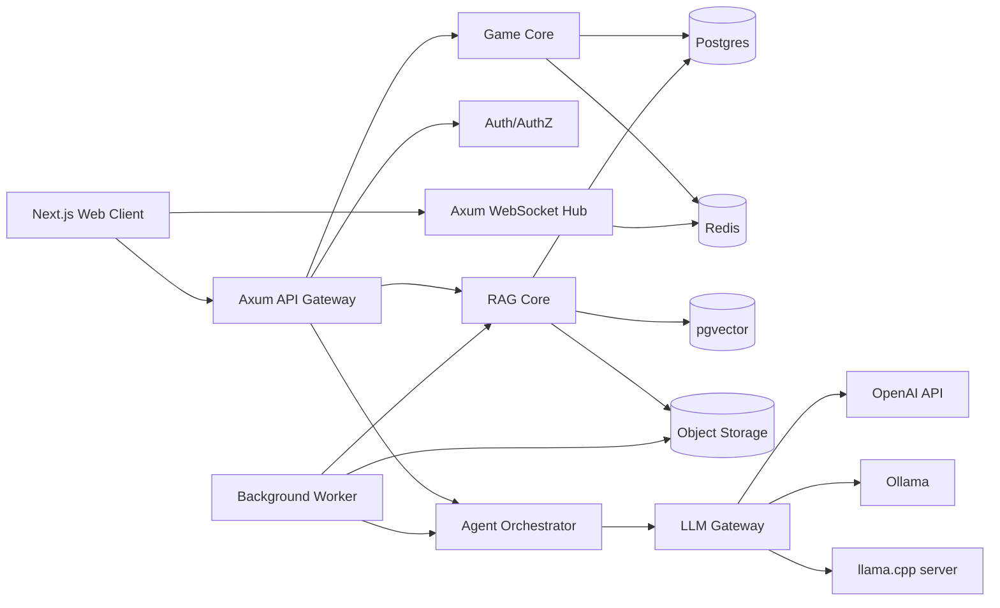
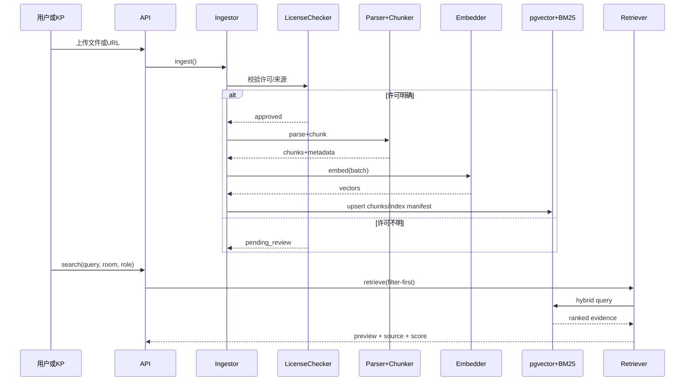
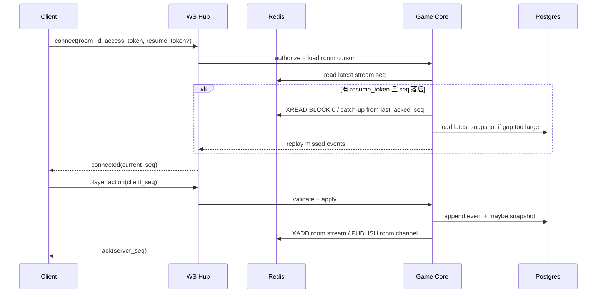

# TRPG 在线游玩平台设计文档集合与 Codex 实施手册（最终决策版）

> **状态：最终决策基线（2026-06-25）**  
> 本文档中的产品与技术决策已经完成确认。Codex 不得重新询问这些已决定事项，也不得退回旧的“待确认/未指定”方案。任何实现偏离都必须先写 ADR 并说明迁移与兼容影响。

## 执行摘要

基于现有三份深度研究文档与此前需求，这个平台最稳妥的实现方式不是“一个 Web 服务 + 一个向量库 + 一个模型接口”，而是**事件驱动的房间核心、权限先行的多知识域 RAG、可插拔模型网关、全链路审计与可回放会话日志**。现有文档已经把产品边界锁定为多知识域 RAG、多 Agent 协作、KP-only 内容保护、桌面 Web 优先且兼容线上/线下双模式，因此服务端应把“权限隔离、断线恢复、审计、部署一致性、成本控制”作为第一优先级，而不是把复杂性提前压到前端或提示词里。

推荐的默认生产栈是 **Rust workspace + Axum + Tokio + SQLx + PostgreSQL + pgvector + Redis + S3 兼容对象存储**。这个组合的优势在于：Axum 原生支持 `WebSocketUpgrade` 与读写并发拆分，适合实时房间；Tokio 的多线程调度器适合将 HTTP、WebSocket、后台 ingest、Agent 调度与导出任务统一在一个运行时内；SQLx 提供静态检查查询与嵌入式 migration 能力；pgvector 可以把向量与业务数据保留在同一 PostgreSQL 中；PostgreSQL 的行级安全策略与 `jsonb`/GIN 能把权限过滤与可扩展元数据统一起来。

模型层应采用 **OpenAI-compatible 统一抽象**。OpenAI 的 Structured Outputs 可保证 schema adherence，优于仅保证“合法 JSON”的 JSON mode；Ollama 已提供本地 API、结构化输出、embeddings 与 OpenAI compatibility；llama.cpp server 也提供 OpenAI-compatible chat completions、responses、embeddings，以及 schema-constrained JSON。这样“云模型 / 本地模型 / mock client”的切换可以落到代码层，而不是靠散落的 if/else 和环境配置绑死。

RAG 侧必须坚持**合法来源、元数据完备、权限过滤优先、只返回短证据片段**。美国版权局明确指出，合理使用没有固定的“可安全复用字数或页数”，是否成立取决于具体情境；Creative Commons 官方则明确 CC 许可是预先授予再利用权限的标准化方式；D&D Beyond 官方 SRD 页面又证明至少部分规则系统内容可以在 CC-BY-4.0 下合法使用。因此平台默认应只导入官方 SRD、CC/OGL/ORC/public domain 内容，或用户声明有权使用的上传资料；许可证不明一律进入 `pending_review`。

在实时链路上，应把 **Redis Pub/Sub** 和 **Redis Streams**分开使用：Pub/Sub 用于低延迟瞬时广播，Streams 用于可恢复事件流。Redis 官方文档明确指出，Pub/Sub 是 at-most-once，断线时消息可能永久丢失；而 Streams 消息可持久化，并支持更强的消费语义；`XREAD` 支持阻塞读取和单连接监听多个流。这正好适合实现“房间事件广播 + 断线重连 + 会话回放 + 事件补齐”。

本报告将结果组织成可直接交给 Codex 的 Markdown 文档集合。首发基线已经确定为：单区域、桌面 Web 优先、云服务与 Compose 自托管双形态、1 个 API + 1 个 Worker、20 个活跃房间、200 个并发 WebSocket，压测目标 1000 连接。外部语音链接进入 MVP；托管 LiveKit、Passkey、等距/3D 与多区域属于后续路线，不再是阻塞性待定项。

## 已完成决策与交付清单

所有原“待确认”事项均已关闭。项目采用 [`DECISIONS.md`](../DECISIONS.md) 中的最终基线；Codex 不得在初始化阶段重新询问产品范围。

关键修订：

- 规则首发覆盖 Generic Percentile、D&D SRD 5.2.1，并支持 COC/商业系统适配器与合法授权规则包；不捆绑未授权商业正文。
- 地图首发包含场景板、正方形网格、六角形网格。
- Creator Agent 包含可选插图插件，默认关闭、逐图审核、独立预算与许可审计。
- 战斗、回合、角色卡使用乐观锁 + PostgreSQL 死锁检测与有界重试；CRDT 仅用于协作笔记和线索布局。
- 云服务和 Compose 自托管同时支持；单区域 MVP，1000 WS 作为压测目标。
- Magic Link + OIDC；三档隐私路由；七通道音频；关键过场默认 1200ms。

Codex 首次执行前必须依次阅读：

1. `DECISIONS.md`
2. `AGENTS.md`
3. `docs/PRODUCT_SYSTEM_DESIGN.md`
4. `docs/BACKEND_ARCHITECTURE.md`
5. `docs/UI_UX_SPEC.md`
6. `CODEX_MASTER_PROMPT.md`

## 核心后端与智能子系统文档包

下图概括了建议的后端主路径。设计重点是让“权限过滤”“结构化输出”“会话持久化”“审计”和“模型切换”都不是附属功能，而是第一层能力。



上图对应的实现逻辑与官方能力匹配：Axum 提供 HTTP 与 WebSocket 的统一服务入口；OpenAI、Ollama、llama.cpp 都能提供结构化输出或 OpenAI-compatible 接口；Postgres/pgvector 可统一业务数据与嵌入向量；Redis 则在实时广播与可恢复事件流之间承担中间层角色。

**文件：`docs/ARCHITECTURE.md`**
**概要**：本文档定义 monorepo 目录、服务边界、crate 划分、运行模式和跨模块依赖规则。目标不是追求微服务数量，而是优先保证可维护性、可插拔性和清晰的权限边界；MVP 阶段建议采用单进程多 crate，后续再按瓶颈拆为 gateway、worker、ingest、export 等独立部署单元。这个取舍与 Axum/Tokio 的异步模型、SQLx 的强类型查询，以及 PostgreSQL + pgvector 一体化存储的工程特性匹配。

关键设计决策与替代方案如下：

| 决策点 | 推荐方案 | 备选方案 | 取舍说明 |
|---|---|---|---|
| 服务形态 | 单仓库、多 crate、单网关 + worker | 多微服务先拆开 | MVP 先降低部署和调试复杂度，避免早期网络边界过多 |
| 向量层 | 默认 pgvector | Qdrant 独立部署 | pgvector 同库事务与权限更简单；Qdrant 作为高过滤升级路径 |
| 后端语言 | Rust | Node/Nest、Go | Rust 更利于共享规则引擎、RAG 与实时状态机 |
| API 风格 | REST + WebSocket | GraphQL + Subscription | REST 便于明确权限和缓存；实时链路单独走 WS 更稳 |

建议仓库骨架如下：

| 路径 | 作用 | 主要依赖 |
|---|---|---|
| `crates/server` | Axum Router、HTTP/WS、错误模型 | axum, tower, tokio |
| `crates/auth` | 登录、JWT/session、房间权限、RLS context | serde, jsonwebtoken, sqlx |
| `crates/game_core` | 房间状态机、回合推进、存档、冲突策略 | sqlx, redis, serde |
| `crates/rag_core` | retrieval trait、hybrid search、evidence model | sqlx, tantivy, pgvector/sql |
| `crates/document_ingestor` | 文件接收、许可校验、解析切块、索引写入 | reqwest, lopdf/文本提取器 |
| `crates/llm_client` | OpenAI-compatible provider、mock、本地/云切换 | reqwest, serde |
| `crates/agent_core` | Agent envelope、schema 校验、审计 | serde_json, jsonschema |
| `crates/kp_agent` 等 | 具体 Agent 逻辑 | agent_core, rag_core |
| `crates/export_core` | markdown/html/json 导出 | tera/askama, serde |
| `infra/` | compose、helm、migrations、prom config | yaml, sql |

关键 API 列表建议从一开始就固定为以下最小集合：

| 路径 | 方法 | 说明 | 权限 |
|---|---|---|---|
| `/healthz` | GET | 存活检查 | public |
| `/readyz` | GET | 就绪检查，验证 DB/Redis/Object Storage | internal |
| `/api/auth/login` | POST | 登录或发起 Magic Link | public |
| `/api/rooms` | POST | 创建房间 | auth user |
| `/api/rooms/{id}` | GET | 房间详情与当前状态 | room member |
| `/api/rules/ingest-file` | POST | 导入规则/模组文件 | kp/admin |
| `/api/rules/search` | GET | 权限过滤检索 | room member/kp |
| `/api/game/{room_id}/act` | POST | 玩家行动 | room member |
| `/ws/rooms/{id}` | GET | 房间实时链路 | room member |
| `/api/exports/{session_id}` | POST | 生成导出 | kp/owner |

请求示例：

```json
POST /api/game/room_123/act
{
  "session_id": "sess_001",
  "player_action": "我翻看桌上的日记本。",
  "client_seq": 184,
  "resume_token": "optional"
}
```

响应示例：

```json
{
  "accepted": true,
  "event_id": "evt_901",
  "server_seq": 912,
  "pending": "kp_agent"
}
```

部署/运行步骤建议先固定为：配置 `DATABASE_URL`、`REDIS_URL`、`S3_ENDPOINT`、`OPENAI_API_KEY`、`OPENAI_MODEL`、`OPENAI_BASE_URL`、`LOCAL_LLM_ENDPOINT`，再通过 SQLx migration 初始化数据库，最后启动 `api` 与 `worker`。SQLx 文档显示 `query!()` 可在编译期静态检查 SQL，而 `migrate!()` 与 `sqlx-cli` 可结合 `migrations/` 目录使用。

测试用例清单建议至少包括：其一，Router 注册与健康检查返回正确状态；其二，带无效 JWT 的房间请求被拒绝；其三，`/api/game/{room_id}/act` 在幂等键重复时不重复推进回合。
Codex 可直接使用的实现提示词如下：
“在 repo 中创建 Rust workspace：`server/auth/game_core/rag_core/document_ingestor/llm_client/agent_core`。用 Axum 暴露 health、auth、rooms、rules、game、exports 与 ws 路由；共用错误类型与 `AppState`。必须使用 `tokio`、`sqlx`、`serde`、`thiserror`，不得在 handler 里直接写业务逻辑。添加 router smoke test、auth middleware test、idempotency test。运行 `cargo fmt && cargo clippy --workspace -- -D warnings && cargo test --workspace`。”

**文件：`docs/RAG_SPEC.md`**
**概要**：本文档定义合法来源导入、source registry、license checker、chunking、embedding、vector store、hybrid retrieval、permission-filtered retrieval 和 index manifest。核心原则是“先判断合法性与可见性，再索引与检索”，并且**检索接口只返回证据，不直接返回最终答案**。这与 USCO 对 fair use 的不确定性说明、CC 的预授权逻辑，以及 D&D SRD 等官方开放规则文本的使用方式是一致的。

关键设计决策与替代方案如下：

| 决策点 | 推荐方案 | 备选方案 | 取舍说明 |
|---|---|---|---|
| 规则来源 | SRD/CC/OGL/ORC/public domain/用户声明上传 | 全网自动抓取 | 法律风险过高，不可默认自动抓取 |
| 检索方式 | 向量 + BM25 混合召回 + RRF | 纯向量检索 | 规则问答常有术语精确命中需求 |
| 检索过滤 | 先权限过滤再检索 | 先召回后裁剪 | 防止 KP-only 内容进入候选集 |
| 向量层 | pgvector 默认，Qdrant 适配 | 直接锁死 Qdrant | MVP 更适合与业务库统一 |

RAG 关键数据模型如下：

| 表/集合 | 关键字段 | 类型 | 索引 |
|---|---|---|---|
| `sources` | `id`, `system_name`, `title`, `source_url`, `license_name`, `license_url`, `accessed_at`, `content_hash`, `status` | uuid/text/timestamptz | `UNIQUE(content_hash)`, `btree(system_name,status)` |
| `documents` | `id`, `source_id`, `document_type`, `room_id`, `session_id`, `visibility_scope` | uuid/text | `btree(source_id)`, `btree(room_id,visibility_scope)` |
| `document_chunks` | `id`, `document_id`, `section_path`, `page_start`, `page_end`, `content`, `token_estimate`, `metadata jsonb` | uuid/text/jsonb | `GIN(metadata)`, `btree(document_id)` |
| `chunk_embeddings` | `chunk_id`, `embedding vector(n)` | uuid/vector | HNSW/IVFFlat on vector |
| `keyword_index_manifest` | `document_id`, `index_version`, `path`, `status` | uuid/text | `btree(document_id,status)` |
| `pending_review` | `source_id`, `reason`, `review_state` | uuid/text | `btree(review_state)` |

推荐的 `visibility_scope` 枚举：`public_rule`、`room_rule`、`kp_only_module`、`pl_visible_clue`、`kp_secret`、`character_private`、`session_log`、`memory_private`。

检索与写入流程如下图所示：



Qdrant 文档明确说明 payload 可存 JSON 形式的附加信息，过滤性能依赖 payload index，而且**payload indexes 应在 ingest 前创建**，否则要重建 HNSW 才能充分利用过滤感知边。即使默认实现选 pgvector，也应保留与 Qdrant 兼容的 `payload`/`metadata` 模型。

关键 API 列表如下：

| 路径 | 方法 | 说明 | 权限 |
|---|---|---|---|
| `/api/rules/discover` | POST | 搜索开放规则源 | admin/kp |
| `/api/rules/ingest-file` | POST | 导入本地 `pdf/md/html/txt` | kp/admin |
| `/api/rules/ingest-url` | POST | 导入 URL 文本 | kp/admin |
| `/api/rules/sources/{id}` | GET | 查看 source 与许可状态 | kp/admin |
| `/api/rules/search` | GET | 权限过滤检索 | room member |
| `/api/rules/reindex/{source_id}` | POST | 重建索引 | admin |

请求示例：

```json
POST /api/rules/ingest-file
{
  "system_name": "dnd5e_srd_5_2_1",
  "document_type": "rulebook",
  "license_name": "CC-BY-4.0",
  "source_kind": "user_upload",
  "declared_has_rights": true
}
```

响应示例：

```json
{
  "source_id": "src_001",
  "status": "approved",
  "chunks_written": 245,
  "keyword_indexed": true
}
```

部署/运行步骤：Postgres 安装 pgvector 扩展；对象存储用于原始文件与 manifest；规则导入 worker 与 API 分离部署；本地离线开发可降级为 SQLite + mock embeddings，但生产默认使用 PostgreSQL。
测试用例清单：其一，`license_name` 缺失或来源不明时进入 `pending_review`；其二，同一文件二次导入按 `content_hash` 去重；其三，PL 查询永远不会召回 `kp_only_module`。
Codex 实现提示词：
“实现 `rag_core` 与 `document_ingestor`。创建 `Source`, `Document`, `DocumentChunk`, `RetrievalFilter`, `Evidence`、`EmbeddingProvider`, `VectorStore`, `KeywordIndex` trait。先做 pgvector + Tantivy，另外预留 Qdrant adapter。禁止抓取或入库存疑版权文本；不明确许可必须写入 `pending_review`。加测试：license checker、chunking、hash de-dup、permission-filtered retrieval。测试命令同 workspace 标准命令。”

**文件：`docs/AGENT_PIPELINE.md`**
**概要**：本文档定义 dice agent、character agent、kp agent、creator agent、memory agent 的统一 I/O schema、调用顺序、provider 切换模式、审计字段、节流与 token 预算规则。核心原则是“能本地 deterministic 解决的问题不调模型；必须调模型时必须结构化返回；每次调用都要可追溯、可限流、可计费、可复盘”。OpenAI Structured Outputs、Ollama Structured Outputs 与 llama.cpp 的 schema-constrained JSON 为这一目标提供了成熟支撑。

关键设计决策与替代方案如下：

| 决策点 | 推荐方案 | 备选方案 | 取舍说明 |
|---|---|---|---|
| Agent 输出 | 强制 JSON schema | 任意文本 + 正则解析 | 结构化输出失败率显著更低 |
| 模型选择 | 统一 provider trait + fallback chain | 每个 Agent 直接绑供应商 SDK | 便于本地/云切换与离线测试 |
| 学习机制 | 记忆文档与偏好提取，不直接微调 | 自动微调权重 | 审计与回滚成本更低，安全性更好 |
| 成本控制 | 证据裁剪、摘要、缓存、预判 | 所有动作直接上大模型 | token 浪费与延迟不可控 |

Agent 审计与调度表建议如下：

| 表 | 字段 | 类型 | 说明 |
|---|---|---|---|
| `agent_runs` | `id`, `agent_type`, `room_id`, `session_id`, `provider`, `model`, `status`, `latency_ms` | uuid/text/int | 基本调用记录 |
| `agent_audit_entries` | `agent_run_id`, `who`, `when`, `prompt_tokens`, `completion_tokens`, `cached_tokens`, `cost_estimate`, `rag_evidence_ids jsonb` | uuid/jsonb | 成本与证据审计 |
| `agent_rate_limits` | `scope_key`, `window_sec`, `max_calls`, `burst` | text/int | 节流策略 |
| `memory_documents` | `id`, `agent_scope`, `summary`, `embedding_ref`, `visibility_scope` | uuid/text | 长期记忆 |
| `model_provider_config` | `provider_name`, `base_url`, `default_model`, `supports_json_schema`, `supports_embeddings` | text/bool | provider 能力矩阵 |

统一的 Agent envelope 建议如下：

```json
{
  "request_id": "uuid",
  "agent_type": "kp_agent",
  "room_id": "uuid",
  "session_id": "uuid",
  "actor_id": "uuid",
  "input": {},
  "required_schema_version": "v1",
  "provider_hint": "auto",
  "timeout_ms": 12000
}
```

KP Agent 返回示例：

```json
{
  "visible_narration": "你听见抽屉内部传来轻微咔哒声。",
  "private_kp_notes": "抽屉有假底，尚未暴露给PL。",
  "rule_basis": [
    {
      "source": "Core Rules SRD",
      "section": "Ability Checks",
      "reason": "撬锁属于技能/工具检定"
    }
  ],
  "required_rolls": [
    {
      "actor": "pl_1",
      "dice_formula": "1d20+5",
      "check_type": "thieves_tools",
      "difficulty": 15
    }
  ],
  "state_updates": [
    {
      "path": "scene.drawer.lock_state",
      "op": "set",
      "value": "contested"
    }
  ],
  "uncertainty": null
}
```

模型切换策略应定义为：

| 模式 | 路由规则 | 典型用途 |
|---|---|---|
| `standard` | 公开与普通上下文可走云端；KP 私密内容默认不出域 | 公共规则、低敏感房间 |
| `private_hybrid` | 公开推理可走云端；模组秘密、隐藏线索和完整档案强制本地 | 默认推荐 |
| `local_only` | chat、embedding、rerank 全部本地；本地故障时停止 Agent，不回退云端 | 高隐私/离线房间 |
| `mock_only` | 全部使用 mock provider | CI 与确定性测试 |

环境变量默认值必须统一为：`OPENAI_API_KEY`、`OPENAI_MODEL`、`OPENAI_BASE_URL`、`LOCAL_LLM_ENDPOINT`。OpenAI 官方 quickstart 明确使用环境变量读入 `OPENAI_API_KEY`；Ollama 和 llama.cpp 都支持本地 OpenAI-compatible base URL。

token 优化策略必须写入此文档并成为审计标准：固定系统提示与 schema 前置，以便命中 OpenAI Prompt Caching；Prompt Caching 官方文档写明，缓存对 1024 token 以上请求自动启用，缓存命中依赖 exact prefix matches，并会返回 `cached_tokens`；因此 system prompt、few-shot、JSON schema 版本、工具定义都应固定在前缀。证据只保留 top-k 和 capped preview，agent 只看摘要化会话和必要证据，不直接吃完整日志。

关键 API 列表：

| 路径 | 方法 | 说明 | 权限 |
|---|---|---|---|
| `/api/agents/dice/resolve` | POST | 行动判定与掷骰请求 | room member |
| `/api/agents/character/assist` | POST | 车卡辅助 | room member/kp |
| `/api/agents/kp/adjudicate` | POST | KP 裁定 | kp/service |
| `/api/agents/creator/export-story` | POST | 会话改写成故事 | kp/room owner |
| `/api/agents/memory/extract` | POST | 从已完成会话提取长期记忆 | service only |

测试用例清单：其一，Schema 不匹配时返回 validation error 而不是静默降级；其二，`kp_agent` 在证据缺失时必须输出 `uncertainty`；其三，`agent_audit_entries` 必须在成功和失败两种情况下都被记录。
Codex 实现提示词：
“实现 `llm_client`、`agent_core`、`dice_agent`、`character_agent`、`kp_agent`、`creator_agent`、`memory_core`。统一 provider trait：`chat_json/chat_text/embed`，支持 OpenAI、Ollama、llama.cpp 与 mock。所有 Agent 输出必须匹配 JSON schema，并写审计表（tokens/cost/evidence_ids）。禁止输出大段版权原文；KP 在规则不足时必须设置 `uncertainty`。添加 provider mock test、schema validation test、audit logging test。”

## 实时会话、数据库与性能文档包

实时链路需要把“广播”和“恢复”拆开。Redis 官方文档说明，Pub/Sub 是 at-most-once，断链时消息可能永久丢失；Streams 则支持持久化与更强的消费语义；`XREAD` 可以阻塞等待新事件，并能用单连接同时监听多个流。因此建议：**房间内瞬时扇出走 Pub/Sub，权威事件日志走 Streams + Postgres 快照**。这样玩家断线后可以根据 `last_acked_seq` 通过 Redis Streams 或 Postgres event log 补齐差量，再重新订阅 live 流。



**文件：`docs/REALTIME_SESSIONS.md`**
**概要**：本文档定义房间创建、玩家加入、会话状态机、WebSocket 协议、resume token、断线重连、事件重放与冲突解决。默认采用 **WebSocket 为主、WebRTC 为可选扩展**，因为 TRPG 平台的关键是状态一致性、顺序事件和审计，而非毫秒级媒体传输。Axum 的 `WebSocketUpgrade` 和 WebSocket `split()` 能支持该模式。

关键设计决策与替代方案如下：

| 决策点 | 推荐方案 | 备选方案 | 取舍说明 |
|---|---|---|---|
| 实时协议 | WebSocket 主链路 | 直接使用 WebRTC data channel | WS 与服务端状态机更直接，便于权限与审计 |
| 恢复机制 | 事件序号 + resume token + snapshot replay | 仅重拉房间全量状态 | 全量重拉开销更高、处理冲突更差 |
| 冲突策略 | 战斗/回合/角色卡乐观锁 + 死锁检测；笔记/线索布局 CRDT | 全量 CRDT 或悲观锁 | 权威状态可审计，协作内容保持实时体验 |
| 房间消息层 | Streams + Pub/Sub 组合 | Pub/Sub 单独承担 | Pub/Sub 无法保证恢复 |

核心表/结构：

| 表/键 | 字段 | 类型 | 说明 |
|---|---|---|---|
| `rooms` | `id`, `title`, `mode`, `system_name`, `owner_user_id`, `status` | uuid/text | 房间基本信息 |
| `room_members` | `room_id`, `user_id`, `role`, `permissions jsonb` | uuid/jsonb | KP/PL/observer |
| `sessions` | `id`, `room_id`, `active_scene_id`, `current_phase`, `version` | uuid/int | 当前游玩会话 |
| `room_events` | `id`, `room_id`, `session_id`, `server_seq`, `event_type`, `payload jsonb`, `created_at` | bigint/jsonb | 权威事件日志 |
| Redis Stream `room:{id}:events` | `server_seq`, `event_type`, `payload` | stream | 断线补齐 |
| Redis Pub/Sub `room:{id}:live` | `event` | pubsub | 低延迟广播 |

WebSocket 入站消息建议统一为：

```json
{
  "op": "player_action",
  "room_id": "room_123",
  "session_id": "sess_001",
  "client_seq": 94,
  "last_acked_server_seq": 1102,
  "payload": {
    "text": "我向门后侧耳倾听。"
  }
}
```

出站消息建议统一为：

```json
{
  "op": "room_event",
  "server_seq": 1103,
  "event_type": "turn.accepted",
  "payload": {
    "event_id": "evt_901",
    "pending_agent": "kp_agent"
  }
}
```

关键 API 列表：

| 路径 | 方法 | 说明 | 权限 |
|---|---|---|---|
| `/api/rooms` | POST | 创建房间 | auth user |
| `/api/rooms/{id}/join` | POST | 加入房间 | invited user |
| `/api/rooms/{id}/resume` | POST | 获取 resume token 与补齐 cursor | room member |
| `/api/sessions/{id}/snapshot` | GET | 获得最新快照 | room member |
| `/ws/rooms/{id}` | GET | 建立实时链接 | room member |

部署/运行步骤：Redis 开启持久化；WS Hub 与 API 共享 room membership cache；`resume_token` 建议 5–15 分钟短时有效，关联 user/room/version；事件流保留 72 小时，快照长期保存于 Postgres。
测试用例清单：其一，客户端断线后 30 秒内重连可按 `server_seq` 补齐事件；其二，伪造 resume token 会被拒绝；其三，同时修改角色 HP 时，版本冲突会返回清晰错误。
Codex 实现提示词：
“在 `game_core` 与 `server` 中实现房间状态机、WS Hub、resume token 与 event replay。Redis 必须同时用于 `room:{id}:events` stream 与 `room:{id}:live` 广播；Postgres 维护 `room_events` 与 `sessions.version`。禁止仅靠内存保存权威状态。测试：disconnect/reconnect、replay gap、optimistic lock conflict。”

**文件：`docs/DATABASE_SCHEMA.md`**
**概要**：本文档定义 PostgreSQL 主 schema、pgvector 列、Redis key 规划、对象存储命名约定与 migration 规则。核心思想是：**结构化强约束数据放关系表，扩展性字段放 `jsonb`，高频过滤字段加 btree/Gin，向量放同库 pgvector，冷原始文件放对象存储**。PostgreSQL 官方文档对 RLS 与 `jsonb` GIN 检索都给出了直接支持。

关键设计决策与替代方案如下：

| 决策点 | 推荐方案 | 备选方案 | 取舍说明 |
|---|---|---|---|
| 主数据库 | PostgreSQL | MySQL | pgvector、jsonb、RLS 的组合更适合本项目 |
| 扩展字段 | `jsonb` + GIN | 全 EAV | `jsonb` 保留灵活性同时可索引 |
| 会话快照 | Postgres JSON 快照 + 事件表 | 仅事件溯源 | 实际恢复速度更好 |
| 原始文件 | S3-compatible Object Storage | 全放 DB | 成本与体积控制更优 |

建议的核心表如下：

| 表 | 关键字段 | 类型 | 索引/约束 |
|---|---|---|---|
| `users` | `id`, `email`, `display_name`, `status` | uuid/text | `UNIQUE(email)` |
| `rooms` | `id`, `owner_user_id`, `mode`, `system_name`, `config jsonb` | uuid/jsonb | `btree(owner_user_id)` |
| `room_members` | `room_id`, `user_id`, `role`, `joined_at` | uuid | `UNIQUE(room_id,user_id)` |
| `sessions` | `id`, `room_id`, `title`, `state jsonb`, `version` | uuid/jsonb | `btree(room_id)`, `btree(version)` |
| `characters` | `id`, `room_id`, `owner_user_id`, `sheet jsonb`, `visibility_scope` | uuid/jsonb | `btree(room_id,owner_user_id)` |
| `clues` | `id`, `room_id`, `session_id`, `title`, `body`, `visibility_scope`, `graph_meta jsonb` | uuid/jsonb | `btree(room_id,visibility_scope)` |
| `room_events` | `room_id`, `server_seq`, `event_type`, `payload jsonb` | uuid/bigint | `UNIQUE(room_id,server_seq)` |
| `documents` / `document_chunks` | 见上一文档 | 见上一文档 | `GIN(metadata)`, vector index |
| `agent_runs` / `agent_audit_entries` | 见上一文档 | 见上一文档 | `btree(room_id,created_at)` |
| `exports` | `id`, `session_id`, `format`, `object_key`, `status` | uuid/text | `btree(session_id,status)` |

Redis key 规划建议如下：

| Key 模式 | 类型 | 用途 |
|---|---|---|
| `room:{id}:events` | Stream | 断线补齐 |
| `room:{id}:live` | Pub/Sub | 即时广播 |
| `room:{id}:presence` | Hash/Set | 在线状态 |
| `ratelimit:{scope}` | String/Hash | 节流 |
| `cache:retrieval:{sha}` | String/Hash | 检索缓存 |
| `cache:summary:{session}:{window}` | String | 会话摘要缓存 |

对象存储命名建议：

| 前缀 | 内容 |
|---|---|
| `raw/{source_id}/original.*` | 用户上传原始文件 |
| `processed/{source_id}/manifest.json` | 解析 manifest |
| `exports/{session_id}/{export_id}.md|html|json` | 导出物 |
| `backups/postgres/...` | 逻辑备份与快照元数据 |

关键 API 列表：

| 路径 | 方法 | 说明 | 权限 |
|---|---|---|---|
| `/api/admin/migrations/status` | GET | migration 状态 | admin |
| `/api/admin/storage/check` | GET | db/redis/object storage 检查 | admin |
| `/api/admin/backups/run` | POST | 发起备份 | admin |

部署/运行步骤：启用 `CREATE EXTENSION vector;`；为 `jsonb` 查询建立 GIN；为房间与 chunk 可见性相关列建立组合索引；RLS 在房间隔离与文档隔离表上默认开启。PostgreSQL 文档说明，启用 RLS 且无策略时表是默认拒绝的；`jsonb` GIN 则适合高频 key/value 查询。
测试用例清单：其一，RLS 下非房间成员无法直接读取该房间角色卡；其二，`jsonb` 查询能按 `visibility_scope` 与 `system_name` 正确过滤；其三，migration 升级与回滚后 schema 校验通过。
Codex 实现提示词：
“创建 SQLx migrations，包含 users/rooms/sessions/room_events/documents/document_chunks/agent_runs 等表，启用 pgvector 扩展与 RLS。扩展字段优先用 `jsonb`，常用过滤字段建 btree/GIN。Redis key 仅通过 repository 封装访问，禁止在业务层拼接散乱 key。添加 migration test、RLS access test、vector schema smoke test。”

**文件：`docs/PERF_COST.md`**
**概要**：本文档定义检索缓存、Agent 节流、批量 embeddings、摘要窗口、top-k 策略与成本仪表盘。目标不是单纯“省 token”，而是把 token 花在真正需要生成式推理的地方，同时让模型使用成本有上限、有观测、有异常告警。OpenAI Prompt Caching、Ollama/llama.cpp 本地供给、Redis 缓存与批处理都是这个策略的组成部分。

关键设计决策与替代方案如下：

| 决策点 | 推荐方案 | 备选方案 | 取舍说明 |
|---|---|---|---|
| 上下文策略 | 规则证据 top-k + 会话摘要 + 状态增量 | 全量日志直塞模型 | 成本与延迟不可控 |
| 证据数 | 规则 top 6、模组 top 4、记忆 top 3 | 无上限召回 | 超过阈值收益快速下降 |
| embeddings | ingest 批量异步生成 | 每次检索在线即席生成 | 索引吞吐与成本不经济 |
| rerank | 本地轻量 reranker 优先，云端可选 | 每次都用大模型重排 | 价格高且延迟偏大 |

关键数据模型：

| 表 | 字段 | 说明 |
|---|---|---|
| `cost_budgets` | `scope`, `daily_limit`, `monthly_limit`, `hard_stop` | 预算 |
| `model_usage_rollups` | `date`, `provider`, `model`, `prompt_tokens`, `completion_tokens`, `cached_tokens`, `cost_estimate` | 聚合账本 |
| `retrieval_cache_entries` | `cache_key`, `query_hash`, `filter_hash`, `expires_at` | 检索缓存 |
| `session_summaries` | `session_id`, `window_start_seq`, `window_end_seq`, `summary` | 摘要缓存 |

关键 API 列表：

| 路径 | 方法 | 说明 | 权限 |
|---|---|---|---|
| `/api/admin/costs/usage` | GET | 成本聚合 | admin |
| `/api/admin/costs/budget` | PUT | 设置预算 | admin |
| `/api/admin/cache/flush` | POST | 刷新缓存 | admin |
| `/api/agents/estimate` | POST | 预估一次调用预算 | kp/admin |

部署/运行步骤：Redis 缓存 TTL 采用 30 秒到 15 分钟分级；Prompt schema 与 system prompt 版本化；OpenAI 请求记录 `cached_tokens`；离线测试默认 mock provider；敏感房间强制本地 provider。
测试用例清单：其一，相同 query + filter 在 TTL 内命中 retrieval cache；其二，超预算房间会退化为 deterministic 或本地 provider；其三，Prompt 前缀一致时审计表能记录非零 `cached_tokens`。
Codex 实现提示词：
“实现成本与性能控制：`BudgetGuard`, `RetrievalCache`, `SessionSummarizer`, `ModelUsageRollupJob`。所有 Agent 调用前必须走预算检查；检索结果缓存 key 由 query+filters+index_version 组成；记录 `cached_tokens` 与估算费用。禁止为方便实现而把全量日志发给模型。添加 budget enforcement、cache hit、summary window tests。”

## 安全、部署与质量文档包

认证、授权、传输安全、密钥管理与日志不是“上线前补一补”的内容，而是这个平台本身的核心功能。因为它天生处理未公开模组、KP 私有信息、用户上传资料和模型交互日志，任何漏检都可能变成数据泄露。OWASP 的建议可以直接转成工程规则：默认拒绝、逐请求鉴权、敏感操作重新认证、传输层默认 TLS 1.3、秘密集中化与自动轮换。

**文件：`docs/SECURITY_COMPLIANCE.md`**
**概要**：本文档定义 AuthN/AuthZ、房间权限模型、文档可见性、模型数据流说明、密钥管理、加密、审计日志、版权合规与合规开关。PostgreSQL RLS、应用层 ABAC、对象存储 SSE、Agent 审计与版权白名单共同构成最小安全基线。

关键设计决策与替代方案如下：

| 决策点 | 推荐方案 | 备选方案 | 取舍说明 |
|---|---|---|---|
| 鉴权模型 | JWT access token + refresh/session + room ABAC | 仅 RBAC | 房间、线索、角色、文档可见性更适合属性与关系控制 |
| 数据隔离 | 应用层校验 + Postgres RLS 双层 | 仅应用层 | 降低漏检风险 |
| 密钥管理 | 环境变量接 Vault/KMS，支持自动轮换 | `.env` 长期固定 | 生产安全不足 |
| 版权策略 | 白名单来源 + pending_review + 输出节流 | 依赖 fair use 自行判断 | 风险不可控 |

最小权限模型建议：

| 资源 | 角色/属性 | 权限 |
|---|---|---|
| 房间 | owner | 全部 |
| 房间 | kp | 规则导入、模组访问、导出、Agent 控制 |
| 房间 | player | 行动、公开线索、自己的角色卡 |
| 房间 | observer | 只读公开视图 |
| 文档 | `visibility_scope=kp_only_module` | 仅 kp/owner |
| 角色卡 | `owner_user_id` 或 kp | 读；修改按配置受限 |
| Agent provider | `room_privacy_mode=local_only` | 禁止云 provider |

关键 API 列表：

| 路径 | 方法 | 说明 | 权限 |
|---|---|---|---|
| `/api/auth/reauth` | POST | 敏感操作前重新认证 | auth user |
| `/api/admin/keys/rotate` | POST | 轮换引用的 provider key alias | admin |
| `/api/compliance/sources/pending` | GET | 查看待人工审核资料 | admin/kp |
| `/api/audit/agent-runs` | GET | 查看模型调用审计 | admin/kp |
| `/api/audit/access-log` | GET | 查看资源访问日志 | admin |

部署/运行步骤：TLS 终止应默认使用 TLS 1.3，兼容时可支持 TLS 1.2，但禁用更旧版本；OWASP 明确建议 Web 应用默认 TLS 1.3，只为兼容开放 TLS 1.2，并禁用 TLS 1.0/1.1 和 SSLv2/v3。密钥必须集中化并自动轮换，避免人工长期维护。

测试用例清单：其一，PL 请求 `kp_only_module` 资源返回 403 且不泄露资源存在性细节；其二，敏感设置修改前未 reauth 会被拒绝；其三，走云模型的请求若房间标记 `local_only` 必须直接拒绝。
Codex 实现提示词：
“实现 `auth`、ABAC 授权、RLS context 注入、审计记录与合规检查。默认 deny-by-default，所有房间和文档请求逐一鉴权。加入 source 白名单与 `pending_review` 流程。禁止把 API key 写入代码或测试快照；禁止返回含 KP-only 内容的错误详情。测试：403 isolation、reauth gate、local-only provider enforcement。”

**文件：`docs/DEPLOYMENT.md`**
**概要**：本文档定义一键本地部署、可选 Kubernetes 部署、备份恢复、监控告警与运行命令。Docker Compose 适合本地开发和单机验收；Helm 适合把一组 K8s 资源打成可升级、可回滚的 chart；Prometheus + Grafana 则作为最小可观测性组合。Docker 官方说明 Compose 用单个 YAML 即可定义并启动整套多容器应用；Helm 文档说明 Chart 是运行在 Kubernetes 集群中的资源定义包；Prometheus 是开源监控告警工具，Grafana 则是最常见的可视化前端。

关键设计决策与替代方案如下：

| 决策点 | 推荐方案 | 备选方案 | 取舍说明 |
|---|---|---|---|
| 本地部署 | Docker Compose | 手动启动各服务 | 验证与 onboarding 最快 |
| 生产部署 | Helm chart | 原始 K8s YAML 散件 | 升级回滚与参数管理更好 |
| 监控 | Prometheus + Grafana | 自定义日志 grep | 无法满足容量与成本分析 |
| 备份 | Postgres 逻辑备份 + Object Storage manifest + 版本化导出 | 只备份数据库 | 原始文件与导出物会丢失 |

最小 Compose 服务集合建议：

| 服务 | 作用 | 端口 |
|---|---|---|
| `api` | Axum API/WS | 8080 |
| `worker` | ingest、summarize、export、memory jobs | - |
| `postgres` | 主库 + pgvector | 5432 |
| `redis` | stream/pubsub/cache | 6379 |
| `minio` | S3-compatible object storage | 9000/9001 |
| `prometheus` | 指标抓取 | 9090 |
| `grafana` | 仪表盘 | 3000 |

关键 API 列表：

| 路径 | 方法 | 说明 | 权限 |
|---|---|---|---|
| `/metrics` | GET | Prometheus 指标 | internal |
| `/api/admin/deploy/info` | GET | 当前版本与构建信息 | admin |
| `/api/admin/backups/run` | POST | 创建备份 | admin |
| `/api/admin/backups/restore` | POST | 恢复演练 | admin |

运行步骤建议如下：先启动 Compose，执行 migration，导入一个开放 SRD 测试文件，启动 mock LLM 或配置 OpenAI/Ollama，然后打开健康检查与基础房间流程。Compose 的单文件、多服务、单命令启动正好适合这种 MVP 路径。

测试用例清单：其一，`docker compose up -d` 后 `readyz` 检查通过；其二，Prometheus 成功抓到 `api` 与 `worker` 指标；其三，恢复演练后房间快照和原始文档可读。
Codex 实现提示词：
“在 `infra/compose` 和 `infra/helm` 下生成本地与生产部署清单。Compose 至少包含 api、worker、postgres、redis、minio、prometheus、grafana。Helm 需要 values 文件、deployment、service、ingress、secret 引用和 migration job。禁止把真实密钥写进 YAML；示例只允许占位符。添加启动自检脚本与备份/恢复 smoke test。”

**文件：`docs/TEST_PLAN.md`**
**概要**：本文档定义单元、集成、端到端、性能、回归和隐私泄漏测试，以及验收标准。TRPG 平台的关键失败模式不是“按钮点不开”，而是“权限判断错、房间状态乱序、模型乱编规则、KP-only 泄露、恢复丢事件、成本飙升”，因此测试必须覆盖这些系统性风险。

关键设计决策与替代方案如下：

| 决策点 | 推荐方案 | 备选方案 | 取舍说明 |
|---|---|---|---|
| 测试层级 | 单元 + 集成 + E2E + 压测 + 隐私测试 | 只做 API 单测 | 覆盖不到核心故障模式 |
| LLM 测试 | mock provider + golden JSON schema | 真模型直测 | CI 成本不可控且不稳定 |
| 隐私泄漏测试 | 规则化攻击样例 + 权限回归套件 | 手工点点看 | 无法持续保证 |
| 验收标准 | 明确阈值与场景 | 模糊“能跑就行” | 容易后期返工 |

测试矩阵建议如下：

| 模块 | 至少覆盖用例 |
|---|---|
| `auth` | 登录、token 过期、reauth、权限回归 |
| `rag` | license checker、chunking、top-k、permission filter |
| `agent` | schema validation、uncertainty、audit logging |
| `ws/session` | reconnect、replay、version conflict |
| `db` | migration、RLS、jsonb filters、vector index smoke |
| `deployment` | compose ready、backup/restore、metrics scraping |
| `privacy` | PL 请求 KP-only、错误消息是否泄露资源存在性、creator export 是否剔除私密内容 |

关键验收标准建议：

| 维度 | 基线 |
|---|---|
| 断线恢复 | 客户端在 60 秒内重连后可补齐最新 500 条房间事件 |
| KPI 响应 | 普通行动提交到收到 accepted ack 小于 300ms（不含长 Agent 完成） |
| RAG 检索 | 权限过滤零误放；规则问答 smoke test top-5 命中率达到团队定义基线 |
| Agent 输出 | JSON schema 解析成功率在 mock + staging 中达到 99% 以上 |
| 隐私 | 关键回归样例中 KP-only 泄露率为 0 |
| 构建 | `cargo fmt`, `cargo clippy --workspace -- -D warnings`, `cargo test --workspace`, `pnpm lint/test` 全通过 |

测试用例清单举例：其一，PL 用猜测出来的 clue id 访问 KP 私密线索，响应必须与不存在资源表现一致；其二，lossy 网络下 WS 中断后用 `last_acked_server_seq` 补齐事件；其三，KP Agent 在无规则证据时输出 `uncertainty` 且不引用伪造章节。
Codex 实现提示词：
“建立测试分层：unit、integration、e2e、privacy。所有 Agent 测试默认用 mock provider；所有房间权限测试必须覆盖 PL/KP/owner 三角色。增加 reconnect、replay、RLS 和隐私泄露回归。CI 运行 `cargo fmt && cargo clippy --workspace -- -D warnings && cargo test --workspace && pnpm lint && pnpm test`。禁止把真模型调用变成 CI 必需项。”

## 文档与开发者体验文档包

最后一组文档的目标，是让 Codex 与后续人类开发者都能在同一个仓库里得到一致行为。Codex 官方文档说明 `AGENTS.md` 会在开始工作前被读取，并且会按全局到项目再到子目录的顺序合并；因此最好的实践不是反复在聊天窗口解释规则，而是把工作约定写进仓库。

**文件：`AGENTS.md`、`README.md`、`API_SPEC.md`**
**概要**：这组文档面向开发者与 Codex 本身。`AGENTS.md` 只写“必须遵守”的约束、测试命令与禁止事项；`README.md` 面向第一次启动项目的人；`API_SPEC.md` 面向前后端联调与后续自动生成 SDK。三者必须保持比代码更稳定，避免把实现细节写死在 prompt 中。

关键设计决策与替代方案如下：

| 文档 | 推荐内容 | 备选但不推荐 |
|---|---|---|
| `AGENTS.md` | 目录边界、测试命令、法律限制、敏感信息规则 | 冗长需求全文复制 |
| `README.md` | 快速开始、依赖、环境变量、示例命令 | 只放产品宣传 |
| `API_SPEC.md` | REST/WS 协议、认证、示例请求响应、错误码 | 仅散落在代码注释中 |

建议 `AGENTS.md` 最小内容：

| 区块 | 需要写入的规则 |
|---|---|
| 项目红线 | 禁止盗版规则书、禁止写死 API key、禁止伪造规则条文 |
| 测试命令 | `cargo fmt`、`cargo clippy --workspace -- -D warnings`、`cargo test --workspace` |
| 模块边界 | server/auth/game_core/rag_core/agent_core/... |
| 提交要求 | 新接口必须补测试，新表必须补 migration |
| 合规要求 | 不明确许可进入 `pending_review` |

建议 `README.md` 最小结构：

| 章节 | 内容 |
|---|---|
| 项目简介 | 多知识域 RAG + 多 Agent TRPG 平台 |
| 快速开始 | compose 启动、migrate、mock LLM |
| 环境变量 | OpenAI、本地模型、DB、Redis、S3 |
| 合法导入 | 允许的规则来源与 pending review |
| CLI/API 示例 | 创建房间、导入规则、开始游玩 |
| 测试与 CI | 标准命令 |
| 版权与合规 | 只导入合法来源、RAG 只输出短证据 |

建议 `API_SPEC.md` 最小接口族：

| 分组 | 主要接口 |
|---|---|
| Auth | login, logout, refresh, reauth |
| Rooms/Sessions | create room, join, get snapshot, act, save |
| Rules/RAG | ingest-file, ingest-url, search, source detail |
| Agents | dice resolve, character assist, kp adjudicate, creator export |
| Admin | backups, metrics, costs, pending review |

部署/运行步骤应在 `README.md` 中明确写出环境变量样例。OpenAI 官方文档已明确建议通过环境变量导入 `OPENAI_API_KEY`；Codex 官方文档则支持把项目工作约定写在 `AGENTS.md` 中。

测试用例清单：其一，`AGENTS.md` 中的命令与仓库实际命令一致；其二，`README.md` 的快速开始能在全新机器上走通；其三，`API_SPEC.md` 与实际路由实现保持同步。
Codex 实现提示词：
“先写 `AGENTS.md`、`README.md`、`API_SPEC.md`、`ARCHITECTURE.md`。`AGENTS.md` 必须声明法律红线、测试命令、模块边界与禁止事项；README 必须能让新用户用 Compose 启动 API、worker、DB、Redis、MinIO；API_SPEC 覆盖 REST 与 WS 协议。禁止把真实密钥、私人 URL 或未授权规则文本写进样例。完成后再开始写业务代码。”

### 最终范围对 Codex 的强制要求

- 创建 `crates/rule_system_generic_percentile`、`crates/rule_system_dnd5e_srd` 与 `crates/rule_system_commercial_adapter`；商业适配器测试只能使用自造 fixture。
- 地图合同必须包含 `scene_board/square/hex_flat/hex_pointy`，并添加六角格距离和邻接测试。
- 创建 `crates/media_provider` 或等价边界，提供 mock image provider；MVP 默认 `MEDIA_GENERATION_ENABLED=false`。
- 权威写 API 必须有 `expected_version`、`idempotency_key`；捕获 `40P01/40001` 并有界重试。
- E2E 必须覆盖版本冲突、死锁重试耗尽、断线重连、PL 私密数据隔离、图片草稿审批和商业规则包许可拒绝。

以下是一段**可直接给 Codex 的总控提示词**，用于把本报告落地为仓库初始化任务：

```text
你现在是本仓库的 Rust 后端总工程师。请按以下顺序执行：
1. 创建 Rust workspace 与 infra 目录，包含 server/auth/game_core/rag_core/document_ingestor/llm_client/agent_core/kp_agent/dice_agent/character_agent/creator_agent/memory_core/export_core。
2. 先写 AGENTS.md、README.md、API_SPEC.md、ARCHITECTURE.md、RAG_SPEC.md、AGENT_PIPELINE.md、REALTIME_SESSIONS.md、DATABASE_SCHEMA.md、SECURITY_COMPLIANCE.md、DEPLOYMENT.md、TEST_PLAN.md、PERF_COST.md。
3. 只允许合法规则来源；不明确许可进入 pending_review。
4. 所有 Agent 输出必须走 JSON schema，所有调用必须记录 who/when/model/prompt_tokens/completion_tokens/cost_estimate/rag_evidence_ids。
5. 默认支持 OpenAI 与本地 OpenAI-compatible provider；必须提供 mock provider。
6. 实现 health/ready、rooms、rules ingest/search、game act、exports 与 ws 骨架。先保证编译、测试与 migration 可运行，再逐步补业务。
禁止事项：不得把 API key 写入代码或样例；不得伪造版权规则文本；不得跳过测试。完成后运行 cargo fmt、cargo clippy --workspace -- -D warnings、cargo test --workspace。
```

补充说明：Docker Compose 适合把本地整套多容器应用在单个 YAML 中定义并一键启动；Helm 适合把 Kubernetes 资源打包成可安装、可升级、可回滚的 chart；Prometheus 适合指标采集与告警，Grafana 适合可视化。这组工具链与当前平台“需要一键部署、需要稳定、需要观测模型成本与实时链路”的目标相匹配。
