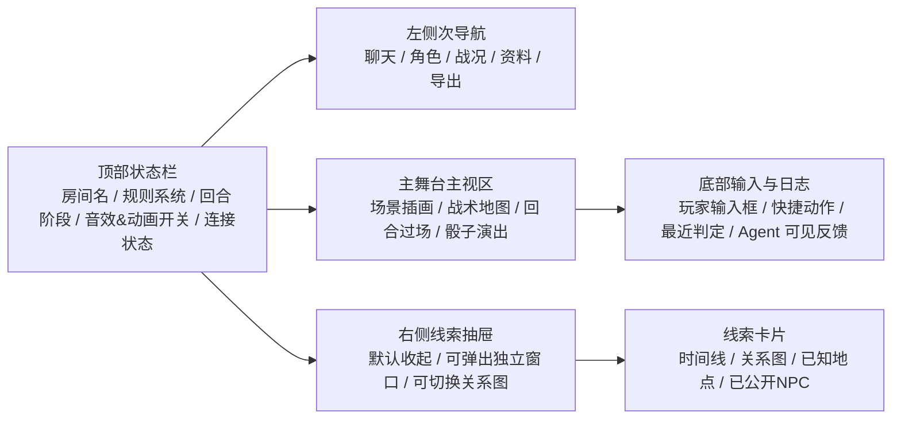
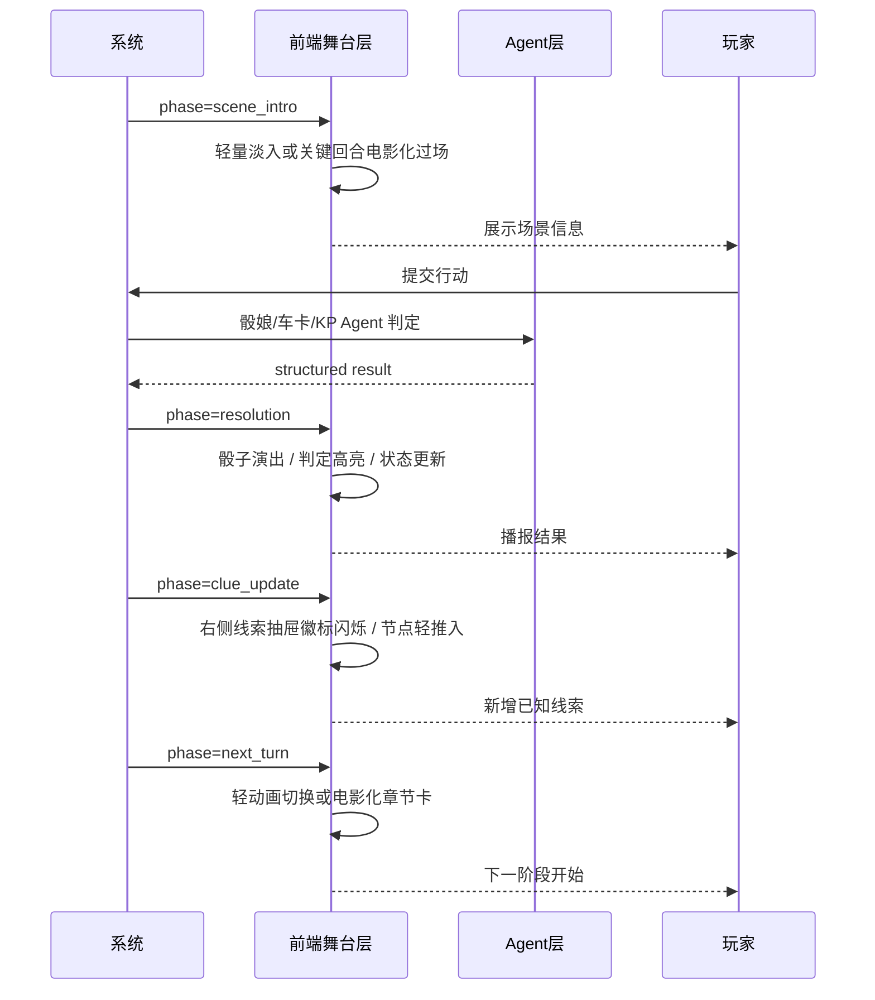
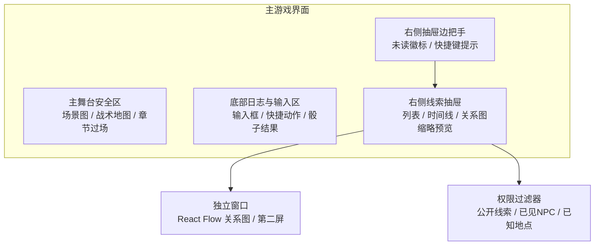
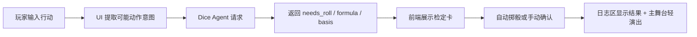

# TRPG 平台 UI/UX 规格（最终决策版）

> **状态：最终决策基线（2026-06-25）**  
> 本文档中的产品与技术决策已经完成确认。Codex 不得重新询问这些已决定事项，也不得退回旧的“待确认/未指定”方案。任何实现偏离都必须先写 ADR 并说明迁移与兼容影响。

## 执行摘要

本规格以你提供的 TRPG 平台研究文档为基础，继承其“多知识域 RAG + 多 Agent + 权限隔离 + KP-only 模组保护”的产品边界，并把重点落在**桌面 Web 优先**、**线上跑团为主**、**兼容平板与线下无实体辅助场景**的 UI/UX 设计上。文档默认采用“中性核心 UI + 可换肤主题系统”的实现思路，使同一套交互骨架能够切换到 COC、D&D、赛博朋克等不同视觉皮肤，同时不破坏权限模型、RAG 流程和 Agent 输出展示。

整体设计采取“**场景优先**、**信息分层**、**主视区不被线索遮挡**、**关键回合电影化**、**常规操作轻动效**”的原则：主游戏界面围绕叙事流与战术地图双核心展开，右侧线索抽屉支持独立窗口/第二屏，动画默认轻量、关键回合提供过场强化，音频向用户暴露 UI、阶段、骰子、环境、战斗、语音聊天、旁白七个独立通道，内部映射为四条 Web Audio 总线。所有范围决策已定稿，Codex 应按本文默认值实现，并仅把允许用户调整的体验参数做成配置。

规范参考了成熟 VTT 的场景化内容组织与沉浸式演出方向：Foundry VTT 的常见对象模型围绕 Scenes、Actors、Items、Journals 与分级权限展开，适合作为房间资料、角色与日志面板的结构参照；Alchemy VTT 则更强调 theatre-of-the-mind 体验、氛围音乐和电影感叠层演出，适合作为“关键回合电影化但常规交互高效率”的视觉参考。线索图、NPC 关系图和地点图建议用 React Flow 实现；其官方文档显示该库专为“节点式编辑器与交互图”设计，内建拖拽、缩放、平移、多选与控制组件，且兼容 Tailwind 和纯 CSS。

## 已确认的 UI 产品决策

| 项目 | 最终方案 |
|---|---|
| 关键回合电影化时长 | 默认 `1200ms`；可选 900/1200/1600ms；上限 1800ms；可跳过与关闭 |
| AI 语音旁白 | 可插拔 TTS，默认关闭；文字叙事始终可用 |
| 语音/视频 | MVP 使用外部语音链接；Beta 可接托管 LiveKit；UI 预留连接状态与控制入口 |
| 地图 | MVP 支持场景板、正方形网格、六边形网格；六角格支持平顶和尖顶 |
| 公共大屏 | 可选设备角色：Host Console / Public Screen / Companion 可任意组合 |
| 3D/等距 | 不进入 MVP；仅保留插件边界和主题视觉模拟 |
| Creator 插图 | 可插拔图片生成或素材服务，默认关闭、逐图审核、独立费用与许可提示 |
| 音频素材 | 自有、CC0、CC-BY 或用户声明有权使用；商业发行不接受 NC 素材 |
| Agent 数量 | Dice、Character、KP、Creator、Memory 共五类；Memory 仅在复盘与审核页出现 |
| 隐私模式 | Standard / Private Hybrid / Local Only，界面必须明确展示数据流向 |
| 并发冲突 | 战斗/回合/角色卡出现版本冲突或死锁重试耗尽时，显示“状态已更新”并自动拉取最新快照；不得静默覆盖 |

## 设计原则与约束

### 核心设计原则

这套平台的 UI 不应做成“管理后台套皮”，而应做成“**高信息密度的游戏控制台 + 可切换的沉浸表层**”。因此界面分为两个层次：底层是稳定、高效、键盘可达的控制框架；上层是随规则系统、场景和回合变化而变化的视觉皮肤、动画、声音和演出叠层。这样做可以保证 KP 与 PL 长时间使用时不疲劳，同时满足你要求的 Z 世代审美和较强游戏感。这个方向与上传研究文档中的多 Agent、多权限和多知识域设计相容，因为控制层更适合承载证据、权限提示、审计与状态；沉浸层则承载场景和过场。

本规格默认采用 **“中性核心 UI + 主题皮肤覆盖”**。Tailwind 官方文档说明，主题变量可以通过 `@theme` 定义，并映射为新的 utility 与 variant；深色模式也可以通过 class 或 `data-theme` 属性驱动，而不是被动依赖系统主题。这使得“同一组件树、不同规则系统皮肤”成为低风险实现路径。

### 可访问性要求

桌面优先不等于忽略可访问性。W3C 的 WCAG 2.2 明确要求开发者优先采用当前版本标准，并覆盖对低视力、听障、肢体障碍、光敏感和认知障碍用户的支持；其中动画触发、焦点可见、目标尺寸、双向滚动和动态内容提示，都会直接影响这类平台的主流程体验。

因此本项目需要把以下要求写入验收标准，而不是停留在“设计建议”层面：

| 领域 | 要求 | 依据 |
|---|---|---|
| 键盘导航 | 主游戏界面、右侧线索抽屉、对话框、标签页、地图工具栏必须全键盘可达 | WCAG 2.2 的 Keyboard / Focus Visible / Focus Appearance；WAI-ARIA Tabs 与 Modal Dialog 模式对焦点流转有明确建议。 |
| 动画减弱 | 所有非必要动画都必须响应 `prefers-reduced-motion`；关键回合电影化也要能降级成淡入淡出或直接切换 | MDN 对 `prefers-reduced-motion` 的说明指出，该媒体查询用于检测用户是否要求减少非必要动画；WCAG 2.2 也要求交互触发的运动动画可以被禁用，除非该动画对功能或信息本身是必要的。 |
| 非文本对比与焦点 | 交互控件、状态徽标、阶段切换条、线索节点高亮必须满足非文本对比与清晰焦点可见 | WCAG 2.2 列出了 Contrast (Minimum)、Non-text Contrast、Focus Appearance 等成功标准。 |
| 动态播报 | 掷骰结果、阶段切换、权限错误、导出完成等状态变化必须通过 `aria-live` 区域播报 | MDN 对 ARIA live regions 的说明强调，动态变化应通过 `aria-live` 或 `role="status"` 等方式暴露给辅助技术。 |
| 点击目标 | 关键按钮最低点击尺寸不低于 `24×24 CSS px`，高频主操作优先做到 `44×44 CSS px` | WCAG 2.2 将 `24×24` 列为 AA 级 Target Size (Minimum)，`44×44` 列为 AAA 级 Enhanced。 |
| 缩放与平板兼容 | 关键信息在高缩放和窄视口下仍需可用，不允许主流程依赖双向滚动 | WCAG 2.2 的 Reflow 要求 320 CSS 像素宽下仍不丢失信息与功能。 |

### 版权、隐私与权限约束

本规格沿用研究文档里的产品红线：规则书、模组书、线索、日志和长期记忆都不是单纯的数据对象，而是带有**来源、许可、可见性和审计属性**的内容对象；UI 必须让用户随时知道“当前看见的是公开规则、已知线索、还是 KP 私有信息”，并且要让模组书和未公开线索在视图上天然隔离，避免误触与误泄露。

KP 缺席模式和本地模型接入同样要体现隐私边界。公共云模型、本地推理服务和房间内上传的未公开模组，必须通过清晰的 UI 文案告知用户其数据流向：哪些内容只在本地处理，哪些会发送给 API 供应商，哪些内容仅允许在“本地模型模式”下参与推理。这些限制来自你上传研究文档中的权限隔离与 KP-only 保护逻辑，UI 绝不能把它做成隐藏设置。

## 主要页面与布局规范

### 信息架构与路由建议

建议保存路径为 `docs/ui/TRPG_UI_UX_SPEC_Codex.md`，前端采用 Next.js App Router 结构，以便将房间壳、游戏壳、管理页和可独立渲染的导出页统一管理。Next.js 官方文档把 `/app` 目录下的 `Layouts and Pages`、`Server and Client Components`、`Route Handlers` 作为 App Router 的核心结构能力，这与本项目的“高状态密度游戏页 + 配置页 + 导出页”非常匹配。

建议路由骨架如下：

```text
app/
  (marketing)/
    page.tsx
  (auth)/
    login/page.tsx
  dashboard/
    page.tsx
    rooms/page.tsx
    rooms/[roomId]/page.tsx
    rooms/[roomId]/documents/page.tsx
    rooms/[roomId]/documents/modules/page.tsx
    rooms/[roomId]/characters/page.tsx
    rooms/[roomId]/agents/page.tsx
    rooms/[roomId]/exports/page.tsx
    rooms/[roomId]/play/page.tsx
    rooms/[roomId]/play/public-screen/page.tsx
    rooms/[roomId]/play/companion/page.tsx
```

### 页面总览

| 页面 | 目标用户 | 主目标 | 核心布局 |
|---|---|---|---|
| 首页/登录 | 全体 | 进入平台、查看系统选择、最近房间 | 双栏落地页；上半为品牌与房间入口，下半为最近活动 |
| 房间页 | KP/PL | 查看成员、资料、规则系统、近期会话 | 左导航 + 中主区 + 右侧状态栏 |
| 游戏主界面 | KP/PL | 跑团、查看战况、进行交互 | 场景主视区 + 右侧线索抽屉 + 下方日志/输入区 |
| KP 私密面板 | KP | 查看模组私密信息、裁定辅助、Agent 审核 | 与主游戏页并排或第二窗口 |
| 线索面板 | PL/KP | 查看已知线索、关系图、任务链 | 右抽屉 / 独立窗口 / 第二屏 |
| 角色卡编辑 | PL/KP | 创建角色、校验合法性、KP 审核 | 主表单 + 规则建议列 + 审核结果列 |
| 导出页面 | KP/PL | 导出战报、故事、日志、角色成长 | 列表 + 预览 + 范围过滤 |
| Agent 设置 | KP/管理员 | 切换模型、权限、输出格式、学习策略 | 分组设置卡片 + 连接状态 + 审计提示 |

### 主游戏界面布局

主游戏界面必须同时适配“叙事为主”和“战术地图为主”的两种节奏，因此建议采用**双层主舞台**：

- **主舞台层**：叙事场景图、战术地图、回合过场动画、环境特效。
- **控制层**：玩家输入、技能按钮、战斗顺序、角色摘要、骰子结果、阶段切换、线索抽屉入口。

右侧线索抽屉默认只占据右边缘，不覆盖主舞台中心 60% 视觉区域；当进入战术地图模式时，它只能从右侧推开侧边工具区，不能压住地图中心战场。该策略继承了你要“线索展示清晰直观且避开主要视觉区域”的核心要求。



**前端实现建议**：
主界面布局建议使用 CSS Grid；右侧抽屉使用 Radix Dialog 或自定义 Drawer，但必须遵循 WAI 模态与非模态对话框焦点规则；关系图面板使用 React Flow，必要时以弹出窗口或浏览器 `window.open` 的第二窗口模式承载。React Flow 官方文档说明它适合“节点式编辑器与交互图”，内建拖拽、缩放、平移、Minimap、Controls、Panel、NodeToolbar 等能力，足以支撑线索图与关系图视图。

### 首页、房间页与管理页布局

首页与房间页不需要像主游戏页那样电影化，而应强调效率和辨识度。建议首页采用“品牌头图 + 最近房间 + 快速进入 + 今日推荐系统皮肤”的结构，风格上保持中性深色底，并用主题卡片展示可换肤方向。房间页则更偏控制台：左侧为房间导航，中央为当前房间概况和最近会话，右侧为活跃成员、未处理 Agent 建议和资料入库状态。此处可以借鉴 Foundry 一类产品以“世界/房间”为中心组织资料的思路，但在视觉上简化为更现代的栏板式布局，而非传统桌面软件树状目录。

### 角色卡编辑与审核页

角色卡页必须服务 PL 和 KP 两类心智模型：

- 对 PL：它是“创建角色 + 规则提示 + 可视化校验”的向导。
- 对 KP：它是“审核合法性 + 发现极端构筑 + 查看 Agent 建议”的后台。

因此角色卡页建议做成**三栏模式**：左栏为基础资料与导入方式，中栏为主表单，右栏为 Character Agent 建议、规则依据摘要和 KP 审核结果。将“错误、警告、建议、KP 注记”分区展示，不要混在同一消息流里。上传研究文档已把 Character Agent 定位为“帮助 PL 按规则创建角色”和“帮助 KP 审核角色卡合法性”的双角色工具，UI 必须把这两种输出明确分色。

### 导出页与 Agent 设置页

导出页建议采用“**过滤器在左，预览在中，导出动作在右**”的工作台式结构。导出类型最少包括：会话日志、PL 无剧透故事、KP 完整复盘、角色成长记录、战斗报告。预览区默认显示 Markdown 渲染结果，导出动作区显示可导出格式与权限提示。创作者 Agent 的输出不应直出下载，而应先进入可预览、可删除、可重跑的草稿状态。

Agent 设置页则用于统一管理模型提供商、结构化输出、学习策略、音视频扩展和审计提示。模型接入必须按“OpenAI API / 本地模型 / 其他 OpenAI-compatible Provider”显式分组；任何会接触 KP-only 模组内容的配置项，都应带醒目的隐私提示和二次确认。上传研究文档已经把 KP 缺席模式与本地模型/API 供应商切换作为核心能力，UI 上必须把“切换后哪些数据会被发送出去”显示清楚。

## 回合阶段状态机与动画音效规范

### 回合阶段状态机

该平台既要支持叙事式推进，也要支持战术回合制，因此建议统一定义一个“可裁剪的回合阶段状态机”。叙事局可以跳过部分阶段；战斗局则启用全套过渡。所有阶段切换都应触发统一的 UI 事件和可选音效，但动画长短由设置中心与 `prefers-reduced-motion` 共同决定。MDN 明确指出，`prefers-reduced-motion` 用于传达用户希望减少、移除或替换基于运动的非必要动画；WCAG 2.2 也要求交互触发的运动动画在非必要时可被禁用。



### 阶段定义

| 阶段 | 说明 | 默认轻动效 | 关键回合电影化 | 音效层 |
|---|---|---|---|---|
| `scene_intro` | 场景开启、章节切入、KP 引导 | `180–280ms` 淡入 + 背景轻移 | `900–1600ms` 章节卡 + 场景遮罩开场 | 阶段切换、环境 |
| `intent_capture` | 玩家输入、焦点高亮、快捷菜单弹出 | `120–180ms` | 不建议电影化 | 关闭或极轻 |
| `rule_resolution` | 规则检索、Agent 思考、等待结果 | Skeleton + 微脉冲 | 仅 Boss/高潮时启用 | 骰子、阶段切换 |
| `roll_reveal` | 骰子结果展示 | `240–420ms` | `700–1200ms` 骰箱/数字跃迁 | 骰子 |
| `outcome_apply` | 伤害、状态、线索、位置更新 | `180–320ms` | `700–900ms` 结果字幕 | 阶段切换、环境 |
| `clue_reveal` | 新线索加入已知列表 | 右抽屉徽标亮起 + 卡片滑入 | `600–900ms` 限关键线索 | 阶段切换 |
| `next_turn` | 进入下一轮或下一幕 | `180–260ms` | `900–1400ms` 章节转场 | 阶段切换、环境 |

### 动画与音效实现规范

动画实现优先使用 CSS `transform/opacity` 与 Motion for React，阶段过场由淡入淡出、短位移、遮罩和章节卡组合。普通回合追求节奏；只有高风险、高情绪或高信息价值节点才触发电影化效果。关键过场默认 1200ms，最大 1800ms，并必须支持 `Esc` 跳过、`prefers-reduced-motion` 降级和完全关闭。

用户可见音频通道：

```ts
type UserAudioChannel =
  | "ui"
  | "phase"
  | "dice"
  | "ambience"
  | "combat"
  | "voice_chat"
  | "narration";
```

内部 Web Audio 总线：

```text
effects_bus   = ui + phase + dice
ambience_bus  = ambience + combat
voice_bus     = voice_chat
narration_bus = narration
master_bus    = effects + ambience + voice + narration
```

- `voice_chat` 优先级最高；旁白开始时环境音默认 duck 6–10 dB。
- 音频必须在用户首次点击“启用音频”后初始化。
- 每个用户通道均可独立静音与调整音量。
- 房主只能发送建议音量或播放 Cue，不能覆盖玩家本地静音设置。
- 所有关键声音都必须有文本/视觉等价表达。
- 可使用的素材仅限自有、CC0、CC-BY、明确授权或用户声明有权使用；商业发行不接受 NC 素材。

| 项目 | 最终要求 |
|---|---|
| 渲染帧率 | 常规动效目标 60fps；性能不足时只保留 opacity |
| 过场默认值 | 1200ms；普通阶段切换 180–480ms |
| 首次播放 | 必须由用户手势解锁 |
| 音频格式 | UI/短音效优先 OGG/MP3；循环环境音优先 OGG |
| 审计 | 上传或生成的音频保存来源、许可、上传者和内容哈希 |

## 线索可视化与主视区保护

### 右侧抽屉与独立第二屏

线索区是本平台最容易“好看但碍事”的部分，所以必须从布局层面约束。默认形态应是**右侧可收起抽屉**，宽度建议为 `360px / 420px / 520px` 三档；在桌面大屏和双屏环境下允许“弹出独立窗口”或“打开第二屏关系图”。抽屉只承载“已知线索”，绝不直接混入 KP-only 模组事实。该原则与上传研究文档中的“已公开线索给 PL、未公开线索留在 KP Agent / KP 视图”的权限设计一致。

React Flow 官方文档表明，其组件内建节点拖拽、缩放、平移、Minimap、Controls、Panel、NodeToolbar 和可定制节点，非常适合实现“时间线 + 关系图 + 地点图 + 任务图”的多视图切换。更重要的是，React Flow 还提供键盘选择和移动节点的能力，可为无鼠标用户保留基本可操作性。

### 线索视图模式

| 模式 | 适用场景 | 视觉要求 | 权限要求 |
|---|---|---|---|
| 列表模式 | 快速查看最近获得线索 | 右抽屉默认模式；按时间倒序；支持标签过滤 | PL 只见 `pl_visible_clue`；KP 可切完整 |
| 时间线模式 | 长剧情回顾、调查链整理 | 抽屉或独立窗口；纵向事件流 | 仅渲染可见事件 |
| 关系图模式 | NPC/地点/物证关系 | 建议独立窗口或第二屏；抽屉内只展示缩略图 | 必须先做节点级权限过滤 |
| 任务图模式 | 当前目标与完成路径 | 适合战役房间 | 与线索共享节点，但分层展示 |

### 主视区保护规则

线索区必须遵循以下硬规则：

1. 抽屉关闭时只保留窄边把手和未读徽标，不占用主舞台宽度。
2. 抽屉展开时，不得覆盖主舞台中心 60% 宽度区域。
3. 若当前是战术地图模式，抽屉优先压缩左侧聊天列，而不是遮住战场中央。
4. 关系图进入编辑/浏览深模式时，必须建议用户“弹出独立窗口”。
5. 新线索加入时，不自动强制展开抽屉；只显示徽标、toast 和可达快捷键。

### 线索可视化布局图



**前端实现建议**：
线索抽屉可采用“非模态侧边面板 + Tabs”结构。WAI-ARIA Tabs 模式建议只在面板切换无明显延迟时使用自动激活；因此“列表 / 时间线 / 关系图 / 任务图”四个标签若切换需要加载大量数据，建议采用手动激活，避免键盘焦点一移动就触发重渲染。

## 战术地图与 Creator 插图 UI

### 地图工具

`TacticalMapSurface` 必须实现：

- 无网格场景板
- 正方形网格
- 六角格（平顶、尖顶）
- 网格尺寸、原点、旋转和单位配置
- 方格/六角格对应的测距、范围模板和 Token 吸附
- 网格切换前预览与确认；已有 Token 采用世界坐标重投影

移动端默认使用查看和基础移动模式，复杂地图编辑建议桌面或平板完成。

### Creator 插图工作台

Creator 导出页增加 `IllustrationPluginPanel`：

- Provider 选择与连通性状态
- 使用范围：章节封面 / 场景图 / 角色纪念图
- PL Safe / KP Full 上下文范围
- 预计费用和图片数量上限
- 提示词与来源事件预览
- `draft -> approved -> published/rejected` 审批状态
- 许可与归属声明
- 失败时“继续纯文字导出”

默认不自动生成，也不自动发布。任何可能包含秘密线索的图像必须先经过服务端可见性投影和人工批准。

### 并发冲突反馈

当服务端返回 `409 concurrent_update`、`deadlock_retry_exhausted` 或 WebSocket 版本缺口时：

1. 保留用户未提交的文本草稿。
2. 显示非破坏性 Banner：“房间状态已被更新，正在同步最新版本”。
3. 拉取快照和尾部事件。
4. 对角色卡提供字段级差异；对战斗和回合不允许客户端强制覆盖。
5. 同步完成后允许用户基于新版本重新提交。

## Agent 交互流程与 KP 缺席模式

### Dice Agent、Character Agent、KP Agent、Creator Agent、Memory Agent 的可见交互

平台包含五类 Agent：Dice Agent 负责规则联动判定，Character Agent 负责车卡辅助与审核，KP Agent 负责剧情裁定与缺席托管，Creator Agent 负责故事与插图草稿，Memory Agent 负责可审计的复盘记忆；因此 UI 不应把它们设计成“后台黑箱”，而应做成**可见、可追踪、可审阅**的协作者。

建议的交互原则如下：

| Agent | 默认可见入口 | 结果展示方式 | 用户可控项 |
|---|---|---|---|
| Dice Agent | 底部输入区旁的“判定建议”按钮；自动触发时显示状态条 | Toast + 结果卡 + 日志嵌入 | 自动掷骰开关、展示详细规则依据 |
| Character Agent | 角色卡页右栏 | 错误/警告/建议三分区 | 自动修正提议、KP 审核视图 |
| KP Agent | 主游戏页顶部状态栏 + KP 私密面板 | 对 PL 显示叙事，对 KP 显示私密注记与规则依据 | 仅辅助/自动代行、上下文范围 |
| Creator Agent | 导出页与战后总结页 | 文字草稿、可选插图草稿、导出按钮 | PL 无剧透版 / KP 完整版 / 风格模板 / 插图插件 |
| Memory Agent | 复盘与长期记忆审核页 | 待审批记忆卡 | 批准、编辑、拒绝、过期时间和作用域 |

### Agent UI 流程

#### Dice Agent



**JSON 输入示例**

```json
{
  "roomId": "room_123",
  "sessionId": "sess_456",
  "actorId": "char_1",
  "actionText": "我检查书架后面的墙壁。",
  "systemName": "coc7e_compatible",
  "uiContext": {
    "mode": "narrative",
    "phase": "rule_resolution"
  }
}
```

**JSON 输出示例**

```json
{
  "needsRoll": true,
  "rollType": "skill_check",
  "skill": "spot_hidden",
  "diceFormula": "1d100",
  "target": 60,
  "difficulty": "regular",
  "modifiers": [],
  "rollResult": 42,
  "successLevel": "regular_success",
  "narrativeHint": "你在书架底部发现了擦拭痕迹。",
  "ruleBasis": [
    {
      "source": "Core Rule SRD",
      "section": "Skill Checks",
      "reason": "该动作属于搜索隐藏信息。"
    }
  ],
  "uncertainty": null
}
```

#### Character Agent

**JSON 输入示例**

```json
{
  "systemName": "dnd5e_srd_5_2_1",
  "mode": "player_assist",
  "characterDraft": {
    "name": "Aria",
    "class": "wizard",
    "level": 1,
    "abilities": {
      "str": 8,
      "dex": 14,
      "con": 12,
      "int": 16,
      "wis": 10,
      "cha": 13
    }
  }
}
```

**JSON 输出示例**

```json
{
  "isValid": false,
  "errors": [
    {
      "field": "skills.arcana",
      "message": "超出当前等级可分配范围",
      "ruleBasis": "职业技能点分配规则"
    }
  ],
  "warnings": [],
  "suggestionsForPlayer": [
    "你可以将 2 点从 Arcana 调整到 Investigation。"
  ],
  "kpReviewNotes": [
    "该角色更偏调查向，适合当前模组。"
  ],
  "uncertainty": null
}
```

#### KP Agent

**JSON 输入示例**

```json
{
  "mode": "assist_or_autorun",
  "playerAction": "我撬开上锁的抽屉。",
  "roomContext": {
    "roomId": "room_123",
    "sessionId": "sess_456",
    "requesterRole": "pl"
  },
  "sceneState": {},
  "publicEvidence": [],
  "kpOnlyEvidence": [],
  "memoryEvidence": []
}
```

**JSON 输出示例**

```json
{
  "visibleNarration": "你把细长金属片插入锁孔，锁芯发出轻微咔嗒声。",
  "privateKpNotes": "抽屉里有第二层假底；尚未被玩家发现。",
  "requiredRolls": [
    {
      "actor": "player_1",
      "diceFormula": "1d20+5",
      "skill": "thieves_tools",
      "difficulty": 15
    }
  ],
  "stateUpdates": [
    {
      "path": "scene.flags.drawerUnlocked",
      "op": "set",
      "value": false
    }
  ],
  "newPublicClues": [],
  "newPrivateClues": [
    {
      "title": "抽屉有假底",
      "visibility": "kp_secret"
    }
  ],
  "uncertainty": null
}
```

#### Creator Agent

**JSON 输入示例**

```json
{
  "sessionId": "sess_456",
  "scope": "pl_safe",
  "storyStyle": "novella",
  "exportFormat": "markdown"
}
```

**JSON 输出示例**

```json
{
  "title": "失落灯火",
  "chapters": [
    {
      "heading": "雨夜入馆",
      "contentMarkdown": "你们在暴雨中推开图书馆的大门……"
    }
  ],
  "appendix": {
    "sessionSummary": "本局以调查推进为主。",
    "spoilerFree": true
  },
  "uncertainty": null
}
```

### KP 缺席模式与本地模型接入 UX

KP 缺席模式不能只是一个开关，而必须是一套**模式切换流程**。研究文档要求该模式能够调用本地大模型或 API 供应商，并与 RAG 协同扮演 KP；同时必须保护未公开模组与私有线索。基于此，建议设置页和房间页都提供统一的“KP 缺席模式向导”：选择提供商、显示将被发送的数据范围、确认是否允许使用 KP-only 模组上下文、确认是否启用本地模式优先。

切换流程建议如下：

1. KP 在 Agent 设置页选择 `Cloud API / Local Model / Hybrid Fallback`。
2. 系统显示数据流向提示卡：
   - 云端：公开规则、公开日志、可选私有上下文；
   - 本地：可启用完整私有上下文；
   - 混合：默认公开走云端，私有推理强制走本地。
3. 若用户选择云端参与 KP-only 内容，必须二次确认。
4. 切换完成后，在主游戏页顶部显示“当前 KP: 人类 / 辅助 Agent / 自动 KP Agent”。

这套 UX 设计与上传研究文档中的权限隔离思路一致，也能与后端的“输出可见性投影”机制配合，避免模型把私密内容直接暴露给 PL。

## 组件目录、主题系统、测试标准与 Codex 提示词

### 组件目录

建议组件目录如下，命名直接可用于 Codex 生成：

```text
apps/web/components/
  layout/
    AppShell.tsx
    RoomShell.tsx
    PlayShell.tsx
  play/
    StageViewport.tsx
    TacticalMapSurface.tsx
    NarrativeStage.tsx
    TurnPhaseBanner.tsx
    DiceResultOverlay.tsx
    ActionComposer.tsx
    CombatTracker.tsx
    ConnectionStatusPill.tsx
  clues/
    ClueDrawer.tsx
    ClueList.tsx
    ClueTimeline.tsx
    ClueGraphPanel.tsx
    CluePopoutButton.tsx
  kp/
    KpPrivatePanel.tsx
    KpRuleBasisCard.tsx
    KpAutoModeBanner.tsx
  characters/
    CharacterEditor.tsx
    CharacterValidationPanel.tsx
    CharacterReviewPanel.tsx
  agents/
    AgentStatusChip.tsx
    AgentResponseCard.tsx
    ProviderSwitcher.tsx
    MemoryReviewTable.tsx
  export/
    ExportWorkbench.tsx
    StoryPreview.tsx
    IllustrationPluginPanel.tsx
  motion/
    SceneTransition.tsx
    PhaseTransition.tsx
    ReducedMotionProvider.tsx
  audio/
    AudioSettingsPanel.tsx
    AudioBusController.tsx
```

### 可复用 UI 组件与交互模式

| 组件 | 作用 | 可访问性要求 |
|---|---|---|
| `TurnPhaseBanner` | 显示当前阶段、剩余状态、切换提示 | 使用 `role="status"` 或 `aria-live="polite"` 播报阶段变化。 |
| `ClueDrawer` | 右侧线索抽屉 | 非模态时不劫持焦点；模态弹出时遵循 WAI Dialog 焦点圈定与 Escape 关闭规则。 |
| `ClueGraphPanel` | React Flow 关系图 | 节点支持键盘选择/移动；提供缩放与复位快捷键。React Flow 官方首页展示了键盘选择节点与边的操作模式。 |
| `ActionComposer` | 玩家输入与快捷动作 | 快捷键提示必须与可见标签一致，满足 Label in Name。 |
| `ProviderSwitcher` | 模型切换器 | 切换到云模型时弹隐私对话框；焦点应回到触发按钮。 |
| `AudioSettingsPanel` | 音效总线和分层控制 | 浏览器未授权前，显示“需点击启用音频”；不可默认自动播放。 |

### 动画与音效资源接口

```ts
export type UserAudioChannel =
  | "ui"
  | "phase"
  | "dice"
  | "ambience"
  | "combat"
  | "voice_chat"
  | "narration";

export interface AudioPreferenceState {
  enabled: boolean;
  masterVolume: number;
  channels: Record<UserAudioChannel, { enabled: boolean; volume: number }>;
  duckingEnabled: boolean;
  autoplayUnlocked: boolean;
}

export interface MotionPreferenceState {
  reducedMotion: boolean;
  cinematicMomentsEnabled: boolean;
  lightAnimationPreset: "tight" | "balanced" | "relaxed";
  cinematicDurationMs: 900 | 1200 | 1600;
}
```

### WebSocket 事件建议

```ts
export type WsEvent =
  | { type: "player_action"; roomId: string; sessionId: string; actorId: string; content: string }
  | { type: "turn_phase_changed"; sessionId: string; phase: TurnPhase; cinematic: boolean }
  | { type: "dice_resolved"; sessionId: string; payload: DiceAgentOutput }
  | { type: "clue_revealed"; sessionId: string; clueId: string; visibility: "public" | "kp_secret" }
  | { type: "agent_status_changed"; sessionId: string; agent: AgentName; status: "idle" | "thinking" | "error" }
  | { type: "combat_state_updated"; sessionId: string; version: number }
  | { type: "export_ready"; exportId: string; scope: "pl_safe" | "kp_full" };
```

### 主题皮肤与 Tailwind 配置建议

Tailwind 官方文档说明，`@theme` 可以定义新的主题变量，并自动生成相应 utility；深色模式可通过 `.dark` class 或 `data-theme` 属性驱动。这非常适合“中性核心 UI + 规则系统皮肤”的实现：基础组件只认语义变量，皮肤再去绑定具体颜色、字体、阴影、边框、动效 token。

```css
/* app/globals.css */
@import "tailwindcss";

@custom-variant dark (&:where([data-theme-mode=dark], [data-theme-mode=dark] *));

@theme {
  --color-bg: oklch(15% 0.02 260);
  --color-panel: oklch(22% 0.03 260);
  --color-text: oklch(95% 0.01 260);
  --color-accent: oklch(72% 0.19 210);
  --color-danger: oklch(62% 0.22 25);
  --radius-card: 1rem;
  --shadow-panel: 0 8px 32px rgb(0 0 0 / 0.28);
  --animate-phase-flash: phase-flash 220ms ease-out;
  @keyframes phase-flash {
    0% { opacity: 0.6; transform: scale(0.985); }
    100% { opacity: 1; transform: scale(1); }
  }
}

/* 系统皮肤 */
[data-system-theme="coc"] {
  --color-accent: oklch(74% 0.08 180);
}

[data-system-theme="dnd"] {
  --color-accent: oklch(70% 0.18 30);
}

[data-system-theme="cyberpunk"] {
  --color-accent: oklch(78% 0.24 320);
}
```

### 前端验收标准

| 类别 | 验收项 |
|---|---|
| 布局 | 1440px 宽桌面下，主舞台、日志、右侧线索抽屉同时可用；1024px 宽平板横屏下保持可操作 |
| 线索区 | 抽屉关闭时不遮挡主舞台；展开时不覆盖中间主要视区；支持弹出独立窗口 |
| 权限 | PL 视图绝不能看到 `kp_secret` 线索标题、私密规则依据或未公开模组节点 |
| Agent 展示 | Dice / Character / KP / Creator / Memory 五类 Agent 的结构化结果都能以对应卡片渲染，不出现裸 JSON |
| 动画 | 关闭电影化后，所有阶段均不超过轻动效；开启 `prefers-reduced-motion` 时不出现位移、缩放或镜头晃动 |
| 音效 | 七个用户通道独立开关有效，内部四总线正确路由；未授权前不自动播放；授权后记忆用户设置 |
| 可访问性 | 所有主流程组件可键盘到达；Dialog 焦点不逃逸；状态播报可被屏幕阅读器读出 |
| 性能 | 主游戏页切换标签与抽屉时无明显卡顿；关系图视图支持至少中等规模节点图 |
| 导出 | 创作者 Agent 导出前可预览；PL 版和 KP 版范围正确 |
| 线下模式 | Host Console、Public Screen、Companion 至少能跑通一个双端组合 |

### 测试用例清单

建议最少覆盖以下测试：

```text
PlayShell.layout.spec.tsx
ClueDrawer.permissions.spec.tsx
ClueDrawer.popout.spec.tsx
TurnPhaseBanner.a11y.spec.tsx
AudioSettingsPanel.autoplay.spec.tsx
MotionPreferences.reduced-motion.spec.tsx
CharacterEditor.validation-panel.spec.tsx
AgentResponseCard.schema-render.spec.tsx
KpAutoMode.privacy-warning.spec.tsx
ExportWorkbench.scope-filter.spec.tsx
PublicScreen.offline-mode.spec.tsx
ReactFlowKeyboardNavigation.spec.tsx
```

### 供 Codex 直接使用的实现提示词

下面这段可以直接复制给 Codex，作为本 UI 规格的实现入口：

```md
请基于 docs/ui/TRPG_UI_UX_SPEC_Codex.md 在 apps/web 中实现桌面优先的 UI/UX 骨架。

目标：
- Next.js App Router + TypeScript + Tailwind
- 中性核心 UI，可按规则系统切换主题皮肤
- 游戏主界面支持叙事与战术地图双模式；地图包含场景板、方格和六角格
- 右侧线索抽屉支持独立窗口/第二屏
- 默认轻量动效，关键回合可选电影化
- 音效分层控制：UI、阶段、骰子、环境、战斗、语音聊天、旁白
- 支持线上模式与线下模式（Host Console / Public Screen / Companion）
- 五类 Agent：Dice / Character / KP / Creator / Memory 的可视化响应卡片
- 严格权限：PL 不得看到 KP-only 内容

请按以下步骤实现：
1. 生成 app/dashboard/rooms/[roomId]/play 页面与 PlayShell。
2. 生成 StageViewport、ActionComposer、CombatTracker、TurnPhaseBanner。
3. 生成 ClueDrawer、ClueList、ClueTimeline、ClueGraphPanel，并接入 React Flow。
4. 生成 KpPrivatePanel 与 AgentResponseCard。
5. 生成 CharacterEditor、CharacterValidationPanel、CharacterReviewPanel。
6. 生成 ExportWorkbench、StoryPreview 与 IllustrationPluginPanel；插图默认关闭且逐图审核。
7. 生成 ProviderSwitcher、AudioSettingsPanel、ReducedMotionProvider。
8. 用 Tailwind `@theme` 和 `data-system-theme` 实现 coc / dnd / cyberpunk 三套示例皮肤。
9. 实现 `prefers-reduced-motion` 分支；关键回合动画通过配置项控制。
10. 为 Dialog、Tabs、Status 文本补齐 ARIA 语义与键盘交互。
11. 对五类 Agent 输出定义 TypeScript interface，并用 mock data 驱动 UI。
12. 写 Vitest + Testing Library 测试：
   - 线索权限过滤
   - 动画/音效总开关
   - Agent 输出展示
   - Dialog 焦点管理
   - 右侧抽屉独立窗口逻辑

建议文件：
- apps/web/components/layout/PlayShell.tsx
- apps/web/components/play/StageViewport.tsx
- apps/web/components/clues/ClueDrawer.tsx
- apps/web/components/agents/AgentResponseCard.tsx
- apps/web/lib/theme/themes.ts
- apps/web/lib/audio/audioBus.ts
- apps/web/lib/motion/motionPrefs.ts
- apps/web/lib/contracts/agent.ts
- apps/web/lib/contracts/ws.ts

测试命令：
- pnpm lint
- pnpm test
- pnpm test -- --runInBand
```

### 最终交付建议

Codex 实作时，应先提交一个**无后端依赖的高保真前端骨架**：用 mock room、mock session、mock agent response、mock clue graph 跑通所有页面，再与真实 WebSocket、RAG 证据和 Agent JSON 输出对接。这样可以保证 UI/UX 的核心结构先固化，再逐步接入 Rust 后端与真实推理层，避免把交互设计绑死在具体接口细节上。这个顺序与上传研究文档中“多知识域 RAG + 多 Agent + 权限投影”的总体架构是兼容的。
